# 10. Logistic Regression

Logistic regression is a **discriminative classification** model $p(y|x;\theta)$, where $x\in\mathbb{R}^D$ is a input vector, $y\in\{1,\dotsc,C\}$ is the class label, and $\theta$ are the parameters.


## 10.2 Binary logistic regression

$$
p(y|x;\theta) = \operatorname{Ber}(y|\sigma(w^Tx+b))
$$

where $\sigma$ is the **sigmoid** or **logistic** function and $\theta=(w,b)$. In other words,

$$
p(y=1|x;\theta) = \sigma(a) \equiv \frac{1}{1+e^{-a}}
$$

where $a=w^Tx+b=\log(\frac{p}{1-p})$ is the **log-odds** (see, eq. 2.83), or called the **logit** or the **pre-activation**.

If we choose the labels $\tilde y\in\{\pm1\}$ instead of $y\in\{0,1\}$, we can compute

$$
p(\tilde y|x;\theta) = \sigma(\tilde ya)
$$

since $\sigma(-a)=1-\sigma(a)$.


### 10.2.1 Linear classifiers

Since $p(y=0|x;\theta)=1-\sigma(a)=\sigma(-a)$ and $\dfrac{\sigma(a)}{\sigma(-a)}=e^a$, we have

$$
\mathbb{I}\bigl[p(y=1|x) > p(y=0|x)\bigr] = \mathbb{I}\Bigl[\frac{\sigma(a)}{1-\sigma(a)}>1\Bigr] = \mathbb{I}\Bigl[\log\frac{\sigma(a)}{\sigma(-a)}>0\Bigr] = \mathbb{I}(a>0)
$$

Thus the <u>prediction (or decision) function</u>

$$
f(x;\theta) = a = w^Tx + b \tag{10.5}
$$

defines a hyperplane (**decision boundary**) with normal vector $w\in\mathbb{R}^D$ and an offset $b\in\mathbb{R}$ from the origin. 

If we can perfectly separate the training examples by such a linear boundary, we say the data is **linearly separable**. The data in Figure 10.1 (b) is not linearly separable.

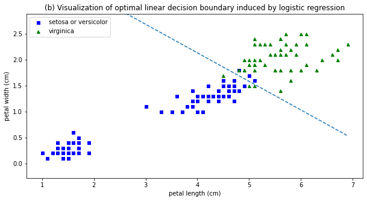

> Figure 10.1: (b) Visualization of optimal linear decision boundary induced by logistic regression on a 2-class, 2-feature version of the iris dataset. Here, $w=(5.75, 10.44)^T$ and $b=-45.27$.

The vector $w$ defines the <u>orientation</u> of the decision boundary, and its magnitude $\|w\|$ controls the <u>steepness</u> of the sigmoid, and hence the <u>confidence of the predictions</u>.

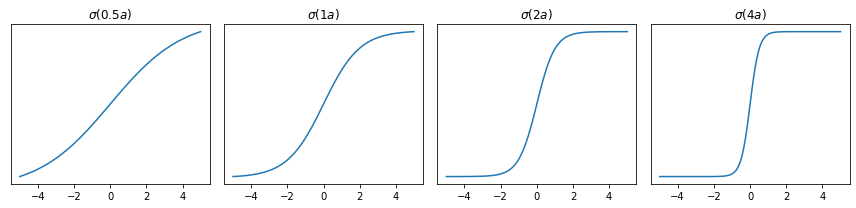


### 10.2.2 Nonlinear classifiers

We can often make a problem linearly separable by <u>preprocessing the inputs</u> in a suitable way.

For example, let $\phi(x_1,x_2)=(x_1^2,x_2^2)$ be a transformed version of the input feature vector $(x_1,x_2)$. If $w=(1,1)$ and $b=-R^2$, then $w^T\phi(x_1,x_2)+b=x_1^2+x_2^2-R^2$, so the decision boundary is a circle with radius $R$.


> Figure 10.3: Illustration of how we can transform a quadratic decision boundary into a linear one by transforming the features from $x=(x_1,x_2)$ to $\phi(x)=(x_1^2,x_2^2)$.

We can gain even more power by <u>learning the parameters of the feature extractor</u> $\phi$ in addition to linear weights $w$. (See Part III. Deep Neural Networks.)


### 10.2.3 Maximum likelihood estimation

We discuss <u>how to estimate $w$ using MLE</u>. We assume that the bias term $b$ is absorbed into the weight vector $w$, i.e., we prepend each $x$ with $x_0=1$ and add $b=w_0$ to the first coordinate of $w$.


#### 10.2.3.1 Objective function (negative log likelihood)

$$
\begin{split}
\operatorname{NLL}(w) &\equiv -\frac{1}{N}\log p(\mathcal{D}|w) = -\frac{1}{N}\log\prod_n\operatorname{Ber}(y_n|\sigma(a_n)) \\
&= -\frac{1}{N} \sum_n\bigl[y_n\log\sigma(a_n)+(1-y_n)\log(1-\sigma(a_n))\bigr] \\
&= \frac{1}{N} \sum_n\mathbb{H}(y_n,\sigma(a_n))
\end{split}
$$

where $a_n=w^Tx_n$ is the **logit** and $\mathbb{H}(p,q)\equiv -[p\log q+(1-p)\log(1-q)]$ is the **binary cross-entropy**.

If we use $\tilde y_n=\{\pm1\}$ instead of $y_n\in\{0,1\}$, then

$$
\begin{split}
\operatorname{NLL}(w) &= -\frac{1}{N}\sum_n\Bigl[ \mathbb{I}(\tilde y_n=1)\log\sigma(a_n) + \mathbb{I}(\tilde y_n=-1)\log\sigma(-a_n) \Bigr] \\
&= -\frac{1}{N}\sum_n \log\sigma(\tilde y_na_n) = \frac{1}{N}\sum_n\log(1+e^{-\tilde y_na_n})
\end{split}
$$

which is called the **log loss** in `scikit-learn`.


#### 10.2.3.2 Optimizing the objective

We can use any <u>gradient-based optimization</u> algorithm to find the MLE, i.e., to solve

$$
\nabla_w\operatorname{NLL}(w)\equiv g(w) = 0
$$


#### 10.2.3.3. Deriving the gradient

Since $\dfrac{d\sigma}{da}(a)=\sigma(a)(1-\sigma(a))$, by the chain rule we have

$$
\nabla_w\log\sigma(a_n)=(1-\sigma(a_n))x_n \quad\text{and}\quad
\nabla_w\log(1-\sigma(a_n))=-\sigma(a_n)x_n
$$

Thus the gradient vector of the NLL (as a column vector) is given by

$$
\begin{align*}
\nabla_w\operatorname{NLL}(w) &= -\frac{1}{N} \sum_n\bigl[y_n(1-\sigma(a_n))x_n-(1-y_n)\sigma(a_n)x_n\bigr] \\
&= \frac{1}{N} \sum_n (\sigma(a_n)-y_n)x_n \\
&= \frac{1}{N} X^T\operatorname{diag}[\sigma(a_n)-y_n]1_N \tag{10.22}
\end{align*}
$$

where $X$ is the $N\times D$ design matrix containing $x_n^T$ as its rows.

If we interpret $e_n\equiv\sigma(a_n)-y_n$ as an <u>error signal</u>, we can see that the gradient weights each input $x_n$ by its error, and then averages the result.


#### 10.2.3.4 Deriving the Hessian

The Hessian $H(w)_{ij}\equiv\frac{\partial^2}{\partial w_iw_j}\operatorname{NLL}(w)$ is given by

$$
H(w) = \nabla_w\nabla_w^T\operatorname{NLL}(w) = \frac{1}{N} \sum_n \sigma(a_n)(1-\sigma(a_n))x_nx_n^T = \frac{1}{N}X^TSX \tag{10.23}
$$

where $S\equiv\operatorname{diag}[\sigma(a_n)(1-\sigma(a_n))]$ has positive diagonal entries.

If $X$ has full rank, $H(w)$ is <u>positive definite</u> so that the NLL is <u>strictly convex</u>, since, for any $v\neq 0$, we have $Xv\neq 0$ so that

$$
v^T(X^TSX)v = (v^TX^TS^\frac{1}{2})(S^\frac{1}{2}Xv) = \|S^\frac{1}{2}Xv\|_2^2 > 0
$$

However, in practice, $\sigma(a_n)$ which are <u>close to 0 or 1</u> might cause the Hessian to be <u>close to singular</u>. We can avoid this by using $\ell_2$ regularization.


### 10.2.4 Stochastic gradient descent

Our goal is to solve the optimization problem

$$
\hat w\equiv\arg\min_w \mathcal{L}(w)
$$

where $\mathcal{L}(w)=\operatorname{NLL}(w)$ is the loss function. If we use a minibatch of size 1, the update equation for SGD becomes

$$
w_{t+1} = w_t - \eta_t\nabla_w\operatorname{NLL}(w_t) = w_t-\eta_t(\sigma(a_n)-y_n)x_n
$$

Since the objective $\operatorname{NLL}(w)$ is convex, this procedure will converge to the global optimum, provided we decay the learning rate $\eta_t$ at the appropriate rate.


### 10.2.5 Perceptron algorithm

A **perceptron** [Ros58] is a deterministic binary classifier with the decision function

$$
f(x;\theta)=\mathbb{I}(a>0)=\mathbb{I}(w^Tx+b>0)
$$

using the Heaviside step function instead of the sigmoid $\sigma(a)$ (compare with eq. 10.5).

Since the Heaviside step function is <u>not differentiable</u>, we <u>cannot</u> use SGD. However, Rosenblatt proposed the **perceptron learning algorithm** instead

$$
w_{t+1} = w_t - \eta_t\big[\mathbb{I}(a>0)-y_n\bigr] x_n
$$

> If the bias term $b$ is absorbed into the weight vector $w$, we can set the learning rate $\eta_t=1$, since the magnitude of $w$ <u>does not</u> affect the decision function $f(x;\theta)=\mathbb{I}(w^Tx>0)$.

If the prediction is correct, no change is made, otherwise we move the weights in a direction so as to make the correct answer more likely.

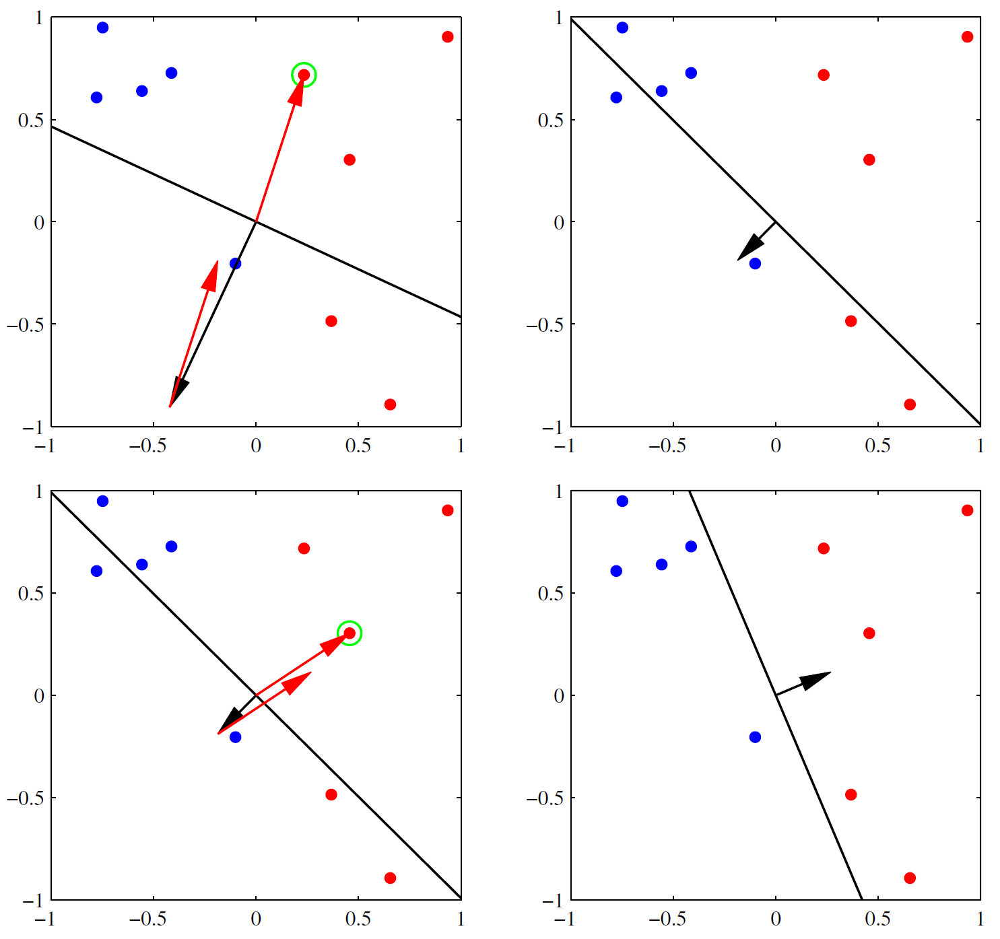

> Figure 4.7 [Bis06, p.195]: Illustration of the convergence of the perceptron learning algorithm.
>
> 1. The **top left plot** shows the initial parameter vector $w$ shown as a black arrow together with the corresponding decision boundary (black line), in which the arrow points towards the decision region which classified as belonging to the red class. The data point circled in green is misclassified and so its feature vector is added to the current weight vector, giving the new decision boundary shown in the **top right plot**.
>
> 2. The **bottom left plot** shows the next misclassified point to be considered, indicated by the green circle, and its feature vector is again added to the weight vector giving the decision boundary shown in the **bottom right plot** for which all data points are correctly classified.


#### Perceptron convergence theorem

If the training data set is <u>linearly separable</u>, then the perceptron learning algorithm is guaranteed to find an exact solution in a finite number of steps.


#### Comparison with SGD

- **Advantage**: We don't need to compute probabilities, which is <u>suitable for large scale learning</u>.
- **Disadvantage**: It will <u>only converge when the data is linearly separable</u>, whereas SGD for minimizing the NLL for logistic regression will always converge to the globally optimal MLE.


### 10.2.6 Iteratively reweighted least squares

#### Newton's method or the Newton-Raphson method

> The Newton-Raphson method is a <u>root-finding</u> algorithm:
> 
> $$
> x_{n+1} = x_n - \frac{f(x_n)}{f'(x_n)}
> $$
> 
> It can be used to <u>find a minimum or maximum</u> of $f(x)$. Since $f'(x)=0$ at a minimum or maximum, local minima and maxima can be found by applying Newton-Raphson method to the derivative $f'(x)$:
> 
> $$
> x_{n+1} = x_n - \frac{f'(x_n)}{f''(x_n)}
> $$

We focus on the <u>full batch</u> setting (so we assume $N$ is small), since it is harder to make second order methods work in the stochastic setting. The Newton-Raphson method consists of updates of the form

$$
w_{t+1} = w_t - H_t^{-1}g_t
$$

where $g_t\equiv\nabla_w\mathcal{L}(w_t)$ and the Hessian $H_t\equiv\nabla_w^2\mathcal{L}(w_t)$ is assumed to be postive-definite.


#### As a weighted least squares problem

We apply the Newton-Raphson method to logistic regression, $\mathcal{L}(w)=\operatorname{NLL}(w)$. From (eq. 10.22 & 10.23),

$$
\begin{align*}
w_{t+1} &= w_t - H_t^{-1}g_t = w_t - \Bigl(\frac{1}{N}X^TS_tX\Bigr)^{-1} \Bigl(\frac{1}{N} X^T(\sigma(a_t)-y)\Bigr) \\
&= w_t + (X^TS_tX)^{-1}X^T(y-\sigma(a_t)) \tag{10.37} \\
&= (X^TS_tX)^{-1}X^T\Bigl[ S_tXw_t+y-\sigma(a_t)\Bigr] \\
&= (X^TS_tX)^{-1}X^TS_tz_t \tag{10.40}
\end{align*}
$$

where $z_t\equiv Xw_t+S_t^{-1}(y-\sigma(a_t))$ called the **working response** and $S_t=\operatorname{diag}\bigl[\sigma(a_t)(1-\sigma(a_t))\bigr]$.

$$
z_{t,n} = w_t^Tx_n + \frac{y_n-\sigma(a_{t,n})}{\sigma(a_{t,n})(1-\sigma(a_{t,n}))}
$$

Equation (10.40) is the normal equation for a <u>weighted least squares</u> problem

$$
z = Xw+\epsilon, \quad \mathbb{E}[\epsilon|X]=0, \quad \operatorname{Cov[\epsilon|X]}=S^{-1}
$$

which is a <u>minimizer of the squared Mahalanobis length</u> of the residual $z-Xw$:

$$
\arg\min_w \|S^\frac{1}{2}(z-Xw)\|^2 = \arg\min_w(z-Xw)^TS(z-Xw) = \arg\min_w\sum_n S_n(z_n-w^Tx_n)^2
$$


#### IRLS algorithm

Because the weighting matrix $S$ is not constant but depends on $w$, we must apply the normal equation (eq. 10.40) iteratively, each time using the new weight vector $w_t$ to compute a revised weighing matrix $S_t$. For this reason, the algorithm is known as the **iterative reweighted least squares (IRLS)**.


#### FIM and Fisher scoring

> The partial derivative of the log likelihood, $\dfrac{\partial}{\partial\theta}\log p(x|\theta)$ is called the the **score**, and the expected value of the score is zero.
> 
> $$
> \mathbb{E}_{x\sim p(x|\theta)}\Bigl[\frac{\partial}{\partial\theta}\log p(x|\theta)\Bigr] = \int \frac{\frac{\partial}{\partial\theta}p(x|\theta)}{p(x|\theta)}p(x|\theta)\,dx = \frac{\partial}{\partial\theta}\int p(x|\theta)\,dx = 0
> $$

The **Fisher information matrix (FIM)** is defined by the <u>covariance of the score</u> function:

$$
F \equiv \mathbb{E}_{x\sim p(x|\theta)} \bigl[\nabla_\theta\log p(x|\theta)\nabla_\theta\log p(x|\theta)^T \bigr] \tag{4.220}
$$

and has the entry

$$
F_{ij} = \mathbb{E}_{x\sim p(x|\theta)} \Bigl[ \Bigl(\frac{\partial}{\partial\theta_i}\log p(x|\theta)\Bigr)\Bigl(\frac{\partial}{\partial\theta_j}\log p(x|\theta)\Bigr) \Bigr] \tag{4.221}
$$

**Theorem 4.7.2.** If $\log p(x|\theta)$ is twice differentiable, and under certain regularity conditions, the FIM is equal to the <u>expected Hessian</u> of the NLL, i.e.,

$$
F_{ij} = -\mathbb{E}_{x\sim p(x|\theta)} \Bigl[ \frac{\partial^2}{\partial\theta_i\partial\theta_j}\log p(x|\theta) \Bigr] \tag{4.222}
$$

Note that **Fisher scoring** is the same as IRLS except we replace the Hessian with the FIM:

$$
w_{t+1} = w_t + \eta_tF^{-1}\nabla_w\operatorname{NLL}(w_t)
$$

Since the FIM is independent of the data, this can be faster for problems with many parameters.


### 10.2.7 MAP estimation

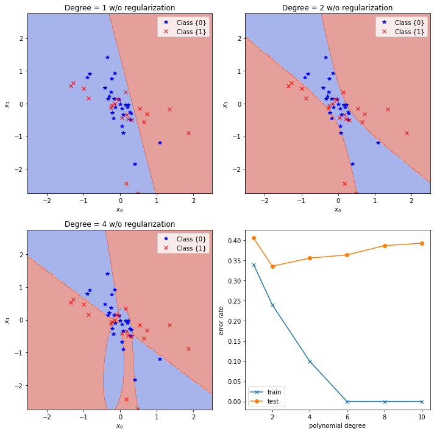

> Figure 10.4: Polynomial feature expansion applied to 2-class, 2d logistic regression problem. (a) Degree 1. (b) Degree 2. (c) Degree 4. (d) Train and test error vs. degree (**1**, **2**, **4**, 6, 8, 10).
>
> - **Degree 1**: $\phi(x_0,x_1) = (x_0,x_1)\in\mathbb{R}^2$ and $\hat w = (0.513, 0.119)$
> - **Degree 2**: $\phi(x_0,x_1) = (x_0,x_1, x_0^2,x_0x_1,x_1^2)\in\mathbb{R}^5$ and $\hat w =(2.293,  0.065, 11.916, 15.504,  2.530)$ 
> - **Degree 4**: $\phi(x_0,x_1) = (x_0,x_1, \dotsc,x_0x_1^3,x_1^4)\in\mathbb{R}^{14}$ and $\hat w=(-661330.445, 165024.837, \dotsc, 5691135.286,5091313.309)$

One way to reduce such overfitting is to <u>prevent the weights from becoming so large</u>.

We can do this by using a <u>zero-mean Gaussian prior</u>, $p(w)=\mathcal{N}(w|0,\lambda^{-1}I)$, and then using <u>MAP estimation</u> (see §4.5.3).

$$
\operatorname{PNLL}(w) = \operatorname{NLL}(w) + \lambda\|w\|_2^2
$$

This is called $\ell_2$ **regularization** or **weight decay**. The larger the value of $\lambda$, the more the parameters are penalized for being *large* (deviating from the zero-mean prior), and thus the less flexible the model.

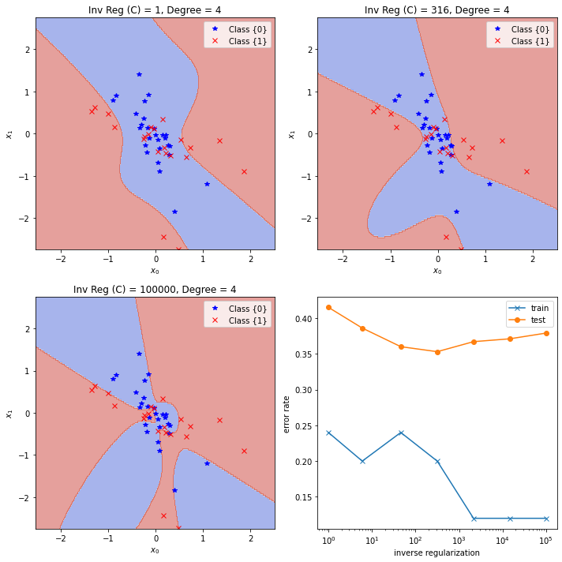

> Figure 10.6: Weight decay with variance $C=\lambda^{-1}$ applied to 2-class, 2d logistic regression problem with a degree 4 polynomial. (a) $C=1$. (b) $C=316$. (c) $C=100,000$. (d) Train and test error vs. $C$ from `numpy.logspace(0, 5, 7, dtype='int64')`, that is, (**1**, 6, 46, **316**,  2154, 14677, **100000**).
>
> - **C = 1**: $\hat w = (0.395, -0.265, \dotsc, 0.579, 0.244)$
> - **C = 316**: $\hat w =(0.736 -0.533, \dotsc, 6.347, 1.778)$ 
> - **C = 100,000**: $\hat w=(-12.642, -2.732, \dotsc, 78.358, 18.320)$

We can compute the MAP estimate by slightly modifying the input to the above gradient based optimization algorithms. The gradient and Hessian of the penalized negative log likelihood have the following forms:

$$
\begin{align*}
\nabla_w\operatorname{PNLL}(w) &= g(w)+2\lambda w \\
\nabla_w^2\operatorname{PNLL}(w) &= H(w)+2\lambda I
\end{align*}
$$


### 10.2.8 Standardization

The isotropic prior $\mathcal{N}(w|0,\lambda^{-1}I)$ used to prevent overfitting implicitly encodes the assumptions:

- We expect all weights to be similar in magnitude.
- We expect all input features to be similar in magnitude.

However, in many datasets, input features are on different scales. In such cases, it is common to **standardize** the data, to ensure <u>each feature has mean 0 and variance 1</u>.

$$
\operatorname{standarize}(x_{nd}) = \frac{x_{nd}-\hat\mu_d}{\hat\sigma_d}
$$

```python
from sklearn.preprocessing import StandardScaler
scaler = StandardScaler()
scaler.fit(X) # compute the mean and (biased) std to be used for later scaling
X_tran = scaler.transform(X) # perform standardization by centering and scaling
X_orig = scaler.inverse_transform(X_tran) # scale back the data to the original
```

An alternative is to use **min-max scaling**, in which we rescale the inputs so they lie in the interval $[0,1]$.

$$
\operatorname{min-max\_scaling}(x_{nd}) = \frac{x_{nd}-\min_{n'}\{x_{n'd}\}}{\max_{n'}\{x_{n'd}\}-\min_{n'}\{x_{n'd}\}}
$$

```python
from sklearn.preprocessing import MinMaxScaler
scaler = MinMaxScaler() # default feature_range=(0,1)
scaler.fit(X) # compute the min and max to be used for later scaling
X_tran = scaler.transform(X) # scale features of X according to feature_range
X_orig = scaler.inverse_transform(X_tran) # undo the scaling of X
```


## 10.3 Multinomial logistic regression

$$
p(y|x;\theta) = \operatorname{Cat}(y|S(Wx+b))
$$

where $S$ is the softmax function, $W$ is a $C\times D$ weight matrix with $w_c^T$ as rows, and $b$ is a $C$-dim. bias vector. We will ignore the bias term $b$ by prepending each $x$ with 1, and adding $b$ to the first column of $W$. Thus $\theta=W$.

If we let $a=Wx$ be the $C$-dim. vector of **logits**, we can rewrite

$$
p(y=c|x;\theta) = S(a)_c = \frac{e^{a_c}}{\sum_{c'} e^{a_{c'}}}
$$

> Since softmax is <u>invariant under translation</u> by the same value in each coordinate $j$,
> 
> $$
> S(a-a_j)_c = \frac{e^{a_c-a_j}}{\sum_{c'}e^{a_{c'}-a_j}} = \frac{e^{a_c}/e^{a_j}}{\sum_{c'}(e^{a_{c'}}/e^{a_j})} = \frac{e^{a_c}}{\sum_{c'}e^{a_{c'}}} = S(a)_c
> $$
> 
> we can set the last weight vector $w_C=0$. In this case, $\theta$ correspond to a weight matrix of size $(C-1)\times D$.


#### Multi-class, multi-label, and multi-output classification

- In multinomial logistic regression ($C>2$), we assume that there is <u>only one true label</u>, i.e., $y\in\{1,\dotsc,C\}$ for an input. This is called **multi-class classification** in `scikit-learn`.

  ```python
  from sklearn.linear_model import LogisticRegression
  LogisticRegression(multi_class='multinomial').fit(X, y)
  ```

- For some applications (e.g., image tagging), we want to <u>predict one or more labels</u>; in this case, $y\subseteq\{1,\dotsc,C\}$ for an input. This is called **multi-label classification** in `scikit-learn`. 
  Similar to one-hot encoding, $y$ can be viewed as a <u>binary vector</u> in $\{0,1\}^C$. However, it is not required that $\sum_c y_c=1$. We can use a modified version of binary logistic regression with multiple outputs:
  
  $$
  p(y|x;\theta) = \prod_c \operatorname{Ber}(y_c|\sigma(w_c^Tx))
  $$
  
  ```python
  from sklearn.preprocessing import MultiLabelBinarizer
  y = MultiLabelBinarizer().fit_transform(y) # make binary vectors
  from sklearn.multiclass import OneVsRestClassifier
  OneVsRestClassifier(LogisticRegression()).fit(X, y)
  ```
  
- If we want to predict <u>fixed number of targets</u> $y=(y_1,\dotsc,y_T)$ with $y_t\in\{1,\dotsc,C\}$ for an input, it is called **multi-class multi-output classification** in `scikit-learn`. On the contrary, the number of targets (or labels) varies by samples in multi-label classification.

  ```python
  from sklearn.multioutput import MultiOutputClassifier
  MultiOutputClassifier(LogisticRegression(multi_class='multinomial')).fit(X, y)
  ```


### 10.3.1 Linear and nonlinear classifiers

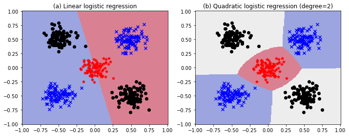

> Figure 10.7: Example of $C=3$-class logistic regression with $D=2$ dim. inputs. (a) Original features. (b) Quadratic features.
>
> The plots are generated using the <u>cross-entropy loss</u> (eq. 10.58) <u>without regularization</u>.
>
> ```python
> LogisticRegression(multi_class='multinomial', penalty='none', solver='lbfgs')
> ```
>
> - Multinomial logistic regression computes <u>linear decision boundaries</u>. In the **left plot** (a), no point in the plane is predicted as black label.
> - In the **right plot** (b), $x$ is transformed by $\phi(x_0,x_1)=(x_0,x_1,x_0^2,x_1^2,x_0x_1)\in\mathbb{R}^5$ to create <u>nonlinear boundaries</u>. The plane is divided by three regions each of which is predicted as red, blue, and black label.


### 10.3.2 Maximum likelihood estimation

We discuss how to compute the MLE by minimizing the NLL.


#### 10.3.2.1 Objective

$$
\operatorname{NLL}(W) = -\frac{1}{N}\log\prod_n\prod_c \mu_{nc}^{y_{nc}} = -\frac{1}{N}\sum_n\sum_c y_{nc}\log\mu_{nc} = \frac{1}{N}\sum_n\mathbb{H}(y_n,\mu_n) \tag{10.58}
$$

where $\mu_{nc}\equiv p(y_{nc}=1|x_n;\theta)=S(Wx_n)_c$, and $y_n$ is represented by the one-hot encoding, i.e., $y_{nc}=\mathbb{I}(y_n=c)$ and $\sum_c y_{nc}=1$, and $\mathbb{H}(p,q)\equiv -\sum_c p_c\log q_c$ is the **cross-entropy**. 


#### 10.3.2.2 Optimizing the objective

To find the optimum, we need to solve $\nabla_W\operatorname{NLL}(W)=0$.


#### 10.3.2.3 Deriving the gradient

Since $\mu_c=S(Wx)_c=S(a)_c=\dfrac{e^{a_c}}{\sum_je^{a_j}}$, we have $\dfrac{\partial\mu_c}{\partial a_j}=\mu_c(\delta_{cj}-\mu_j)$, where $\delta_{cj}=\mathbb{I}(c=j)$.

Let $\operatorname{NLL_n(W)}=-\sum_c y_{nc}\log\mu_{nc}$ denote the NLL for a single sample $(x_n, y_n)$. Since the entry $w_{jk}$ in $W$ is associated with class $j$, the gradient of $\operatorname{NLL}_n(W)$ is given by the $C\times D$ matrix

$$
\begin{align}
\bigl[\nabla_W\operatorname{NLL}_n(W)\bigr]_{jk} &= \frac{\partial}{\partial w_{jk}}\operatorname{NLL}_n(W) = -\sum_c\frac{y_{nc}}{\mu_{nc}}\frac{\partial\mu_{nc}}{\partial w_{jk}} = -\sum_c\frac{y_{nc}}{\mu_{nc}}\frac{\partial\mu_{nc}}{\partial a_{nj}}\frac{\partial a_{nj}}{\partial w_{jk}} \\
&= -\sum_c\frac{y_{nc}}{\mu_{nc}}\mu_{nc}(\delta_{cj}-\mu_{nj})x_{nk} = \sum_c y_{nc}(\mu_{nj}-\delta_{cj})x_{nk} \\
&= \bigl(\sum_c y_{nc}\bigr)\mu_{nj}x_{nk} - y_{nj}x_{nk} = (\mu_{nj}-y_{nj})x_{nk}
\end{align}
$$

The gradient of the overall NLL is obtained by summing over samples, to give the $C\times D$ matrix

$$
\begin{align*}
g(W) &= \frac{1}{N}\sum_n\nabla_{W}\operatorname{NLL}_n(W) = \frac{1}{N}\sum_n (\mu_n-y_n)x_n^T \tag{10.68} \\
&= \frac{1}{N}\sum_n (\mu_n-y_n)\otimes x_n
\end{align*}
$$

where $A\otimes B$ is the Kronecker product (see §7.2.5).


#### 10.3.2.4 Deriving the Hessian

The Hessian of the NLL for multinomial logistic regression is given by the $CD\times CD$ matrix

$$
H(W) = \frac{1}{N} \sum_n \bigl(\operatorname{diag}(\mu_n)-\mu_n\mu_n^T\bigr)\otimes\bigl(x_nx_n^T\bigr)
$$

and it is positive definite (Exercise 10.1), so the objective is convex.


### 10.3.3 Gradient-based optimization

- It is straightforward to use the gradient to derive the (<u>first-order</u>) SGD algorithms.
- We can use the Hessian to derive a <u>second-order</u> optimization method.
- However, computing Hessian can be expensive, so it is common to approximate it using **quasi-Newton** methods (see §8.3.2).

The gradient of the log likelihood (eq. 10.68) requires computing normalized probabilities $\mu$, which can be computed from the logits vector $a=Wx$ using

$$
\mu_c=p(y=c|x;\theta)=S(a)_c=\frac{\exp a_c}{\sum_{c'}\exp a_{c'}}=\exp\bigl[a_c-\operatorname{lse}(a)\bigr]
$$

where the **log-sum-exp** function is defined by

$$
\operatorname{lse}(a)\equiv\log\sum_c\exp(a_c)=m+\log\sum_c\exp(a_c-m) \tag{2.101}
$$

It is common to use $m=\max_c a_c$ (see §2.5.4).


### 10.3.4 Bound optimization

Let us fit logistic regression using **bound optimization** or **MM (minorize-maximize) algorithm** (see §8.7).

> **Reference**: §8.7.1 The general algorithm
>
> Our goal is to <u>maximize</u> the log likelihood $\operatorname{LL}(\theta)$. The basic approach is as follows.
>
> 1. Construct a **surrogate function** $Q(\theta,\theta^t)$ which is a tight lower bound to $\operatorname{LL}(\theta)$ such that
>
> $$
> Q(\theta,\theta^t)\leq\operatorname{LL}(\theta) \quad\text{and}\quad Q(\theta^t,\theta^t)=\operatorname{LL}(\theta^t)
> $$
>
> 2. If these conditions are met, we say that $Q$ **minorizes** $\operatorname{LL}$.
> 3. Then perform the update at each step:
>
> $$
> \theta^{t+1} = \arg\max_\theta Q(\theta,\theta^t) \tag{8.144}
> $$
>
> 4. This guarantees us monotonic increases in the original objective:
>
> $$
> \operatorname{LL}(\theta^{t+1})\geq Q(\theta^{t+1},\theta^t)\geq Q(\theta^t,\theta^t)=\operatorname{LL}(\theta^t) \tag{8.145}
> $$
>
> 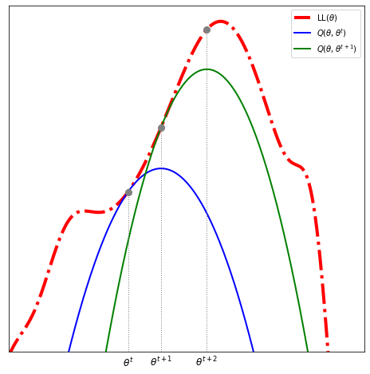
>
> > Figure 9.14 [Bis06, p.453] Illustration of a bound optimization algorithm.
>
> If $Q$ is a quadratic lower bound, the overall method is similar to Newton's method. The difference is
>
> - Optimizing $Q$ is guaranteed to lead to an improvement in the objective, <u>even if it is not convex</u>.
> - Newton's method may overshoot or lead to a decrease in the objective, <u>since it is a quadratic approximation</u> and not a (lower) bound.


If $\operatorname{LL}(\theta)$ is a <u>concave function we want to maximize</u>, then one way to obtain a valid lower bound is to <u>use a bound on its Hessian</u>, i.e., to find a negative definite matrix $B$ such that $H(\theta)\succ B$. In this case,

$$
\operatorname{LL}(\theta) \geq \operatorname{LL}(\theta^t) + (\theta-\theta^t)^Tg(\theta^t) + \tfrac{1}{2}(\theta-\theta^t)^TB(\theta-\theta^t) \equiv Q(\theta,\theta^t)
$$

where $g(\theta^t)=\nabla\operatorname{LL}(\theta^t)$. Then, the update becomes

$$
\theta^{t+1}=\arg\max_\theta Q(\theta,\theta^t)=\theta^t-B^{-1}g(\theta^t)
$$


#### Application to logistic regression

We want to <u>maximize the log likelihood</u> (without $\frac{1}{N}$)

$$
\operatorname{LL}(W) = \sum_n\sum_c y_{nc}\log\mu_{nc}=\sum_n\sum_c y_{nc}(a_c-\operatorname{lse}(a))
$$

The gradient and the Hessian are given by

$$
\begin{align*}
g(W) &= -\sum_n (\mu_n-y_n)\otimes x_n \\
H(W) &= -\sum_n \bigl(\operatorname{diag}(\mu_n)-\mu_n\mu_n^T\bigr)\otimes\bigl(x_nx_n^T\bigr)
\end{align*}
$$

We can construct a lower bound on the Hessian, as shown in [D. Böhning, *Multinomial logistic regression algorithm*, Ann. Inst. Statist. Math. (1992)]

$$
B \equiv -\frac{1}{2}\bigl[I_C-\tfrac{1}{C}11^T\bigr] \otimes \Bigl(\sum_n x_nx_n^T\Bigr) \prec H(W)
$$

> **IMPORTANT**: If we enforce that $w_C=0$, we can use the $(C-1)\times(C-1)$ matrix $\bigl[I_{C-1}-\frac{1}{C}11^T\bigr]$ instead.

We can use this lower bound to construct an MM algorithm to find the MLE. The update becomes

$$
W^{t+1} = W^t - B^{-1}g(W^t)
$$

<u>This iteration can be faster than IRLS</u>, since we can precompute $B^{-1}$ in time independent of $t$, rather than having to invert the Hessian at each iteration.

> In the binary case when $C=2$, assume that $w_2=0$. Then, since $\mu_n-\mu_n^2=\mu_n(1-\mu_n)\leq\frac{1}{4}$ for $0\leq\mu_n\leq 1$, we have
> 
> $$
> H(w)=-\sum_n(\mu_n-\mu_n^2)x_nx_n^T \succ -\sum\tfrac{1}{4}x_nx_n^T=-\tfrac{1}{4}X^TX\equiv B
> $$
> 
> The update becomes $w^{t+1}=w^t+4(X^TX)^{-1}g(w^t)=w^t+4(X^TX)^{-1}X^T(y-\mu_t)$. Compare this to (eq. 10.37) $w_{t+1}=w_t+(X^TS_tX)^{-1}X^T(y-\mu_t)$, where $S_t=\operatorname{diag}(\mu_t\odot(1-\mu_t))$.


### 10.3.5 MAP estimation

The benefits of $\ell_2$ regularization for binary logistic regression hold also in the multinomial case. However, there is an **identifiability** issue.

> A model is **identifiable** if it is theoretically possible to learn the true values of this model's underlying parameters after obtaining an infinite number of observations from it.
>
> Mathematically, this is equivalent to saying that <u>different values of the parameters</u> must generate <u>different probability distributions</u> of the observable variables.

Recall that multinomial logistic regression has the form

$$
p(y=c|x;W) = S(Wx) = \frac{\exp(w_c^Tx)}{\sum_{c'}\exp(w_{c'}^Tx)}
$$

where $W$ is a $C\times D$ weight matrix with rows $w_c^T$. We can arbitrarily *clamp* $w_c=0$ for one of the classes, since softmax is invariant under translation by the same value in each coordinate. Therefore, <u>the parameters will be unidentifiable if we don't *clamp*</u>.


However, suppose <u>we don't *clamp*</u> $w_c=0$, but <u>we add $\ell_2$ regularization</u> by optimizing

$$
\operatorname{PNLL}(W) = \operatorname{NLL}(W) + \lambda\|W\|_F^2
$$

where $\|W\|_F=\sqrt{\sum_{i,j}w_{ij}^2}$ is the **Frobenius norm** (eq. 7.27). At the optimum $\hat W$, it is required that

$$
\nabla_W\operatorname{PNLL}(\hat W) = \nabla_W\operatorname{NLL}(\hat W) + 2\lambda \hat W = \frac{1}{N}\sum_n(\hat\mu_n-y_n)\otimes x_n + 2\lambda \hat W = 0
$$

so that $\sum_n (y_n-\hat\mu_n)\otimes x_n=2N\lambda\hat W$, where $\hat\mu_n=S(\hat Wx_n)$. It follows that, for any feature dimension $j$,

$$
2N\lambda\sum_c\hat W_{cj} = \sum_n\sum_c(y_{nc}-\hat\mu_{nc})x_{nj} = \sum_n\Bigl[\sum_c y_{nc}-\sum_c\hat\mu_{nc}\Bigr]x_{nj} = \sum_n(1-1)x_{nj} = 0
$$

Thus if $\lambda>0$ we should have $\sum_c\hat W_{cj}=0$, so the weights <u>automatically satisfy a sum-to-zero constraint</u>, thus making them <u>uniquely identifiable</u>. (The softmax function and thus $\mu_n$ and $\operatorname{NLL}(W)$ are invariant under translation by the same value in each coordinate; whereas $\operatorname{PNLL}(W)$ is not invariant under translation.)


### 10.3.6 Maximum entropy classifiers

There is a slight <u>extension of logistic regression</u> that use class-dependent features,

$$
p(y|x;w) = \frac{\exp\bigl(w^T\phi(x,y)\bigr)}{\sum\exp\bigl(w^T\phi(x,y)\bigr)}
$$

where $\phi(x,y)$ is the feature vector of $x$ for class $y$. This is called a **maximum entropy classifier**, or **maxent classifier** for short. Notice that $\theta=w$ is a vector, not a matrix $W$.

Maxent classifiers are very widely used in NLP. For example, consider the problem of **semantic role labeling**, where we classify a word $x$ into a semantic role $y$ (person, place or thing).

$$
\begin{split}
\phi_1(x,y) &= \mathbb{I}(y=\text{person $\and$ $x$ occcurs after Mr. or Mrs.}) \\
\phi_2(x,y) &= \mathbb{I}(y=\text{person $\and$ $x$ is in whitelist of common names}) \\
\phi_3(x,y) &= \mathbb{I}(y=\text{place $\and$ $x$ is in Google maps}) \\
&\vdots
\end{split}
$$


### 10.3.7 Hierarchical classification

> **Reference**: [RF17] J. Redmon and A. Farhadi, *YOLO9000: Better, Faster, **Stronger***, CVPR 2017.
>
> - (Small) **detection dataset**: **COCO** is a large-scale <u>object detection</u>, segmentation, and captioning dataset with 330K images (over 200K labeled), 80 object categories, etc.
> - (Big) **classification dataset**: **ImageNet** is an image dataset organized according to the <u>WordNet hierarchy</u>. There are more than 100,000 synsets in WordNet. In ImageNet, we aim to provide on average 1000 images to illustrate each synset.
>
> We would like <u>object detection to scale to level of object classification</u>.
>
> - A <u>hierarchical view</u> of object classification that allows us to combine distinct datasets together.
> - <u>Detection images</u> to learn to precisely localize objects; <u>classification images</u> to increase its vocabulary and robustness.

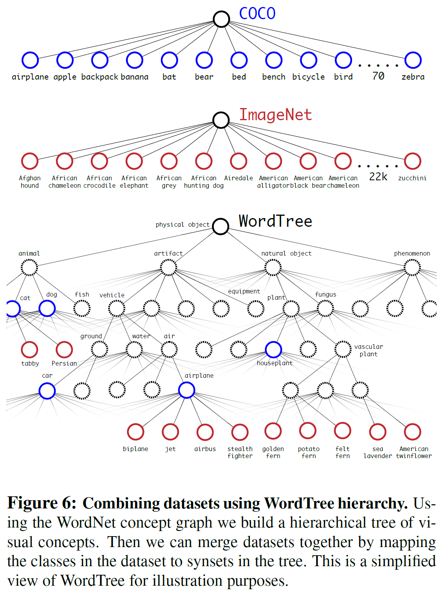

We might want to predict <u>what kind of an animal is in an image</u>: it could be a `Dog` or a `Cat`; if it is a `Dog`, it could be a `Golden Retriever` or `German Shepherd`, etc.


> Figure 10.8: A simple example of a label hierarchy. Nodes within the same ellipse have a mutual exclusion relationship between them.

1. Create model with <u>a binary output label for every possible node</u> in the tree (similar to multinomial logistic regression with one-hot encoding).

2. **Label smearing**: A label is <u>propagated to all of its parents</u> (hypernyms). For example, if an image is labeled `Golden Retriever`, we will also label it `Dog` and `Mammals` (similar to multi-label classification).

   However, the model <u>does not</u> capture the fact that some labels are mutually exclusive. For example, this method could predict `Golden Retriever`, `Cat`, and `Birds` all with probability 1.0.

3. Use the <u>softmax function to add a mutual exclusion constraint</u> between all label nodes which are siblings. For example,

   $$
   p(y=\text{Dog}|x;\text{Mammals}) = S(a)_\text{Dog} = \frac{\exp(a_\text{Dog})}{\exp(a_\text{Dog})+\exp(a_\text{Cat})+\dotsc}
   $$

   so that
   
   $$
   p(\text{Golden Retriever}|x) = p(\text{Golden Retriever}|x,\text{Dog}) \times p(\text{Dog}|x,\text{Mammals}) \times p(\text{Mammals}|x)
   $$
   
   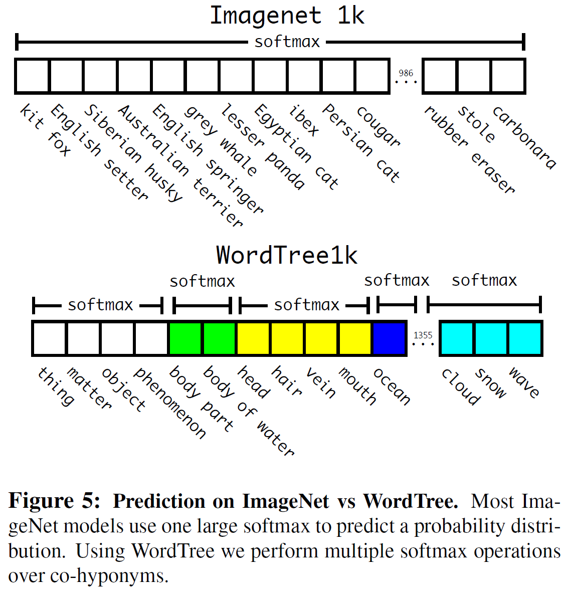


### 10.3.8 Handling large numbers of classes

#### 10.3.8.1 Hierarchical softmax

> **Reference**: [Mik+13b] T. Mikolov, et al. *Distributed Representations of Words and Phrases and their Compositionality*, NIPS 2013.

In regular softmax classifiers, computing the normalization constant, which is need to compute $\nabla_W\operatorname{NLL}(W)$, takes $O(C)$ time, which can <u>become the bottleneck if $C$ is large</u>.


However, if we structure the labels as a tree, we can compute the probability of any label in $O(\log C)$ time, by multiplying the probabilities of each edge on the path from the root to the leaf. This is called **hierarchical softmax**.


> Figure 10.9: A flat and hierarchical softmax model $p(y=w|x=C)$, where $C$ are the input features (context) and $w$ is the output label (word). https://www.quora.com/What-is-hierarchical-softmax/


A good way to structure such a tree is to use (binary) Huffman encoding.

Notice that in the <u>flat softmax</u>, the parameter matrix $W$ consists of the row vectors $w_w^T$ for each leaf (label) $w$. On the contrary, in the hierarchical softmax, $W$ consists of the row vectors $w_j^T$ for each inner node $j$ of the tree.

Let $n_j(w)$ be the $j$-th node on the path from the root to $w$, and let $L(w)$ be the length of this path. Note that $n_1(w)$ is the root node for all $w$. Then

$$
\begin{split}
p(y=w|x;W) &= \prod_{j=1}^{L(w)-1} p(n_j(w)\to n_{j+1}(w)|x;w_{n_j(w)}) \\
&= \prod_{j=1}^{L(w)-1} \sigma(\mathbb{sgn}[n_j(w)\to n_{j+1}(w)]\cdot w_{n_j(w)}^Tx)
\end{split}
$$

where $\mathbb{sgn}[n_p\to n_c]=1$ if $n_c$ is the left sibling of $n_p$, otherwise -1. Note that

$$
\sigma(1\cdot w_{n_j(w)}^Tx) + \sigma(-1\cdot w_{n_j(w)}^Tx)
= \sigma(1\cdot w_{n_j(w)}^Tx) + \bigl[1-\sigma(1\cdot w_{n_j(w)}^Tx)\bigr] = 1
$$


#### 10.3.8.2 Class imbalance and the long tail

> **Reference**: [Kan+20] B. Kang, et al., *Decoupling Representation and Classifier for Long-Tailed Recognition*, ICLR 2020.

Another issue is that <u>we may have very few samples for most classes</u>. More precisely, the number $N_c$ of samples in each class $c$ highly varies and follows a **long-tailed** distribution. The result is an extreme form of **class imbalance**.

Since the rare classes will have a smaller effect on the overall loss than the common classes, <u>the model may focus its attention on the common classes</u>. The learned classification model tends to perform better on these classes, while performance is significantly worse for the rare classes.

> [Kan+20] Data imbalance might not be an issue learning high-quality representations.

1. Set the bias vector $b$ such that $b_c = \dfrac{N_c}{N}$ (no longer parameter); such a model will <u>match the empirical label prior</u> even when using weights of $w=0$. As the weights are adjusted, the model can learn input-dependent deviations from this prior.

2. Resample the data to make it more balanced, before (or during) training. In particular suppose we sample a data point from class $c$ with probability $p_c=\dfrac{N_c^q}{\sum_j N_j^q}$ where $q\in[0,1]$.
   - **Instance-balanced sampling**: Set $q=1$. Then $p_c\propto N_C$ and the common classes will be sampled more than rare classes.

   - **Class-balanced sampling**: Set $q=0$. Then $p_c=\frac{1}{C}$ and this can be thought of as first sampling a class uniformly at random, and then sampling an instance of this class.

   - **Square-root sampling**: Set $q=\frac{1}{2}$. We can get more balanced samples as $q\to 0$.

   - **Progressively-balanced sampling**: This involves first using instance-balanced sampling for a number of epochs, and then class-balanced sampling for the last epochs. For the epoch $t\in[0,T]$,

     $$
     p_c(t) = \Bigl(1-\frac{t}{T}\Bigr)\frac{N_c}{\sum_j N_j} + \frac{t}{T}\frac{1}{C}
     $$

3. The **nearest class mean classifier** is simple and can easily handle the long tail.

   $$
   f(x) = \arg\min_c\|\phi(x)-\mu_c\|_2^2
   $$

   where the representation $\phi(x)$ is implemented by a DNN model and $\mu_c=\frac{1}{N_c}\sum_{n:y_n=c}\phi(x_n)$ is the mean feature representation for each class $c$.


## 10.4 Robust logistic regression*

Sometimes we have **outliers** in our data, which are often due to labeling errors called **label noise**. To prevent the model from being adversely affected by such contamination, we will use **robust logistic regression**.

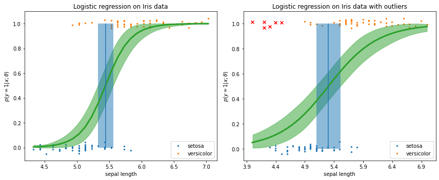

> Logistic regression for classifying if an <u>Iris flower</u> is `setosa` ($y=0$) or `versicolor` ($y=1$) using a <u>single input feature</u> $x$, `sepal length`. Labeled points have been (vertically) jittered to avoid overlapping too much. Vertical line (blue) is the <u>decision boundary</u>, $x^*=-b/w$.
>
> Here, a Bayesian approach, MCMC is used to approximate the <u>posterior</u> $p(\theta|\mathcal{D})$. Given this, we can approximate the <u>posterior predictive distribution</u> using a Monte Carlo approximation:
> 
> $$
> p(y=1|x;\mathcal{D}) \approx \frac{1}{S}\sum_s p(y=1|x;\theta^s) \tag{4.205}
> $$
> 
> where $\theta^s\sim p(\theta|\mathcal{D})$ is a posterior sample with the priors $w,b\sim\mathcal{N}(0,10^2)$ and $S=1,000$ (see §10.5).
>
> The **left plot**, Figure 4.20 (b) shows the mean and the 94% highest density interval (green) of the posterior predictive distribution, and the **right plot**, Figure 10.10 (a) shows the posterior predictive distribution with outliers (denoted by red $\times$).


### 10.4.1 Mixture model for the likelihood

One of the simplest ways is to modify the likelihood, for example, in the binary case,

$$
p(y|x;\theta) = \pi\operatorname{Ber}(y|\tfrac{1}{2}) + (1-\pi)\operatorname{Ber}(y|\sigma(w^Tx))
$$

In this case, $\theta=(w,\pi)$. This approach, of using a <u>mixture model</u> for the observation model to make it robust, can be applied to many different models, e.g., DNNs.

We can fit this model using standard method, such as SGD or Bayesian inference methods such as <u>MCMC</u>.

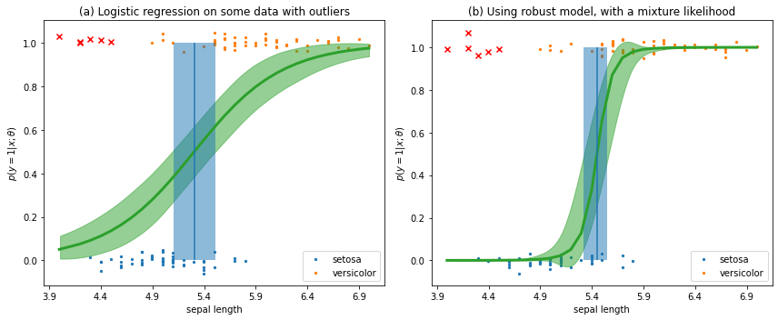

> Figure 10.10: (a) Logistic regression on the Iris data with outliers. (b) Same as (a) but using <u>robust model</u>, with a mixture likelihood. Here, the 94% highest density interval of the parameter $\pi$ is (0.152, 0.446) and the mean is 0.302. The prior of $\pi$ is uniform.

```python
import pymc as pm
pm.sample(draws=1000, chains=2, cores=1, target_accept=0.95)
pm.plot_trace(trace_robust, var_names=['w', 'b', 'π', 'bd'], combined=True)
```

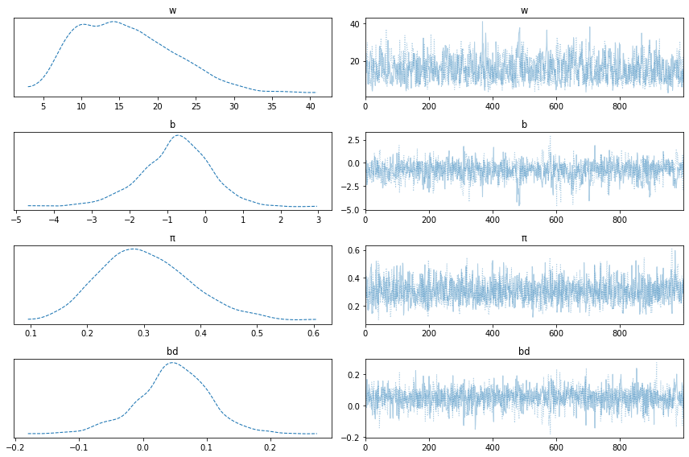


### 10.4.2 Bi-tempered loss

#### Tempered logarithm and tempered exponential

- The **tempered logarithm** $\log_t\colon\mathbb{R}_+\to\mathbb{R}$ for $0\leq t<1$, is defined by

  $$
  \log_t x\equiv\dfrac{1}{1-t}(x^{1-t}-1)
  $$
  
  which is strictly increasing and concave downward, and reduces to the natural logarithm as $t\to 1$.

  Note that $\log_t 1=0$ and $\log x\leq\log_t x\leq\log_0x=x-1$. Moreover, $\log_tx$ is <u>bounded below</u> by $\frac{-1}{1-t}$ for all $0\leq t<1$, whereas $\log x$ is unbounded.
  
- The **tempered exponential** $\exp_t\colon(-\infty,\frac{1}{t-1})\to\mathbb{R}_+$ for $t>1$, is defined by

  $$
  \exp_t x\equiv \bigl[1+(1-t)x\bigr]^{\frac{1}{1-t}}
  $$
  
  which is strictly increasing and concave upward, and reduces to the exponential as $t\to1$.
  
  Note that $\exp_t 0 = 1$ and $\exp x\leq\exp_t x$.

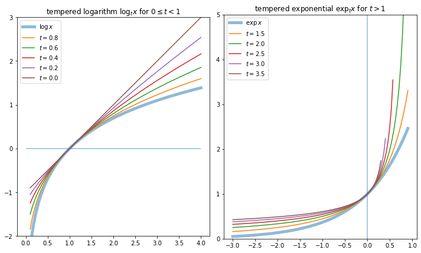


#### Outliers far away can dominate the overall loss.

> **Reference**: [LR10] P. Long and R. Servedio, *Random Classification Noise Defeats All Convex Potential Boosters*, ICML 2008.
>
> Convex losses have been shown to be <u>prone to outliers</u> as the loss of each individual example <u>unboundedly increases</u> as a function of the activations.
>
> These outliers may correspond to (a) extreme examples that <u>lead to large gradients</u>, or (b) misclassified training examples that are <u>located far away from the classification boundary</u>.


> From https://ai.googleblog.com/2019/08/bi-tempered-logistic-loss-for-training.html

We replace the usual cross entropy loss with a tempered version, that uses a temperature parameter $0\leq t_1<1$ to ensure <u>the loss from outliers is bounded</u>. The **tempered cross entropy loss** is defined by

$$
\begin{split}
\mathcal{L}(y,\hat y) &= \sum_c \Bigl[ y_c(\log_{t_1}y_c-\log_{t_1}\hat y_c) - \frac{1}{2-t_1}(y_c^{2-t_1}-\hat y_c^{2-t_1}) \Bigr] \\
&= \sum_c \Bigl[ \frac{y_c}{1-t_1}(y_c^{1-t_1}-\hat y_c^{1-t_1}) - \frac{1}{2-t_1}(y_c^{2-t_1}-\hat y_c^{2-t_1}) \Bigr] \\
&= - \log_{t_1}\hat y_c - \frac{1}{2-t_1}\Bigl(1-\sum_{c'} \hat y_{c'}^{2-t_1}\Bigr) \quad\text{if $y$ one-hot with $y_c=1$}
\end{split}
$$


Since $\sum_c y_c=\sum_c\hat y_c=1$, it reduces to the log loss as $t\to1$.

$$
\lim_{t_1\to1}\mathcal{L}(y,\hat y) = \mathbb{H}(y,\hat y) = -\sum_c y_c\log\hat y_c
$$

Since $\log_{t_1}x$ is <u>bounded below</u> by $\frac{-1}{1-{t_1}}$, and hence $\mathcal{L}(y,\hat y)$ is <u>bounded above</u> by $\frac{1}{1-{t_1}}$ (see Figure 10.11 (a)).

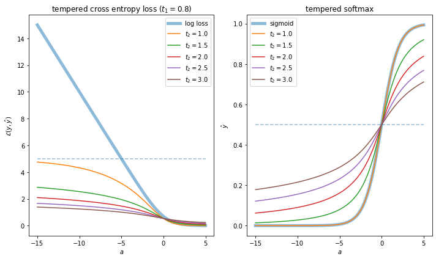

> Figure 10.11: (a) Illustration of log loss ($t_1,t_2\to 1$) and tempered cross entropy loss with fixed $t_1=0.8$. It is bounded above by $\frac{1}{1-t_1}=5$. (b) Illustration of sigmoid ($t_2\to 1$) and tempered softmax.
>
> In both plots, activation $a=(a_1,a_2)$ is given according to $a_2$ with fixed $a_1=0$. Then the tempered softmax becomes the sigmoid as $t_2\to 1$.


#### Mislabeled examples nearby can stretch the decision boundary.

> **Reference**: N. Ding and S. Vishwanathan, *$t$-logistic regression*, NIPS 2010.
>
> Another issue arises due to the <u>exponentially decaying tail</u> of the softmax function.
>
> In the presence of mislabeled training examples <u>near the classification boundary</u>, the short tail of the softmax probabilities enforces the classifier to stretch the decision boundary towards the noisy training examples.
>
> In contrast, <u>heavy-tailed alternatives</u> for the softmax probabilities have been shown to significantly improve the robustness of the loss to these examples.


> From https://ai.googleblog.com/2019/08/bi-tempered-logistic-loss-for-training.html

We use a transfer function (from activations $\mathbb{R}^C$ to probabilities $[0,1]^C$) that has <u>heavier tails than the softmax</u>, which is based on the exponential:

$$
\begin{split}
\hat y_c = S(a)_c &\equiv \frac{\exp(a_c)}{\sum_{c'}\exp(a_{c'})} = \exp\Bigl[ a_c-\log\sum_{c'}\exp(a_c')\Bigr] \\
&= \exp\bigl[ a_c-(\operatorname{lse}(a-\mu\vec1)+\mu)\bigr] \quad\text{where $\mu=\max_c\{a_c\}$}
\end{split}
$$

We can make a heavy tailed version by using the **tempered softmax**, for $t_2>1$,

$$
\hat y_c \equiv \exp_{t_2}\bigl[a_c-\lambda_{t_2}(a)\bigr] \tag{10.105}
$$

Figure 10.11 (b) shows that <u>the tempered softmax has heavier tails</u>, as desired.


#### All that remains is to compute normalization $\lambda_t(a)$.

> **Reference**: [Ami+19] E. Amid, et al., *Robust Bi-Tempered Logistic Loss Based on Bregman Divergences*, NeurIPS 2019.

Suppose $t>1$. Since we need $\sum_c\hat y_c=1$ in (eq. 10.105),  the real value $\lambda=\lambda_t(a)$ must satisfy the fixed point equation

$$
\sum_c\exp_t(a_c-\lambda) = 1
$$

and $\lim_{t\to1}\lambda_t(a)=\operatorname{lse}(a-\mu\vec1)+\mu$.

Note that $\lambda_t(a)$ does not have a closed form solution in general, and must be calculated numerically. We can find $\lambda_t(a)$ using binary search or by using the iterative procedure in Algorithm 3.

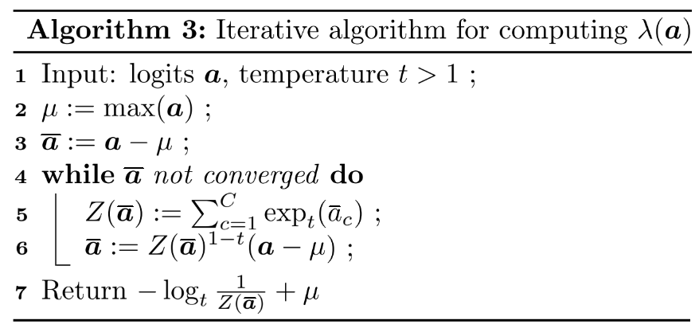

> **Proof**. For logits $a\in\mathbb{R}^C$ and a temperature $t>1$, let
> 
> $$
> \tilde a_{k+1}\equiv Z(\tilde a_k)^{1-t} \tilde a_0 \quad\text{and}\quad \tilde a_0=a-\mu\vec{1}
> $$
> 
> where $Z(a)\equiv\sum_c\exp_t(a_c)\in\mathbb{R}$ and $\mu\equiv\max_c\{a_c\}$.
>
> (1) We assert that $0<Z(\tilde a_{k})^{1-t}<1$ and $(\tilde a_k)_c\leq 0$ for all $k$.
>
> > ($\because$) Notice that if $a_{c_0}=\mu$ for some $c_0$, then $(\tilde a_k)_{c_0}=0$ for all $k$ so that there is at least one $c$ such that $(\tilde a_k)_c=0$ for all $k$. Since $C\geq 2$, we have $Z(\tilde a_{k})=\sum_c\exp_t((\tilde a_k)_c)>1$ so that $0<Z(\tilde a_{k})^{1-t}<1$ for all $k$. It follows that $(\tilde a_{k+1})_c=Z(\tilde a_k)^{1-t}(\tilde a_0)_c\leq 0$ for all $k$, since $(\tilde a_0)_c\leq 0$, for all $c$.
>
> (2) We assert that $(\tilde a_k)_c$ is monotonically increasing for all $c$.
>
> > ($\because$) It is trivial that $(\tilde a_0)_c\leq Z(\tilde a_0)^{1-t}(\tilde a_0)_c=(\tilde a_1)_c$ for all $c$. Suppose $(\tilde a_{k-1})_c\leq(\tilde a_k)_c$ for all $c$. Then $Z(\tilde a_{k-1})=\sum_c\exp_t[(\tilde a_{k-1})_c]\leq\sum_c\exp_t[(\tilde a_k)_c]=Z(\tilde a_k)$. It follows that $(\tilde a_k)_c=Z(\tilde a_{k-1})^{1-t}(\tilde a_0)_c\leq Z(\tilde a_k)^{1-t}(\tilde a_0)_c=(\tilde a_{k+1})_c$ for all $c$.
>
> Thus, the limit $\tilde a_c\equiv\lim_{k\to\infty}(\tilde a_k)_c$ exists for all $c$, in other words, we can define $\tilde a\equiv\lim_{k\to\infty}\tilde a_k$. Since $Z$ is continuous, we have
> 
> $$
> \tilde a=\lim_{k\to\infty}\tilde a_{k+1}=\lim_{k\to\infty}\bigl[Z(\tilde a_k)^{1-t}\tilde a_0\bigr]=Z\Bigl(\lim_{k\to\infty}\tilde a_k\Bigr)^{1-t}\tilde a_0=Z(\tilde a)^{1-t}\tilde a_0
> $$
> 
> It follows that $\lambda_t(a) \equiv - \log_t Z(\tilde a)^{-1} + \mu$ satisfies
> 
> $$
> \begin{align*}
> \exp_t(a_c-\lambda_t(a)) &= \exp_t\Bigl[(\tilde a_0)_c + \log_t Z(\tilde a)^{-1}\Bigr] \\
> &= \Bigl[1+(1-t)(\tilde a_0)_c + (1-t)\log_t Z(\tilde a)^{-1}\Bigr]^{\frac{1}{1-t}} \\
> &= \Bigl[(1-t)(\tilde a_0)_c + Z(\tilde a)^{-(1-t)}\Bigr]^{\frac{1}{1-t}} \\
> &= \Bigl[Z(\tilde a)^{-(1-t)}\bigl[1+(1-t)\tilde a_c\bigr]\Bigr]^{\frac{1}{1-t}} \\
> &= Z(\tilde a)^{-1}\exp_t(\tilde a_c)
> \end{align*}
> $$
> 
> Therefore, $\sum_c\exp_t(a_c-\lambda_t(a))=Z(\tilde a)^{-1}\sum_c\exp_t(\tilde a_c)=Z(\tilde a)^{-1}Z(\tilde a)=1$. It is trivial to check that $\lim_{t\to1}\lambda_t(a)=\log\sum_c\exp(a_c)+\mu$.


#### Bi-tempered logistic regression

Combining the <u>tempered softmax</u> with the <u>tempered cross entropy loss</u> results in a method called **bi-tempered logistic regression**.


> Figure 10.12: Illustration of standard and bi-tempered logistic regression on data with label noise.
>
> (a) noise-free labels, (b) small-margin label noise, (c) large-margin label noise, and (d) random label noise.
>
> We find that for each situation, the decision boundary recovered by training with the bi-tempered logistic loss function is better than before. https://ai.googleblog.com/2019/08/bi-tempered-logistic-loss-for-training.html


## 10.5 Bayesian logistic regression*

It is useful to measure uncertainty when we have little data, and when choosing the wrong decision may be costly. We want to compute the posterior $p(\theta|\mathcal{D})$ in order to <u>capture our uncertainty</u>, not the point estimates:

- **MLE estimate**: $\hat\theta_\text{mle} \equiv \arg\max_\theta p(\mathcal{D}|\theta)$
- **MAP estimate**: $\hat\theta_\text{map}\equiv\arg\max_\theta p(\theta|\mathcal{D})=\arg\max_\theta p(\theta,\mathcal{D})$

Given a likelihood $p(\mathcal{D}|\theta)$ and a prior $p(\theta)$, we can compute the posterior $p(\theta|\mathcal{D})$ using Bayes' rule:

$$
p(\theta|\mathcal{D}) = \frac{p(\mathcal{D}|\theta)p(\theta)}{p(\mathcal{D})} = \frac{p(\theta,\mathcal{D})}{\int p(\theta',\mathcal{D})d\theta'} \tag{4.107}
$$

However, actually performing this computation is usually intractible, except for simple special cases. We therefore need to <u>approximate the posterior</u> $p(\theta|\mathcal{D})$ (see §4.6.8).


### 10.5.1 Laplace approximation

#### Negative log-likelihood of binary logistic regression model

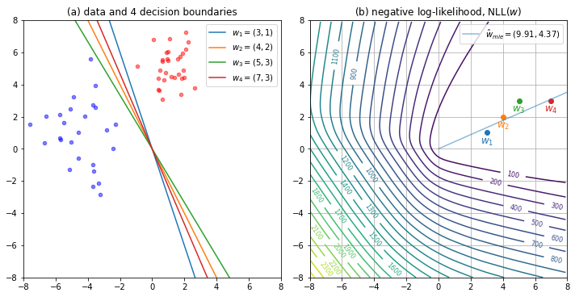

> Figure 10.13: (a) Illustration of the data (red $y=1$, blue $y=0$) and four decision boundaries according to the weights $w_1,w_2,w_3,w_4$.
>
> (b) Negative log-likelihood $\operatorname{NLL}(w)$ of binary logistic regression model. The (blue) diagonal line connects the origin to the point, $\hat w_\text{mle}=(9.91, 4.37)$, computed using
>
> ```python
> scipy.optimize.minimize(x0=(0, 0), method='Newton-CG')
> ```
>
> However, the unconstrained MLE has $\|\hat w_\text{mle}\|=\infty$. Notice that $w_i(1) / w_i(2) \approx \hat w_\text{mle}(1) / \hat w_\text{mle}(2)$ for $i=1,2,3,4$.


#### Unnormalized negative log posterior

We use a (spherical) Gaussian prior, $p(w)=\mathcal{N}(w|0,\sigma^2I)$ so that

$$
\begin{align*}
-\log p(w|\mathcal{D}) &= -\log p(\mathcal{D}|w) + \frac{1}{2\sigma^2}\|w\|_2^2 + \text{const} \\
\operatorname{P
NLL}(w) &= \operatorname{NLL}(w) + \lambda\|w\|_2^2
\end{align*}
$$

where $\lambda=\frac{1}{2\sigma^2}$. Note that $\sigma^2$ controls the strength of the prior.

- $\sigma^2\to 0$ implies $\lambda\to\infty$ so that $\hat w_\text{map}=0$; <u>maximally uncertain predictions</u>.
  
- $\sigma^2\to\infty$ implies $\lambda=0$ so that the prior becomes uninformative and $\hat w_\text{map}=\hat w_\text{mle}$; <u>minimally uncertain predictions</u>.


The **Laplace approximation** or a **quadratic approximation** approximates the posterior using a <u>multivariate Gaussian</u>.

$$
p(w|\mathcal{D}) \approx \mathcal{N}(w|\hat w_\text{map}, H_{\hat w_\text{map}}^{-1})
$$

where $\hat w_\text{map}$ is the MAP estimate and $H_{\hat w_\text{map}}$ is the Hessian computed at $\hat w_\text{map}$ (see §4.6.8.2).

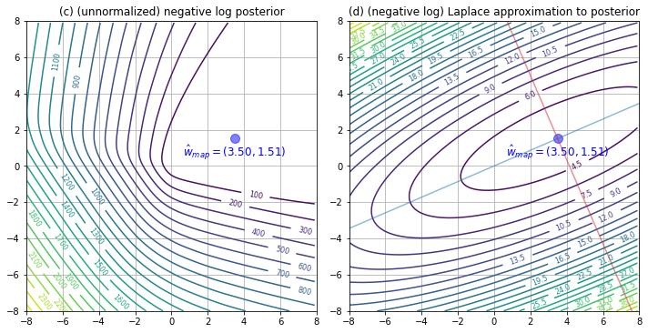

> Figure 10.13: (c) Unnormalized log posterior (assuming vague spherical prior). (d) Negative log of Laplace approximation to posterior.

In Figure 10.13 (d), the shape of the posterior is distorted. The orientation of the blue line shows (big) uncertainty about the magnitude of $w$, and the orientation of the red line shows (small) uncertainty about the decision boundary.


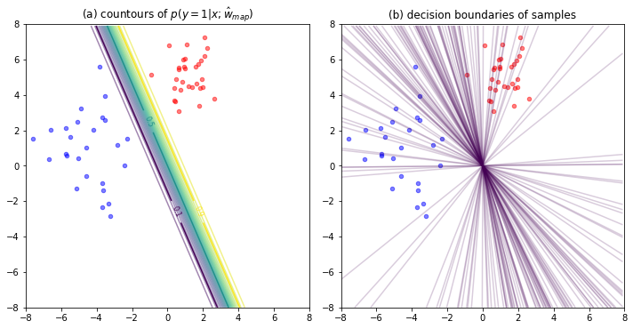

> Figure 10.14: Posterior predictive distribution for a logistic regression model in 2d. (a) Contours of $p(y=1|x;\hat w_\text{map})$. (b) 100 samples from the Laplace approximation $w\sim\mathcal{N}(w|\hat w_\text{map},H_{\hat w_\text{map}}^{-1})$.

Figure 10.14 (a) shows the plugin approximation using the MAP estimate. There is no uncertainty about the decision boundary.

Figure 10.14 (b) shows what happens when we plug in samples from the Gaussian posterior. There is considerable uncertainty about the *best* decision boundary.


### 10.5.2 Approximating the posterior predictive

The posterior $p(w|\mathcal{D})$ tells us everything we know about the parameters of the model given the data. However, the main interest is to predict $y$ given an input $x$. Thus we need to compute the **posterior predictive distribution**

$$
p(y|x;\mathcal{D}) = \int p(y|x;w)p(w|\mathcal{D})\,dw
$$

A simple approach is to first compute a point estimate $\hat w$, such as the MLE or MAP estimate, and then to ignore all posterior uncertainty, by assuming $p(w|\mathcal{D})=\delta(w-\hat w)$ where $\delta$ is the Dirac-delta function. In this case we have

$$
p(y|x;\mathcal{D}) \approx \int p(y|x;w)\delta(w-\hat w)\,dw = p(y|x;\hat w)
$$


#### 10.5.2.1 Monte Carlo approximation

The simplest approach is to use a Monte Carlo approximation to the integral. We draw $S$ samples from the posterior, $w_s\sim p(w|\mathcal{D})$, and then compute

$$
p(y=1|x;\mathcal{D}) \approx \frac{1}{S}\sum_s\sigma(w_s^Tx)
$$

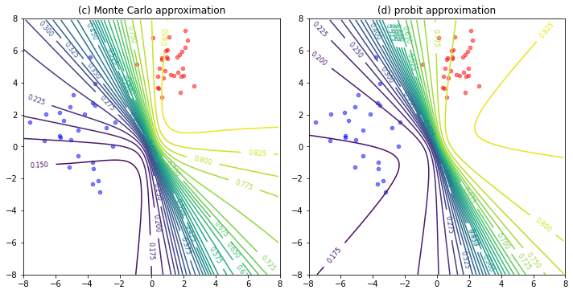

Figure 10.14 (c) shows the average of the samples generated in (b). The uncertainty in the decision boundary *splays out* as we move further from the training data.


#### 10.5.2.2 Probit approximation

The Monte Carlo approximation is simple, but it can be slow, since we need to draw $S$ samples *at test time* for each input $x$.

If we can approximate $p(w|\mathcal{D})$ using a multivariate <u>Gaussian</u>, there is a <u>simple yet accurate deterministic</u> approximation, called the **probit approximation**.

Figure 10.14 (d) shows that the probit approximation gives very similar results to the Monte Carlo approximation. Here, the Laplace approximation $p(w|\mathcal{D})\approx\mathcal{N}(w|\hat w_\text{map},H_{\hat w_\text{map}}^{-1})$ is used.

> **Reference**: [Bis06, p.219] C. Bishop, *Pattern recognition and machine learning*, 2006.
>
> Suppose that $p(w|\mathcal{D})\approx q(w)=\mathcal{N}(w|\mu,\Sigma)$ is a <u>multivariate Gaussian</u>.
>
> - Note that $\sigma(w^Tx)$ depends on $w$ only through its projection onto $x$. From the sifting property $\sigma(w^Tx) = \int\delta(a-w^Tx)\sigma(a)\,da$ of the Dirac delta function $\delta$, we obtain
> 
>   $$
>   \int\sigma(w^Tx)q(w)\,dw = \int\sigma(a)\Biggl[\int\delta(a-w^Tx)q(w)\,dw\Biggr]\,da = \int\sigma(a)p(a)\,da
>   $$
>   
>   where $p(a)=\int\delta(a-w^Tx)q(w)\,dw.$
>
> - Note that the Dirac delta function imposes a linear constraint on $w$ and so forms a marginal distribution from the joint distribution $q(w)$ by integrating out all directions orthogonal to $x$. Since $q(w)$ is Gaussian, the marginal distribution is a <u>univariate Gaussian</u>, $p(a)=\mathcal{N}(a|m,v)$, where
>
> $$
> \begin{align*}
> m \equiv \mathbb{E}_p[a] &= \int p(a)a\,da = \int q(w)\Biggl[\int\delta(a-w^Tx)a\,da\Biggr]\,dw \\
> &= \int q(w)w^Tx\,dw = \mathbb{E}_q[w^Tx] = 
> \mu^Tx \in \mathbb{R} \\
> v \equiv \mathbb{V}_p[a] &= \int p(a)a^2\,da-m^2 = \int q(w)\Biggl[\int\delta(a-w^Tx)a^2\,da\Biggr]\,dw-m^2 \\
> &= \int q(w)(w^Tx)^2\,dw-\mathbb{E}_q[w^Tx]^2 = \mathbb{V}_q[w^Tx] = x^T\Sigma x \in \mathbb{R} 
> \end{align*}
> $$
> 
> - The key observation is that $\sigma(a)\approx\Phi(\lambda a)$ where $\Phi$ is the Gaussian cdf and $\lambda^2=\pi/8$. Thus the posterior predictive distribution becomes
> 
>   $$
>   \begin{split}
>   p(y=1|x;\mathcal{D}) &= \int p(y=1|x;w)p(w|\mathcal{D})\,dw
>   \approx \int\sigma(w^Tx)q(w)\,dw = \int\sigma(a)p(a)\,da \\
>   &\approx \int\Phi(\lambda a)\mathcal{N}(a|m,v)\,da = \Phi\Bigl[\frac{m}{(\lambda^{-2}+v)^{\frac{1}{2}}}\Bigr] \approx \sigma(k(v)m)
>   \end{split}
>   $$
>   
>   where $\kappa(v) \equiv \lambda^{-1}(\lambda^{-2}+v)^{-\frac{1}{2}} = (1+\lambda^2v)^{-\frac{1}{2}} = (1+\pi v/8)^{-\frac{1}{2}}$.
> 


#### Generalized probit approximation

Multinomial probit or multivariate probit (Check!)

> **Reference:** [Gib97, eq. 5.33] M. Gibbs, *Bayesian Gaussian Processes for Regression and Classification*, 1997.
>
> In the multi-class case we can use the approximation to the integral of a Gaussian and softmax. If $a=W^Tx$, we have
> 
> $$
> p(y=c|x;\mathcal{D}) = \int S(a)_c p(a)\,da \approx \frac{\exp(\kappa(v_c)\bar m_c)}{\sum_{c'}\exp(\kappa(v_{c'})\bar m_{c'})}
> $$
> 
> where $p(a)=\mathcal{N}(a|\bar m,\operatorname{diag}(v_1,\dotsc,v_C))$ is a <u>multivariate Gaussian</u>.
>
> Note that the approximation is based on the assumption that $\kappa(v_c)$ is close to unity for all $c$.


## Implementation of logistic regression in scikit-learn (under construction)

> Classification can be viewed as a two step process:
>
> 1. Model construction: $x\in\mathbb{R}^D\mapsto a=\phi(x;\theta)\in\mathbb{R}^*$, $\phi$ can be any function including DNN
>    - **Binary classification**: $x\mapsto a=w^Tx+b\in\mathbb{R}$, where $\theta=(w,b)\in\mathbb{R}^{D+1}$ and $y\in\{0,1\}$ 
>    - **Multi-class classification**: $x\mapsto a=Wx+b\in\mathbb{R}^C$, where $\theta=(W,b)\in\mathbb{R}^{C(D+1)}$ and either $y\in\{1,2,\dotsc,C\}$ or $y\in\{0,1\}^C$ with $\sum_c y_c=1$ (one-hot encoding)
>    - **Multi-label classification**: $x\mapsto a=Wx+b\in\mathbb{R}^C$, where $\theta=(W,b)\in\mathbb{R}^{C(D+1)}$ and $y\in\{0,1\}^C$
>    - **Multi-class multi-output classification**: $x\mapsto [a_t=W_tx+b_t]\in\mathbb{R}^{TC}$, where $\theta=(W_t,b_t)\in\mathbb{R}^{TC(D+1)}$ and $[y_t]\in\mathbb{R}^T$ with $y_t\in\{1,2,\dotsc,C\}$
> 2. Parameter learning: $a\mapsto \mu\mapsto p(y|x;\theta)$. In particular $\operatorname{NLL}(\theta)\equiv-\frac{1}{N}\sum_n\log p(y_n|x_n;\theta)$ gives a loss to learn the parameters $\theta$.
>    - **Binary classification**: $a\mapsto\mu=\sigma(a)\in\mathbb{R}\mapsto\operatorname{Ber}(y|\mu)$, and $\operatorname{NLL}(\theta)=\frac{1}{N}\sum_n\mathbb{H}(y_n,\mu_n)$
>    - **Multi-class classification**: $[a_c]\mapsto\mu=S([a_c])\in\mathbb{R}^C\mapsto\operatorname{Cat}(y|\mu)$, and $\operatorname{NLL}(\theta)=\frac{1}{N}\sum_n\mathbb{H}(y_n,\mu_n)$
>    - **Multi-label classification**: $[a_c]\mapsto[\mu_c=\sigma(a_c)]\in\mathbb{R}^C\mapsto\prod_c\operatorname{Ber}(y|\mu_c)$, and $\operatorname{NLL}(\theta)=\frac{1}{N}\sum_n\sum_c\mathbb{H}(y_{nc},\mu_{nc})$
>    - **Multi-class multi-output classification**: $[a_{tc}]\mapsto [\mu_t=S([a_{tc}]_c)]_t\in\mathbb{R}^{TC}\mapsto\prod_t\operatorname{Cat}(y_t|\mu_t)$, and $\operatorname{NLL}(\theta)=\frac{1}{N}\sum_n\sum_t\mathbb{H}(y_{nt},\mu_{nt})$


Our goal is to solve the optimization problem

$$
\hat w\equiv\arg\min_w \bigl[\mathcal{L}(w) + \alpha \mathcal{R}(w)\bigr]
$$

where $\mathcal{L}(w)$ is the loss function that measures model (mis)fit and $\mathcal{R}$ is a regularization term (or `penalty`) that penalizes model complexity, where $\alpha>0$ is a hyperparameter that controls the regularization strength.


```python
from sklearn.linear_model import SGDClassifier
clf = SGDClassifier(loss='log_loss', penalty='none')
    # e.g., learning_rate='constant', eta0=0.1 for constant learning rate
clf.fit(X, y)
clf.decision_function(X) # logit a: X @ clf.coef_.T + clf.intercept_
clf.predict(X) # argmax of decision_function(X)
clf.predict_proba(X) # softmax of decision_function(X)
    # For the binary classification: (1-p, p), where p=sigmoid(decision_function(X))
    # In this case, decision_function(X) is of shape (1,)
clf.predict_log_proba(X) # log of predict_proba(X)
```

- `clf.coef_`: Weights assigned to the features, of shape $(C,D)$ or $(1,D)$ if binary
- `clf.intercept_`: Constants in decision function, of shape $(C,)$ or $(1,)$ if binary


We can improve the convergence speed using variance reduction techniques such as **SAGA** (see §8.4.5).

> SAGA – Defazio, A., Bach F. & Lacoste-Julien S. (2014). https://arxiv.org/abs/1407.0202

In particular, `LogisticRegression` in `scikit-learn` solves the optimization problem

$$
\arg\min_w \Bigl[ C \sum_n \log\bigl[1+\exp(-\tilde y_n(w^Tx_n+b))\bigr] + \mathcal{R}(w) \Bigr]
$$

where $C$ (default 1.0) gives the inverse of regularization strength.

```python
from sklearn.linear_model import LogisticRegression
clf = LogisticRegression(solver='saga', penalty='none')
    # Supported penalties by 'saga': 'elasticnet', 'l1', 'l2', 'none'
clf.fit(X, y)
clf.decision_function(X) # logit a: X @ clf.coef_.T + clf.intercept_
clf.predict(X) # argmax of decision_function(X)
clf.predict_proba(X) # softmax of decision_function(X)
    # For the binary classification: (1-p, p), where p=sigmoid(decision_function(X))
    # In this case, decision_function(X) is of shape (1,)
clf.predict_log_proba(X) # log of predict_proba(X)
```

- `clf.coef_`: Coefficient of the features in the decision function, of shape $(C,D)$ or $(1,D)$ if binary
- `clf.intercept_`: Intercept (bias) added to the decision function, of shape $(C,)$ or $(1,)$ if binary


Notice that `sklearn.linear_model.Perceptron()` is equivalent to

````python
SGDClassifier(loss='perceptron', penalty='none', learning_rate='constant', eta0=1.0)
````

The `perceptron` loss is defined by

$$
\mathcal{L}(w) = \frac{1}{N}\sum_n\max\{0,-\tilde y_na_n\}
$$


```python
from sklearn.linear_model import Perceptron
clf = Perceptron(penalty='none') # Supported penalties: 'elasticnet', 'l1', 'l2'
clf.fit(X, y)
clf.decision_function(X) # logit a: X @ clf.coef_.T + clf.intercept_
clf.predict(X) # argmax of decision_function(X)
```

- `clf.coef_`: Coefficient of the features in the decision function, of shape $(C,D)$ or $(1,D)$ if binary
- `clf.intercept_`: Intercept (bias) added to the decision function, of shape $(C,)$ or $(1,)$ if binary

