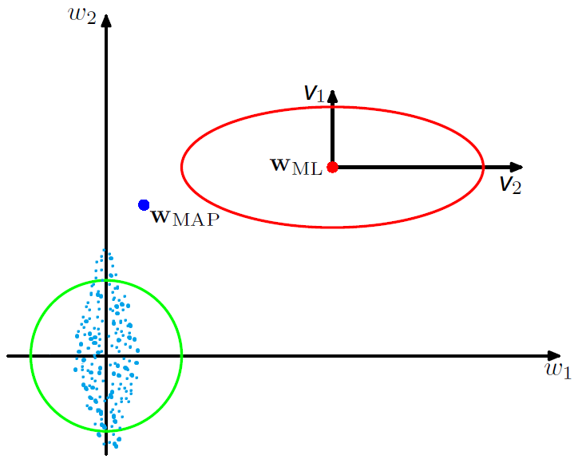
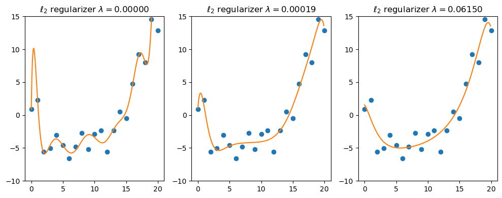
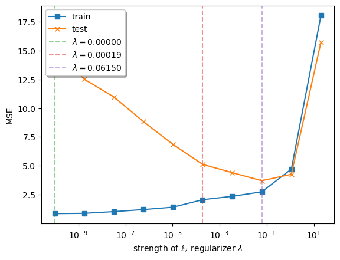
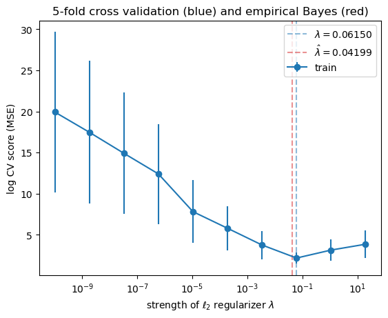

# 11. Linear Regression

We assume that $x$ is written as $(1,x_1,\dotsc,x_D)$, so we can absorb the offset (or bias) term $b=w_0$ into the weight vector $w$.

The key property of the **linear model** is that the <u>expected value of the output</u> $y$ is assumed to be a <u>linear function of the input</u> $x$, i.e,

$$
\mathbb{E}[y|x] = \int y\,p(y|x;\theta)\,dy = w^Tx
$$


## 11.2 Least squares linear regression

We assume that $y=f(x,w)+\epsilon$, where $f(x,w)$ is a <u>deterministic function</u> and $\epsilon\sim\mathcal{N}(0,\sigma^2)$ is an <u>additive Gaussian noise</u>. The term **linear regression** refers to a model

$$
p(y|x;w,\sigma^2) = \mathcal{N}(y|f(x,w),\sigma^2)
$$

where $f(x,w)=\mathbb{E}[y|x]=w^Tx$. If $x$ is one-dimensional, it is called **simple linear regression**. If $x\in\mathbb{R}^D$ is multi-dimensional, it is called **multiple linear regression**. If the output $y\in\mathbb{R}^J$ is also multi-dimensional, it is called **multivariate linear regression**

$$
p(y|x;w_1,\dotsc,w_J,\sigma_1^2,\dotsc,\sigma_J^2) = \prod_j \mathcal{N}(y_j|w_j^Tx,\sigma_j^2)
$$

We can apply a <u>nonlinear transformation</u> $\phi$ to the input $x$ to get 

$$
p(y|x;\theta) = \mathcal{N}(y|w^T\phi(x),\sigma^2)
$$


> Figure 11.1: Polynomial regression of degrees 1 and 2 fit to 21 datapoints. $\phi(x)=(1,x,x^2)$ for degree 2.


### 11.2.2 Least squares estimation

The objective function to <u>minimize the negative log likelihood</u> is

$$
\begin{align*}
\operatorname{NLL}(w,\sigma^2) &= -\sum_n\log\mathcal{N}(y_n|w^Tx_n,\sigma^2) \\
&= \frac{1}{2\sigma^2}\sum_n(y_n-w^Tx_n)^2 + \frac{N}{2}\log(2\pi\sigma^2) \tag{11.5}
\end{align*}
$$

We <u>focus on estimating the weights</u> $w$. In this case, the NLL is equal (up to irrelevant constants) to the **residual sum of squares (RSS)**

$$
\operatorname{RSS}(w) \equiv \frac{1}{2}\sum_n (y_n-w^Tx_n)^2 = \frac{1}{2}(Xw-y)^T(Xw-y) \tag{11.6}
$$

Thus $\hat w_\text{mle}$ is the point where

$$
\nabla_w\operatorname{NLL}(w,\sigma^2)=\nabla_w\operatorname{RSS}(w)=X^TXw-X^Ty=0 \tag{11.7}
$$

We can first optimize with respect to $w$, and then solve for the optimal $\sigma$.

> **IMPORTANT**: In the following, we assume that the $N\times(D+1)$ design matrix $X$ has <u>full rank</u> and $N\geq D+1$.

- Then $X$ has <u>linearly independent columns</u> so that $X^TX$ is invertible. In this case $X^\dagger=(X^TX)^{-1}X^T$ constitutes a left inverse, since $X^\dagger X=I$.
- On the contrary, if $N\leq D+1$ then $X$ has <u>linearly independent rows</u> so that $XX^T$ is invertible. In this case $X^\dagger=X^T(XX^T)^{-1}$ constitutes a right inverse, since $XX^\dagger=I$.

The matrix $X^\dagger$ is called the **Moore–Penrose inverse** (or **pseudoinverse**) of $X$ (see §7.5.3).


#### 11.2.2.1 Ordinary least squares

Setting $\nabla_w\operatorname{RSS}(w)=0$ and solving gives the **normal equations**

$$
X^TXw = X^Ty
$$

since, at the optimal solution, $Xw-y$ is normal (orthogonal) to the column space (range) of $X$ (see §7.7.3).

The corresponding solution $\hat w_\text{mle}$  is the **ordinary least squares (OLS)** solution

$$
\hat w_\text{mle} = (X^TX)^{-1}X^Ty = X^\dagger y \tag{11.9}
$$

Moreover, the Hessian $H(w)=\nabla_w^2\operatorname{RSS}(w) = X^TX$ is <u>positive definite</u> so that the least squares objective has a <u>unique global minimum</u> at $\hat w_\text{mle}$.


> Figure 11.2: (a) Contours of the RSS error surface for the example in Figure 11.1. The blue cross represents the MLE $\hat w_\text{mle}$. (b) Corresponding surface plot.


#### 11.2.2.2 Geometric interpretation of least squares

In the case of an **overdetermined system** when $N>D+1$,

$$
\hat y = X\hat w_\text{mle} = XX^\dagger y = X(X^TX)^{-1}X^T y
$$

corresponds to an **orthogonal projection** of $y$ onto the column space of $X$. Here, $\operatorname{Proj}(X)\equiv XX^\dagger$ is called the **projection matrix** or the **hat matrix**.


#### 12.2.2.3 Algorithmic issues

Even if it is theoretically possible to compute the pseudoinverse, we should not do so for numerical reasons, since $X^TX$ may be <u>ill conditioned or singular</u>.

1. A better and more general approach is to use the <u>SVD</u>, $X=USV^T$. Then $X^\dagger=VS^\dagger U^T$, where $S^\dagger$ is formed by replacing every non-zero diagonal entry by its reciprocal and transposing the resulting matrix (see §7.5.3), and

   $$
   \hat y = XX^\dagger y = (USV^T)(VS^\dagger U^T)y = UU^Ty \tag{11.70}
   $$
   
   ```python
from scipy.linalg import lstsq
   # lstsq.default_lapack_driver = 'gelsd'
   w, residues, rank, singular_values = lstsq(X, y)
   ```
   
   (See LAPACK: DGELSD, https://netlib.org/lapack/explore-3.1.1-html/dgelsd.f.html)

2. If $N\gg D$, it can be quicker to use <u>QR decomposition</u>, $X=QR$ where $Q$ is an orthogonal matrix and $R=\begin{bmatrix}R_1\\0\end{bmatrix}$ with a $(D+1)\times(D+1)$ upper triangular matrix $R_1$ (see §7.6.2).

   $$
   y=Xw=(QR)w \implies Q^Ty = Q^T(QR)w = Rw
   $$

   Since $R_1$ is upper triangular, we can solve the last equation using <u>back-substitution</u>, thus <u>avoiding matrix inversion</u>.

   ```python
   from scipy.linalg import lstsq
   # 'gelsy' can be slightly faster on many problems.
   w, _, rank, _ = lstsq(X, y, lapack_driver='gelsy')
   ```

   (See LAPACK: DGELSY, https://netlib.org/lapack/explore-3.1.1-html/dgelsy.f.html)

3. An alternative is to use <u>iterative solvers</u>, such as the **conjugate gradient** method for a <u>symmetric positive definite</u> matrix, and the **GMRES** (generalized minimal residual method) for a general <u>square</u> matrix.

   These methods are well-suited to problems where the matrix is a <u>dependency structure matrix</u> (DSM; it is an equivalent of an adjacency matrix in graph theory) or a <u>sparse matrix</u>.

   ```python
   from scipy.sparse.linalg import cg, gmres
   w, info = cg(X.T @ X, X.T @ y)    # Conjugate Gradient iteration
   w, info = gmres(X.T @ X, X.T @ y) # Generalized Minimal RESidual iteration
   ```

> **IMPORTANT**: It is usually essential to <u>standardize the input features before fitting the model</u>, to ensure that they are zero mean and unit variance (see §11.7.5).


#### 11.2.2.4 Weighted least squares

In some cases, we want to associate a weight with each sample. For example, in **heteroskedastic regression**, the variance depends on the input, so

$$
p(y|x;\theta) = \mathcal{N}(y|w^Tx,\sigma^2(x))
$$

The **weighted linear regression** has the form

$$
p(y|x;\theta) = \mathcal{N}(y|Xw,\Lambda^{-1})
$$

where $\Lambda=\operatorname{diag}(1/\sigma^2(x_n))$. The MLE is given by the **weighted least squares (WLS)** estimate

$$
\hat w_\text{mle} = (X^T\Lambda X)^{-1}X^T\Lambda y
$$

Recall that it is called the **generalized least squares (GLS)** estimate if $\Lambda$ is not diagonal.


### 11.2.3 Other approaches to computing the MLE

#### 11.2.3.1 Solving for offset and slope separately

> **Reference**: [Bis06, p.142]
>
> If we make the bias parameter explicit, then the RSS (eq. 11.6) becomes
>
> $$
> \begin{split}
> \operatorname{RSS}(w_0,w) &= \frac{1}{2}\sum_n(y_n-w_0-w^Tx_n)^2 = \frac{1}{2}\sum_n (y_n-w_0-\sum_{d=1:D} w_dx_{nd})^2 \\
> \frac{\partial}{\partial w_0}\operatorname{RSS}(w_0,w) &= -\sum_n (y_n-w_0-\sum_{d=1:D} w_dx_{nd}) = Nw_0 - \sum_n (y_n-\sum_{d=1:D} w_dx_{nd})
> \end{split}
> $$
>
> Setting $\frac{\partial}{\partial w_0}\operatorname{RSS}(w_0,w)=0$ and solving for $w_0$ gives
>
> $$
> \hat w_0=\frac{1}{N}\sum_n(y_n-\sum_{d=1:D} w_dx_{nd}) = \bar y-\sum_{d=1:D} w_d\bar x_d = \bar y-w^T\bar x
> $$
>
> where $\bar y = \frac{1}{N}\sum_n y_n$ and $\bar x_d=\frac{1}{N}\sum_n x_{nd}$.
>


Replacing $w_0$ with $\hat w_0=\bar y-w^T\bar x$, we have an equation similar to (eq. 11.6)
$$
\operatorname{RSS}(w) = \frac{1}{2}\sum_n\bigl[(y_n-\bar y)-w^T(x_n-\bar x)\bigr]^2
= \frac{1}{2}(X_cw-y_c)^T(X_cw-y_c)
$$

where $X_c$ is the $N\times D$ <u>centered design matrix</u> containing $(x_n-\bar x)^T$ along its rows, and $y_c=y-\bar y1_N$ is the <u>centered output vector</u>. Remember that $w=(w_1,\dotsc,w_D)$ does not contain the bias $w_0$.

Thus we can first compute $\hat w$ on the centered input matrix:

$$
\hat w = (X_c^TX_c)^{-1}X_c^Ty_c = \Bigl[\sum_n(x_n-\bar x)(x_n-\bar x)^T\Bigr]^{-1} \Bigl[\sum_n(y_n-\bar y)(x_n-\bar x)\Bigr] \tag{11.25}
$$

and then finally estimate

$$
\hat w_0=\bar y-\hat w^T\bar x \tag{11.26}
$$

```python
from sklearn.linear_model import LinearRegression

clf = LinearRegression(fit_intercept=True)
clf.fit(X, y)   # fit linear model
clf.predict(X)  # predict using the linear model
clf.score(X, y) # coefficient of determination (eq. 11.51) of the prediction
```

By default, `LinearRegression()` solves (eq. 11.25) for $\hat w$ using the SVD (`scipy.linalg.lstsq`) of the <u>centered</u> design matrix $X_c$ and the <u>centered</u> output vector $y_c$. And then the bias $\hat w_0$ is calculated from (eq. 11.26).

On the contrary, `fit_intercept=False` <u>prevents</u> $X$ and $y$ from being centered. In this case (eq. 11.9) is used directly. If the first column of $X$ corresponds to the bias $w_0$, this option must be set to `False`.

- `clf.coef_`: The MLE estimate $\hat w$.

- `clf.intercept_`: The MLE estimate $\hat w_0$. It is always zero if `fit_intercept=False`.


#### 11.2.3.2 Simple linear regression (1d inputs)

In the case of 1d (scalar) inputs, (eq. 11.25 & 11.26) reduce to the familiar form

$$
\begin{align*}
\hat w_1 &= \frac{\sum_n(x_n-\bar x)(y_n-\bar y)}{\sum_n(x_n-\bar x)^2} = \frac{C_{xy}}{C_{xx}} \tag{11.27} \\
\hat w_0 &= \bar y-\hat w_1\bar x = \mathbb{E}[y]-\hat w_1\mathbb{E}[x] \tag{11.28}
\end{align*}
$$

where $C_{xy}=\operatorname{Cov}[X,Y]$ and $C_{xx}=\operatorname{Cov}[X,X]=\mathbb{V}[X]$.

> **Reference**: §3.1.1 Covariance and §3.1.2 Correlation
>
> The **covariance** $\operatorname{Cov}[X,Y]\equiv\mathbb{E}[(X-\mathbb{E}[X])(Y-\mathbb{E}[Y])]$ between $X$ and $Y$ measures the <u>degree to which $X$ and $Y$ are (linearly) related</u>. If $X$ and $Y$ are independent, $\operatorname{Cov}[X,Y]=0$, but the converse is not true. Note that $-\infty<\operatorname{Cov}[X,Y]<\infty$.
>
> The (Pearson) **correlation coefficient** gives a normalized measure with a finite lower and upper bound $\pm1$.
> 
> $$
> \operatorname{corr}[X,Y] \equiv \frac{\operatorname{Cov}[X,Y]}{\sqrt{\mathbb{V}[X]\mathbb{V}[Y]}} = \frac{C_{xy}}{\sqrt{C_{xx}C_{yy}}} \tag{3.7}
> $$
> 
> Note that $\operatorname{corr}[X,Y]=1$ if and only if $Y=aX+b$ and $a>0$.
>
> One might expect the <u>correlation coefficient</u> (eq. 3.7) to be related to the slope of the regression line. However, the <u>regression coefficient</u> is in fact given by (eq. 11.27).


#### 11.2.3.3 Partial regression

Consider the case of 2d inputs, so $Y=w_0+w_1X_1+w_2X_2+\epsilon$, where $\mathbb{E}[\epsilon]=0$. Then

$$
\begin{split}
\begin{bmatrix} \hat w_1 \\ \hat w_2 \end{bmatrix} &= \hat w = (X_c^TX_c)^{-1}X_c^Ty_c = \begin{bmatrix} C_{11} & C_{12} \\ C_{12} & C_{22} \end{bmatrix}^{-1} \begin{bmatrix} C_{1y} \\ C_{2y} \end{bmatrix} \\
&= \frac{1}{C_{11}C_{22}-C_{12}^2} \begin{bmatrix} C_{22}C_{1y}-C_{12}C_{2y} \\ -C_{12}C_{1y}+C_{11}C_{2y} \end{bmatrix}
\end{split}
$$

where $C_{ij}=\operatorname{Cov}[X_i,X_j]$ and $C_{iy}=\operatorname{Cov}[X_i,Y]$.

The optimal regression coefficient for $w_1$ is given by

$$
\frac{\partial}{\partial x}\mathbb{E}[Y|X_1=x,X_2] = \hat w_1 = \frac{C_{22}C_{1y}-C_{12}C_{2y}}{C_{11}C_{22}-C_{12}^2}
$$

which is the **partial regression coefficient** of $Y$ on $X_1$, keeping $X_2$ constant. This quantity is invariant to the specific value of $X_2$ we condition on. Similarly, the **partial regression coefficient** of $Y$ on $X_2$, keeping $X_1$ constant, is given by

$$
\frac{\partial}{\partial x}\mathbb{E}[Y|X_1,X_2=x] = \hat w_2 = \frac{-C_{12}C_{1y}+C_{11}C_{2y}}{C_{11}C_{22}-C_{12}^2}
$$

We can extend this to multiple input variables. In each case, we find the <u>optimal coefficients</u>

$$
\hat w = (X_c^TX_c)^{-1}X_c^Ty_c = \Bigl[\sum_n(x_n-\bar x)(x_n-\bar x)^T\Bigr]^{-1} \Bigl[\sum_n(y_n-\bar y)(x_n-\bar x)\Bigr]
$$

<u>are equal to the partial regression coefficients</u>. This means that we can interpret the $d$'th coefficient $\hat w_d$ as the <u>change in output</u> $y$ we expect <u>per unit change in input</u> $x_{nd}$ at the $d$'th dimension, keeping all the other dimensions constant. 


#### 11.2.3.4 Recursively computing the MLE

OLS is a <u>batch method</u> for computing the MLE (see eq. 11.27 and 11.28). In some applications, the data arrives in a <u>continual stream</u>, so we want to compute the estimate online, or recursively (see §4.4.2).

Suppose $Y=w_0+w_1X+\epsilon$, simple 1d linear regression. Define

$$
\begin{split}
\bar x^{(n)} &= \frac{1}{n}\sum_{i=1:n} x_i, \quad \bar y^{(n)} = \frac{1}{n}\sum_{i=1:n} y_i \\
C_{xx}^{(n)} &= \frac{1}{n}\sum_{i=1:n} (x_i-\bar x^{(n)})^2, \quad
C_{yy}^{(n)} = \frac{1}{n}\sum_{i=1:n} (y_i-\bar y^{(n)})^2, \\
C_{xy}^{(n)} &= \frac{1}{n}\sum_{i=1:n} (x_i-\bar x^{(n)})(y_i-\bar y^{(n)})
\end{split}
$$

1. We can update the means online using

$$
\bar x^{(n+1)} = \bar x^{(n)} + \frac{1}{n+1}(x_{n+1}-\bar x^{(n)}), \quad
  \bar y^{(n+1)} = \bar y^{(n)} + \frac{1}{n+1}(y_{n+1}-\bar y^{(n)})
$$

2. To update the covariance terms, let us first rewrite $C_{xy}^{(n)}$ as follows:

$$
\begin{split}
C_{xy}^{(n)} &= \frac{1}{n} \Bigl[ \sum_{i=1:n} x_iy_i - n\bar x^{(n)}\bar y^{(n)} \Bigr] \implies
  \sum_{i=1:n} x_iy_i = nC_{xy}^{(n)}+n\bar x^{(n)}\bar y^{(n)} \\
  C_{xy}^{(n+1)} &= \frac{1}{n+1} \Bigl[ x_{n+1}y_{n+1} +   nC_{xy}^{(n)} + n\bar x^{(n)}\bar y^{(n)} - (n+1)\bar x^{(n+1)}\bar y^{(n+1)} \Bigr]
\end{split}
$$

3. From (eq. 11.27 and 11.28) we have

$$
\hat w_1^{(n+1)} = \frac{C_{xy}^{(n+1)}}{C_{xx}^{(n+1)}} \quad\text{and}\quad
  \hat w_0^{(n+1)} = \bar y^{(n+1)} - w_1^{(n+1)} \bar x^{(n+1)}
$$


> Figure 11.4: Regression coefficients over time for the 1d model in Figure 11.1.


To extend the above analysis to multi-dimensional inputs, the easiest approach is to use SGD with a minibatch of size 1, called the **least mean squares (LMS)** algorithm (see §8.4.2).

$$
\hat w^{(n+1)} = \hat w^{(n)} - \eta^{(n)}({\hat w^{(n)}}^Tx_n-y_n)x_n \tag{8.60}
$$

since $\nabla_w\operatorname{NLL}(w)=\nabla_w\operatorname{RSS}(w)=(w^Tx_n-y_n)x_n$ for one sample $(x_n,y_n)$.


#### 11.2.3.5 Deriving the MLE from a generative perspective

Linear regression is a <u>discriminative model</u> of the form $p(y|x)$. However, we can also use <u>generative model</u> for regression. The goal is to compute the conditional expectation

$$
f(x) = \mathbb{E}[y|x] = \int y\,p(y|x)\,dy = \int y\,\frac{p(x,y)}{p(x)}\,dy = \frac{\int y\,p(x,y)\,dy}{\int p(x,y)\,dy}
$$

Suppose we fit $p(x,y)$ using an <u>MVN (multivariate Gaussian)</u>. The MLEs for the parameters of the joint distribution are the <u>empirical mean and covariances</u>,

$$
\begin{split}
\mu_x &= \frac{1}{N}\sum_n x_n = \bar x \quad \mu_y = \frac{1}{N}\sum_n y_n = \bar y \\
\Sigma_{xx} &= \frac{1}{N}\sum_n (x_n-\bar x)(x_n-\bar x)^T = \frac{1}{N}X_c^TX_c \\
\Sigma_{xy} &= \frac{1}{N}\sum_n (x_n-\bar x)(y_n-\bar y)^T = \frac{1}{N}X_c^Ty_c
\end{split}
$$

Hence from (eq. 3.28) we have $\mathbb{E}[y|x] = \mu_y+\Sigma_{xy}^T\Sigma_{xx}^{-1}(x-\mu_x)=w^Tx+w_0$, where

$$
\begin{split}
w &= \Sigma_{xx}^{-1}\Sigma_{xy} = (X_c^TX_c)^{-1}X_c^Ty_c \\
w_0 &= \mu_y - \Sigma_{xy}^T\Sigma_{xx}^{-1}\mu_x = \mu_y-w^T\mu_x = \bar y-w^T\bar x
\end{split}
$$

This matches the MLEs for the discriminative model in (eq. 11.25 and 11.26).

Thus we see that fitting the joint model, and then conditioning it, <u>yields the same result</u> as fitting the conditional model. However, <u>this is only true for Gaussian models</u>.


#### 11.2.3.6 Deriving the MLE for $\sigma^2$

After estimating $\hat w_\text{mle}$, we can estimate the noise variance. From (eq 11.5) we have

$$
\hat\sigma_\text{mle}^2 = \arg\min_{\sigma^2}\operatorname{NLL}(\hat w_\text{mle},\sigma^2) = \frac{1}{N}\sum_n(y_n-\hat w_\text{mle}^Tx_n)^2
$$


### 11.2.4 Measuring goodness of fit

#### 11.2.4.1 Residual plots

For 1d inputs, we can check the reasonableness of the model by plotting the residuals, $r_n=y_n-\hat y_n$ vs. the input $x_n$. The model assumes that the residuals have a $\mathcal{N}(0,\sigma^2)$ distribution, so the **residual plot** should be a cloud of points more or less <u>equally above and below the horizontal line at 0</u>, <u>without any obvious trends</u>.


> Figure 11.5: Residual plot for polynomial regression of degree 1 and 2 for the data in Figure 11.1. (a) We see that there is some curved structure to the residuals, indicating a lack of fit. (b) We see a much better fit.


To extend this approach to <u>multi-dimensional inputs</u>, we can plot $\hat y_n$ vs. the true output $y_n$, rather than plotting vs. $x_n$. A good model will have points that <u>lie on a diagonal line</u>.


> Figure 11.6: Fit vs. actual plots for polynomial regression of degree 1 and 2 for the dataset of size 200 chosen uniformly from 0 to 20.


#### 11.2.4.2 Prediction accuracy and $R^2$

- We can assess the fit quantitatively by computing the **RSS (residual sum of squares)**. A model with <u>lower RSS fits the data better</u>.

- Another measure that is used is **root mean squared error (RMSE)**:

$$
\operatorname{RMSE}(w) \equiv \sqrt{\frac{1}{N}\operatorname{RSS}(w)} \tag{11.50}
$$

- A more interpretable measure can be computed using the **coefficient of determination**:

  $$
  R^2 \equiv 1- \frac{\operatorname{RSS}}{\operatorname{TSS}} = 1 - \frac{\sum_n(\hat y_n-y_n)^2}{\sum_n(\bar y_n-y_n)^2} \tag{11.51}
  $$
  
  We see that $R^2$ measures the <u>variance in the predictions relative to a simple constant prediction</u> of $\hat y_n=\bar y$ (no information from other variables). Note that <u>larger values imply a greater reduction in variance (better fit)</u>.

  > **Reference**: *When is R squared negative?* https://stats.stackexchange.com/questions/12900/when-is-r-squared-negative
  >
  > $R^2$ compares the fit of the chosen model with that of a horizontal straight line (the null hypothesis). If the chosen model fits worse than a horizontal line, then $R^2$ is negative.
  >
  > With <u>linear regression with no constraints</u>, $R^2$ <u>must be positive (or zero)</u> and <u>equals the square of the correlation coefficient</u>. A negative $R^2$ is only possible with linear regression when either the intercept or the slope are constrained so that the "best-fit" line (given the constraint) fits worse than a horizontal line. With <u>nonlinear regression</u>, the $R^2$ <u>can be negative</u> whenever the best-fit model (given the chosen equation, and its constraints, if any) fits the data worse than a horizontal line.


## 11.3 Ridge regression

> **Reference**: [HTF09, p.57] T. Hastie, et al. *The Elements of Statistical Learning*, 2nd ed. 2009.
>
> There are two reasons why we are often <u>not satisfied with the least squares estimates</u> $\hat w_\text{mle}$.
>
> - The first is *<u>prediction accuracy</u>*. The least squares estimates often have <u>low bias</u> $\mathbb{E}[\hat y-y]$ but <u>high variance</u> $\mathbb{V}[\hat y]$. Prediction accuracy can sometimes be <u>improved by shrinking or setting some coefficients to zero</u>. By doing so we <u>sacrifice a little bit of bias to reduce the variance</u> of the predicted values, and hence may improve the overall prediction accuracy. (See §3.4 Shrinkage Methods, [HTF09])
> - The second is *<u>interpretation</u>*. With a large number of variables (or features), we often would like to determine a <u>smaller variable subset</u> that exhibit the strongest effects. In order to get the big picture, we are willing to sacrifice some of the small details. (See §3.3 Subset Selection, [HTF09])
>
> **Ridge regression** <u>shrinks the regression coefficients</u> $w$ by imposing a penalty on their size $\|w\|_2^2$. The ridge coefficients <u>minimize a penalized RSS</u>.


#### MLE can result in overfitting.

**Ridge regression** can be derived as the <u>MAP estimation</u> of the posterior
$$
p(w|\mathcal{D}) \propto p(\mathcal{D}|w)\,p(w) = \mathcal{N}(y|Xw,\sigma^2I)\,\mathcal{N}(w|0,\tau^2I)
$$

with <u>linear regression</u> as a likelihood and <u>zero-mean Gaussian</u> prior.

Let $\lambda\equiv\sigma^2/\tau^2$ be the <u>strength of the regularizer</u>, which is proportional to the <u>strength of the prior</u> $1/\tau^2$.

$$
\begin{align*}
\hat w_\text{map} &= \arg\min_w \frac{1}{2\sigma^2}(y-Xw)^T(y-Xw)+\frac{1}{2\tau^2}w^Tw \\
&= \arg\min_w \operatorname{RSS}(w) + \frac{\lambda}{2} \|w\|_2^2 \tag{11.53}
\end{align*}
$$

This technique is called $\ell_2$ **regularization** or **weight decay**.


### 11.3.1 Computing the MAP estimate

From (eq. 11.53) the MAP estimate corresponds to minimizing

$$
J(w) \equiv (y-Xw)^T(y-Xw) + \lambda w^Tw \tag{11.55}
$$

The derivative is given by

$$
\nabla_w J(w) = 2 (X^TXw-X^Ty+\lambda w)
$$

and hence

$$
\hat w_\text{map} = (X^TX+\lambda I)^{-1}X^Ty = \bigl(\sum_n x_nx_n^T + \lambda I\bigr)^{-1}\sum_n y_nx_n \tag{11.57}
$$


#### We do not penalize $w_0$.

> **Reference**: [Bis06, p.10]
>
> - The coefficient $w_0$ is <u>omitted from the regularizer</u> because its inclusion causes the results to depend on the choice of origin for the target variable (see [HTF09, p.64]).
>
> - Or $w_0$ may be <u>included but with its own regularization coefficient</u> $\lambda_0$ (see [Bis06, §5.5.1]).

Suppose that $w_0$ has its own regularization coefficient $\lambda_0$.

Denote by $\bar x_0=(1+\frac{\lambda_0}{N})^{-1}\bar x$ and $\bar y_0=(1+\frac{\lambda_0}{N})^{-1}\bar y$. Then the optimizer of

$$
J(w,w_0) = (y-Xw-w_01_N)^T(y-Xw-w_01_N) + \lambda w^Tw + \lambda_0 w_0^2
$$

is given by

$$
\begin{split}
\hat w &= (X_{c_0}^TX_{c_0}+\lambda I_D+\lambda_0\bar x_0\bar x_0^T)^{-1}(X_{c_0}^Ty_{c_0}+\lambda_0\bar y_0\bar x_0) \\
\hat w_0 &= \bar y_0-\hat w^T\bar x_0
\end{split} \tag{*}
$$

where $X_{c_0}$ is the centered matrix with $(x_n-\bar x_0)^T$ along its rows and $y_{c_0}=y-\bar y_01_N$.

> **Reference**: [HTF09, p.64]
>
> Penalization of the intercept would make the procedure depend on the origin chosen for $y$; that is, adding a constant $c$ to each of the targets $y_n$ would not simply result in a shift of the predictions by the same amount $c$.

If we <u>do not penalize</u> $w_0$, i.e., $\lambda_0=0$, then (eq. *) becomes

$$
\hat w = (X_c^TX_c+\lambda I_D)^{-1}X_c^T(y-\bar y1_N) \quad\text{and}\quad \hat w_0=\bar y-\hat w^T\bar x
$$

Let $y'=y+c1_N$. Then $\hat w$ is not changed by adding a constant vector $c1_N$ to the target $y$, i.e., $\hat w'=\hat w$, since $y'-\bar y'1_N=y'-(\bar y+c)1_N=y-\bar y1_N$. It follows that

$$
\hat y'-\hat y=(\hat w'^Tx+\hat w_0')-(\hat w^Tx+\hat w_0)=\hat w_0'-\hat w_0=\bar y'-\bar y=c
$$

However, we cannot have the same result with nonzero $\lambda_0$.


> **Question**: Is PyTorch `SGD` optimizer apply weight decay to bias parameters with default settings?
>
> https://github.com/pytorch/pytorch/issues/2639
>
> How about `scikit-learn`'s `Ridge` model?


```python
from sklearn.linear_model import Ridge

clf = Ridge(alpha=1.0, fit_intercept=True, solver='auto')
clf.fit(X, y)   # fit linear model
clf.predict(X)  # predict using the linear model
clf.score(X, y) # coefficient of determination (eq. 11.51) of the prediction
```

The argument `alpha` is nothing but the strength of the regularizer $\lambda$.

> **IMPORTANT**:  If `fit_intercept=True`, $w_0$ will <u>not be penalized</u>, i.e., $\lambda_0=0$ so that $X_{c_0}=X_c$ and $y_{c_0}=y_c$ in (eq. *). On the contrary, if `fit_intercept=False`, $w_0$ will <u>be penalized</u> using $\lambda_0=\lambda$.

By default, `Ridge()` solves (eq. *) for $\hat w$ and then $\hat w_0$.

However, `fit_intercept=False` prevents $X$ and $y$ from being centered. In this case (eq. 11.57) is used directly. If the first column of $X$ corresponds to the bias $w_0$, this option must be set to `False`.

- `clf.coef_`: The MAP estimate $\hat w$.
- `clf.intercept_`: The MAP estimate $\hat w_0$. It is always zero if `fit_intercept=False`.

The argument `solver='auto'` selects the `sag` solver if `fit_intercept=True`. Otherwise the `cholesky` (using eq. 11.57 with `scipy.linalg.solve`) or the `sparse_cg` solver is chosen according to $X$ is dense or sparse. Other solvers available are `svd`, `lsqr`, `saga` and `libfgs` (default solver when `positive=True` is given).


> **IMPORTANT**: In the following we assume that $X$ is an $N\times D$ matrix (without the bias) and focus on
>
> $$
> \hat w_\text{map} = (X^TX+\lambda I_D)^{-1}X^Ty \tag{11.57}
> $$


> **Reference**: [HTF09, p.64]
>
> - The ridge regression solution $\hat w_\text{map}$ is again a <u>linear function</u> of $y$.
> - The solution adds a positive constant $\lambda$ to the diagonal of $X^TX$ before inversion. This makes the problem <u>nonsingular</u>, even if $X^TX$ is <u>not of full rank</u>.
> - It was the <u>main motivation</u> for ridge regression when it was first introduced in statistics (Hoerl and Kennard, 1970). Traditional descriptions of ridge regression start with definition (11.57).


#### 11.3.1.1 Solving using QR

Naively computing $\hat w_\text{map}$ using matrix inversion is a bad idea, since it can be slow and numerically unstable.

Suppose that the prior is $p(w)=\mathcal{N}(w|0,\Lambda^{-1})$, where $\Lambda$ is the precision matrix (symmetric and positive-definite).

Let $\tilde X=\begin{pmatrix}X/\sigma \\ \sqrt{\Lambda}\end{pmatrix}$ and $\tilde y=\begin{pmatrix}y/\sigma \\ 0_D\end{pmatrix}$ where $\Lambda=\sqrt{\Lambda}\sqrt{\Lambda}^T$ is a <u>Cholesky decomposition</u>. Then the RSS on this expanded data is equivalent to <u>penalized</u> RSS on the original data:

$$
\begin{split}
f(w) &= (\tilde y-\tilde Xw)^T(\tilde y-\tilde Xw)
= \begin{pmatrix}\frac{1}{\sigma}(y-Xw)\\-\sqrt{\Lambda}w\end{pmatrix}^T \begin{pmatrix}\frac{1}{\sigma}(y-Xw)\\-\sqrt{\Lambda}w\end{pmatrix} \\
&= \frac{1}{\sigma^2}(y-Xw)^T(y-Xw)+w^T\Lambda w
\end{split}
$$

In the case of ridge regression when $\Lambda=\tau^{-2}I_D$, we have $f(w)=\frac{1}{\sigma^2}J(w)$ in (eq. 11.55). Hence the MAP estimate is given by

$$
\hat w_\text{map}=(\tilde X^T\tilde X)^{-1}\tilde X^T\tilde y
$$

which can be solved using standard OLS methods.

In particular, we can compute the QR decomposition of the $(N+D)\times D$ matrix $\tilde X$, and then proceed as in §11.2.2.3. This takes $O((N+D)D^2)$ time. (https://math.stackexchange.com/questions/501018/what-is-the-operation-count-for-qr-factorization-using-householder-transformatio)


#### 11.3.1.2 Solving using SVD

> **Reference**: [HTF09, p.64-66]
>
> The **singular value decomposition (SVD)** of $X$ gives us some additional insight into the nature of ridge regression.
>
> $$
> X = USV^T \quad\text{or}\quad Xv_d=\sigma_du_d
> $$
>
> - $U$ is an $N\times D$ matrix with <u>orthonormal columns</u> $u_d$ spanning the <u>column space</u> of $X$ such that $\hat y\in\operatorname{Col}X\subseteq\mathbb{R}^N$. Note that $U^TU=I_D$.
> - $V$ is a $D\times D$ <u>orthogonal matrix</u> and the columns $v_d$ of $V$ spans the <u>row space</u> of $X$ such that $x_n\in\operatorname{Row}X\subseteq\mathbb{R}^D$. Note that $V^TV=VV^T=I_D$.
> - $S$ is a $D\times D$ <u>diagonal matrix</u> with diagonal entries $\sigma_1\geq\dotsb\geq\sigma_D\geq 0$ called the **singular values** of $X$. If one or more values $\sigma_d=0$, $X$ is singular.
>
> Using the SVD we can write the least squares fitted vector as
>
> $$
> \begin{split}
> \hat y = X\hat w_\text{mle} &= X(X^TX)^{-1}X^Ty = (USV^T)(VS^{-2}V^T)(VSU^T)y \\
> &= UU^Ty = \sum_d u_du_d^Ty
> \end{split} \tag{11.70}
> $$
>
> Now the ridge solutions are
>
> $$
> \begin{split}
> \hat y = X\hat w_\text{map} &= X(X^TX+\lambda I)^{-1}X^Ty = (USV^T)(V(S^2+\lambda I)^{-1}V^T)(VSU^T)y \\
> &= US(S^2+\lambda I)^{-1}SU^Ty = \sum_d u_d\Bigl(\frac{\sigma_d^2}{\sigma_d^2+\lambda}\Bigr)u_d^Ty 
> \end{split} \tag{11.69}
> $$


In the case when $D\gg N$ (usual in ridge regression), it is faster to use SVD than QR.

> **Reference**: [HTF09, §18.3.5 Computational ShortCuts When $p\gg N$, p.659]
>
> Given the $N\times D$ design matrix $X$, let $X=(US)V^T=RV^T$ be the SVD of $X$.
>
> - $U$ is an $N\times N$ orthogonal matrix such that $U^TU=UU^T=I_N$.
> - $V$ is a $D\times N$ matrix with orthonormal columns such that $V^TV=I_N$.
> - $S$ is an $N\times N$ diagonal matrix with diagonal entries $\sigma_1\geq\dotsb\geq\sigma_N\geq 0$.
> - $R\equiv US$ is an $N\times N$ matrix with rows $r_n^T$.
>
> Replacing $X$ by $RV^T$ we have
>
> $$
> \begin{split}
> \hat w_\text{map} &= (X^TX+\lambda I_D)^{-1}X^Ty = (VR^TRV^T+\lambda I_D)^{-1}VR^Ty \\
> &= V(R^TR+\lambda I_N)^{-1}R^Ty
> \end{split} \tag{11.65}
> $$
>
> since $(VR^TRV^T+\lambda I_D)V=VR^TR+\lambda V=V(R^TR+\lambda I_N)$.
>
> Thus $\hat w_\text{map}=V\hat\theta_\text{map}$, where $\hat\theta_\text{map}=(R^TR+\lambda I_N)^{-1}R^Ty$ is the ridge regression estimate using the $N$ observations $(r_n,y_n)$.
>
> In other words, we can simply reduce the design matrix $X$ to $R$, and work with rows of $R$. This trick reduces the computational cost from $O(D^3)$ to $O(DN^2)$ when $D>N$.


### 11.3.2 Connection between ridge regression and PCA

> **Reference**: [HTF09, p.66]
>
> Like linear regression, $\hat y=X\hat w_\text{mle}=\sum_d u_d(u_d^Ty)$, ridge regression computes the coordinates (or projection) of $y$ w.r.t. the orthonormal basis $u_d$.
> 
> $$
> \hat y = X\hat w_\text{map} = \sum_d u_d\Bigl(\frac{\sigma_d^2}{\sigma_d^2+\lambda}\Bigr)(u_d^Ty) \tag{11.69}
> $$
>
> It then **shrinks** $u_d^Ty$ by the factors $\frac{\sigma_d^2}{\sigma_d^2+\lambda}$. This means that a <u>greater amount of shrinkage</u> is applied to the coordinates of basis vectors $u_d$ with <u>smaller</u> $\sigma_d^2$.


#### What does a small value of $\sigma_d^2$ mean?

> **Reference**: [HTF09, p.66]
>
> The SVD of the <u>centered</u> design matrix $X$ is another way of expressing the <u>principal components</u> of the variables in $X$.
>
> - The <u>sample covariance</u> matrix is given by $\Sigma = \frac{1}{N-1}X^TX=\frac{1}{N-1}VS^2V^T$, which is the eigen decomposition of $\Sigma$ (up to a factor ${N-1}$).
>
> - The <u>first principal component</u> direction $v_1$ has the property that $z_1 = Xv_1=\sigma_1u_1\in\operatorname{Col}X\subseteq\mathbb{R}^N$ (projections of $x_n$'s onto $v_1$) has the <u>largest variance</u> $\frac{\sigma_1^2}{N}$ amongst all normalized linear combinations of the columns of $X$.
>
>   Note that $\mathbb{V}[u_d]=\frac{1}{N}\sum_n (u_{dn}-\mathbb{E}[u_d])^2=\frac{1}{N}$, since $X$ is centered so that $\mathbb{E}[u_d]=0$ and $u_d$ is orthonormal.
>
> - Subsequent principal components $z_d$ have maximum variance $\frac{\sigma_d^2}{N}$, subject to being orthogonal to the earlier ones. Conversely the <u>last principal component</u> has <u>minimum variance</u>.
>
> - Hence the <u>small singular values</u> $\sigma_d$ correspond to <u>directions</u> $u_d$ in the column space of $X$ <u>having small variance</u> $\frac{\sigma_d^2}{N}$, and ridge regression <u>shrinks these directions the most</u>.


If $\sigma_d^2$ is <u>small</u> compared to $\lambda$, then the direction $u_d$ will <u>not have much effect</u> on the prediction. In view of this, we define the effective number of **degrees of freedom** of the model

$$
\operatorname{dof}(\lambda) = \sum_d \frac{\sigma_d^2}{\sigma_d^2+\lambda}
$$

Since $\lambda\geq 0$, we have $0\leq\frac{\sigma_d^2}{\sigma_d^2+\lambda}\leq 1$. Note that $\operatorname{dof}(0)=D$ and $\operatorname{dof}(\lambda)\to0$ as $\lambda\to\infty$.


#### Why is this behavior desirable?



> Figure 3.15 [Bis06, p.170]: Contours of the likelihood function $p(\mathcal{D}|w,\sigma^2)$ (red) and the prior $p(w)$ (geen).
>
> - The <u>Hessian</u> of the (negative log) likelihood function is $H(w)=X^TX=VS^2V^T$ and $S^2=\operatorname{diag}(\sigma_1^2,\dotsc,\sigma_D^2)$ so that the eigenvalues $\sigma_d^2$ measure the <u>curvature of the likelihood function</u>.
> - Since a <u>smaller curvature</u> corresponds to a <u>greater elongation of the contours</u> of the likelihood function, $\sigma_2^2$ is small compared with $\sigma_1^2$.
> - For directions $v_1=w_2$ in which $\sigma_1^2\gg\lambda$, the corresponding parameter $\hat w_\text{map}=(X^TX+\lambda I)^{-1}X^Ty$ will be close to $\hat w_\text{mle}=(X^TX)^{-1}X^Ty$, and the ratio $\frac{\sigma_1^2}{\sigma_1^2+\lambda}$ will be close to 1. Such parameters are called **well-determined** because their values are tightly constrained by the data.
> - For directions $v_2=w_1$ in which $\sigma_2^2\ll\lambda$, the corresponding parameter $\hat w_\text{map}$ will be close to 0, as will the ratio $\frac{\sigma_d^2}{\sigma_d^2+\lambda}$. These are directions in which the likelihood function is relatively insensitive to the parameter value and so the parameter has been set to a small value by the prior.

In this way, <u>ill-determined parameters are reduced</u> in size towards 0. This is called **shrinkage**.


#### Principal component regression

This technique is a supervised version of PCA (see §20.1).

- First use PCA to reduce the dimensionality to $K$, and then use these low dimensional features as input to regression.

> **Reference**: [HTF09, §3.5.1 Principal Components Regression, p.79]
>
> As with ridge regression (see §11.7.5), principal components depend on the scaling of the inputs, so typically we first standardize them.
>
> If $K=D$, then we would just get back the usual least squares estimates. For $K\lt D$, we get a reduced regression.
>
> We see that principal components regression is very similar to ridge regression, since both operate via the principal components of the design matrix $X$.
>
> - <u>Ridge regression shrinks</u> the coefficients of the principal components, shrinking more depending on the size of the corresponding eigenvalue.
> - <u>Principal component regression discards</u> the $D-K$ smallest eigenvalue components.
>
> 
>
> > Figure 3.17 [HTF09, p.80]: <u>Ridge regression</u> shrinks the regression coefficients of the principal components, using shrinkage factors $\frac{\sigma_d^2}{\sigma_d^2+\lambda}$. <u>Principal component regression</u> truncates them. Shown are the shrinkage and truncation patterns as a function of the principal component index.


### 11.3.3 Choosing the strength of the regularizer

#### Cross validation

To find the <u>optimal value</u> of $\lambda$, we can try a finite number of distinct values, and use <u>cross validation</u> to estimate their expected loss (see §4.5.5.2).



> Figure 4.5: (a-c) Ridge regression applied to a degree 14 polynomial fit to 21 data points.



> Figure 4.5: (d) MSE vs. strength of regularizer $\lambda$. The degree of regularization <u>increases</u> from left to right, so model complexity <u>decreases</u> from left to right. Here, 10 points of $\log_{10}\lambda$ are chosen evenly from -10 to 1.3, using `np.logspace(-10, 1.3, 10)`.


#### Warm start

Cross validation can be <u>quite expensive</u> if we have many values to choose from.

We can often **warm start** the optimization procedure, using the value of $\hat w(\lambda_k)$ as an initializer for $\hat w(\lambda_{k+1})$, where $\lambda_{k+1}<\lambda_k$; in other words, we <u>start with a highly constrained model</u> (strong regularizer), and then <u>gradually relax the constraints</u> (decrease the amount of regularization).

The set of parameters $\hat w_k$ that we sweep out in this way is known as the **regularization path** (see §11.4.4).


> Figure 11.10: (a) Profiles of ridge coefficients for the prostate cancer example vs. bound $B$ on $\ell_2$ norm of $w$, so large $\lambda_k$ is on the left. The vertical line is the best value $\lambda=7.27895$ chosen by the efficient <u>Leave-One-Out Cross-Validation</u> with $N=97$.


## 11.7 Bayesian linear regression *

> **Reference**: [Bis06, §3.3, p.152]
>
> In <u>maximum likelihood estimation</u> of a linear regression model, we have seen that
>
> - The <u>effective model complexity</u> needs to be controlled according to the <u>size of the data set</u> (to avoid overfitting).
> - It can then be controlled by the value of the <u>regularization coefficient</u>.
>
> This leaves <u>the issue of deciding the appropriate model complexity</u> for the particular problem, which cannot be decided simply by maximizing the likelihood function.
>
> - <u>Independent hold-out (validation) data</u> can be used to determine model complexity, but this can be both computationally expensive and wasteful of valuable data.
>
> - A <u>Bayesian treatment of linear regression</u> will avoid the overfitting problem of maximum likelihood, and will also lead to automatic methods of determining model complexity <u>using the training data alone</u> (without cross-validation).

For simplicity, we assume the noise variance $\sigma^2$ is a known constant, so we just want to compute the posterior $p(w|\mathcal{D};\sigma^2)\propto p(\mathcal{D}|w;\sigma^2)p(w)$.


### 11.7.1 Priors

We will use a <u>Gaussian prior</u>, $p(w)=\mathcal{N}(w|\breve w,\breve\Sigma)$. For example, $\breve w=0$ and $\breve\Sigma=\tau^2I_D$ in ridge regression.


### 11.7.2 Posteriors

We can rewrite the <u>likelihood</u> in terms of an MVN

$$
p(\mathcal{D}|w;\sigma^2) = \prod_n p(y_n|w^Tx_n,\sigma^2) = \mathcal{N}(y|Xw,\sigma^2I_N)
$$

From §3.3.1 **Bayes rule for Gaussians**, the <u>posterior</u> is given by

$$
p(w|y;X,\sigma^2) = \mathcal{N}(w|\tilde w,\tilde\Sigma) \propto \mathcal{N}(y|Xw,\sigma^2I_N)\,\mathcal{N}(w|\breve w,\breve\Sigma) \tag{3.37}
$$

where the inverse of the <u>posterior covariance</u> $\tilde\Sigma^{-1}\equiv\breve\Sigma^{-1}+\frac{1}{\sigma^2}X^TX$, and the <u>posterior mean</u> $\tilde w\equiv\tilde\Sigma \bigl( \frac{1}{\sigma^2}X^Ty+\breve\Sigma^{-1}\breve w \bigr)$.

- Since the posterior is Gaussian, its mode $\hat w_\text{map}$ coincides with its mean $\tilde w$.

- For example, $\breve w=0$, $\breve\Sigma=\tau^2I_D$, and $\lambda=\sigma^2/\tau^2$ <u>in ridge regression</u> so that

  $$
  \begin{gather*}
  \tilde\Sigma^{-1} = \tfrac{1}{\tau^2}I_D + \tfrac{1}{\sigma^2}X^TX = \tfrac{1}{\sigma^2}(X^TX+\lambda I_D) \\
  \tilde w = \sigma^2(X^TX+\lambda I_D)^{-1}\Bigl(\tfrac{1}{\sigma^2}X^Ty+0\Bigr)=(X^TX+\lambda I_D)^{-1}X^Ty
  \end{gather*}
  $$
  
- In particular, if $\tau^2\to\infty$ (infinitely broad prior in ridge regression), the <u>posterior mean</u> $\tilde w=\hat w_\text{mle}=(X^TX)^{-1}X^Ty$ (eq. 11.9), and the inverse of the <u>posterior covariance</u> $\tilde\Sigma^{-1}=\frac{1}{\sigma^2}X^TX$.


- If $N=0$, i.e., $X=0$, then the posterior reverts to the prior.

Furthermore, the <u>normalization constant</u> of the posterior is given by

$$
p(y) = \int \mathcal{N}(y|Xw,\sigma^2I_N)\,\mathcal{N}(w|\breve w,\breve\Sigma)\,dw = \mathcal{N}(y|X\breve w,\sigma^2I_N+X\breve\Sigma X^T) \tag{3.38}
$$

- In <u>ridge regression</u>, we have a Gaussian $p(y)=\mathcal{N}(y|0,\tau^2(XX^T+\lambda I_N))$.


### 11.7.3 Example

> **Reference**: [Bis06, §3.3.1, p.154-155]
>
> We can illustrate Bayesian learning in a linear model, as well as the <u>sequential update of a posterior distribution</u>, using a simple example involving straight line fitting.
>
> **Linear model**: $y=f(x,w)=w_0+w_1x$, where the true parameters are $w_0=-0.3$ and $w_1=0.5$. 
>
> **Synthetic data**:
>
> 1. Choose $x_n\sim\mathcal{U}(-1,1)$ from the uniform distribution.
> 2. Evaluate $y_n=f(x_n,w)+\epsilon_n$, where $\epsilon_n\sim\mathcal{N}(0,\sigma^2)$ is a Gaussian noise with $\sigma=0.2$.
>
> **Goal**: Recover $w_0$ and $w_1$ from $\mathcal{D}=\{(x_n,y_n)_{n=1:N}\}$, and explore the dependence on $N$.
>
> **Hyperparameters**: $\sigma^2=(0.2)^2$ and $\tau^2=0.5$ so that $\lambda=\sigma^2/\tau^2=2(0.2)^2=0.08$.


> Figure 11.20: Sequential Bayesian inference of the parameters of a linear regression model $p(y|x)=\mathcal{N}(y|w_0+w_1x,\sigma^2)$.
>
> - <u>Left column</u>: Likelihood function $L(w_0,w_1)=\mathcal{N}(y_n|w_0+w_1x_n,\sigma^2)$ for the current data point $(x_n,y_n)$ shown by the <u>solid blue circle</u> in the right column.
> - <u>Middle column</u>: Posterior $p(w|\mathcal{D}_N,\sigma^2)$ given first $N=0,1,2,100$ data points $\mathcal{D}_N$.
> - <u>Right column</u>: 10 sample lines $y=f(x,w)$ where $w=(w_0,w_1)\sim p(w|\mathcal{D}_N,\sigma^2)$.
>
> The <u>white cross</u> in the left and middle columns represents the true parameter $w_0=-0.3$ and $w_1=0.5$.
>
> - <u>1st row</u>: Before any data points are observed. Prior distribution where $N=0$.
> 
> - <u>2nd row</u>: After observing a single data point $(x_1,y_1)$.
>
>   Note that the likelihood provides a <u>soft constraint</u> that the line must pass close to the data point, where close is determined by the noise variance $\sigma^2=(0.2)^2$. When we multiply this likelihood function by the prior from the top row, and normalize, we obtain the posterior distribution shown in the middle plot on the second row.
>
>   Note that the sample lines in the right column all pass close to the data point.
>   
> - <u>3rd row</u>: After observing a second data point $(x_2,y_2)$.
>
>   Note that this is exactly the same posterior as would be obtained by combining the original prior with the likelihood function for the two data points. This posterior has now been influenced by two data points, and because two points are sufficient to define a line this already gives a relatively compact posterior.
>
>   Note that the sample lines in the third column pass close to both of the data points.
>
> - <u>4th row</u>: After observing a total of 100 data points.
>
>   Note how the posterior is much sharper than in the 3rd row. In the limit of an infinite number of data points, the posterior would become a delta function centered on the true parameter values, shown by the <u>white cross</u>.


### Maximal likelihood or model evidence

#### The evidence approximation: Empirical Bayes

> **Reference**: [Bis06, §3.5.1, p.166-169]
>
> The <u>marginal likelihood</u> (or <u>model evidence</u>) function is obtained by integrating over $w$, so that in ridge regression
>
> $$
> \begin{align*}
> p(y|X,\sigma^2,\tau^2) &= \int \mathcal{N}(y|Xw,\sigma^2)\mathcal{N}(w|0,\tau^2)\,dw \\
> &= \frac{1}{\sqrt{(2\pi\sigma^2)^N}} \frac{1}{\sqrt{(2\pi\tau^2)^D}} \int\exp\bigl[-\tfrac{1}{2}E(w)\bigr]\,dw
> \end{align*}
> $$
>
> where $E(w)\equiv\frac{1}{\sigma^2}(y-Xw)^T(y-Xw)+\frac{1}{\tau^2}w^Tw$.
>
> Recall that $\tilde\Sigma^{-1}=\frac{1}{\sigma^2}X^TX+\frac{1}{\tau^2}I_D$ and $\tilde w=\frac{1}{\sigma^2}\tilde\Sigma X^Ty$. Thus we have
>
> $$
> E(w) = E(\tilde w)+(w-\tilde w)^T\tilde\Sigma^{-1}(w-\tilde w)
> $$
>
> *Proof.* Using $\tilde w^T\tilde\Sigma^{-1}=\frac{1}{\sigma^2}y^TX$, it follows that
> 
> $$
> \begin{align*}
> E(w) &= \frac{1}{\sigma^2}(y-Xw)^T(y-Xw)+\frac{1}{\tau^2}w^Tw \\
> &= \frac{1}{\sigma^2}y^Ty-\frac{2}{\sigma^2}y^TXw+w^T\tilde\Sigma^{-1}w
> = \frac{1}{\sigma^2}y^Ty-2\tilde w^T\tilde\Sigma^{-1}w+w^T\tilde\Sigma^{-1}w \\
> &= \frac{1}{\sigma^2}y^Ty-\tilde w^T\tilde\Sigma^{-1}\tilde w + (w-\tilde w)\tilde\Sigma^{-1}(w-\tilde w) \\
> &= \frac{1}{\sigma^2}y^Ty-\frac{2}{\sigma^2}y^TX\tilde w + \frac{1}{\sigma^2}y^TX\tilde w + (w-\tilde w)\tilde\Sigma^{-1}(w-\tilde w) \\
> &= \frac{1}{\sigma^2}y^Ty-\frac{2}{\sigma^2}y^TX\tilde w + \tilde w^T\tilde\Sigma^{-1}\tilde w + (w-\tilde w)\tilde\Sigma^{-1}(w-\tilde w) \\
> &= E(\tilde w) + (w-\tilde w)^T\tilde\Sigma^{-1}(w-\tilde w)
> \end{align*}
> $$
>
> The integral over $w$ can now be evaluated simply by appealing to the standard result for the normalization coefficient of a MVN, giving
>
> $$
> \begin{align*}
> \int\exp\bigl[-\tfrac{1}{2}E(w)\bigr]\,dw &= \exp\bigl[-\tfrac{1}{2}E(\tilde w)\bigr] \int\exp\bigl[-\tfrac{1}{2}(w-\tilde w)^T\tilde\Sigma^{-1}(w-\tilde w)\bigr]\,dw \\
> &= \exp\bigl[-\tfrac{1}{2}E(\tilde w)\bigr] (2\pi)^\frac{D}{2}|\tilde\Sigma|^\frac{1}{2}
> \end{align*}
> $$
>
> We can then write the log of the marginal likelihood in the form
>
> $$
> \begin{align*}
> \log p(y|X,\sigma^2,\tau^2) &= -\frac{N}{2}\log(2\pi\sigma^2)-\frac{D}{2}\log(2\pi\tau^2)-\frac{1}{2}E(\tilde w)+\frac{D}{2}\log(2\pi)+\frac{1}{2}\log|\tilde\Sigma| \\
> &= -N\log\sigma-D\log\tau-\frac{1}{2}E(\tilde w)-\frac{N}{2}\log(2\pi)+\frac{1}{2}\log|\tilde\Sigma| \\
> &= -N\log\sigma+\frac{D}{2}\log\lambda-\frac{1}{2}E(\tilde w)-\frac{N}{2}\log(2\pi)-\frac{1}{2}\sum_d\log(\sigma_d^2+\lambda)
> \end{align*}
> $$
>
> since $\log\tau=\log\sigma-\frac{1}{2}\log\lambda$  and $\log|\tilde\Sigma|=2D\log\sigma-\sum_d\log(\sigma_d^2+\lambda)$. Thus
>
> $$
> \frac{\partial}{\partial\lambda}\log p(y|X,\sigma^2,\tau^2) = \frac{D}{2\lambda}-\frac{1}{2\sigma^2}\tilde w^T\tilde w-\frac{1}{2}\sum_d\frac{1}{\sigma_d^2+\lambda} = 0
> $$
>
> implies that
>
> $$
> \frac{\lambda}{\sigma^2}\tilde w^T\tilde w = D - \sum_d\frac{\lambda}{\sigma_d^2+\lambda} = \sum_d\Bigl(1-\frac{\lambda}{\sigma_d^2+\lambda}\Bigr) = \sum_d\frac{\sigma_d^2}{\sigma_d^2+\lambda} = \operatorname{dof}(\lambda)
> $$
>
> - The value of $\lambda$ that <u>maximize the marginal likelihood</u> satisfies
>
>   $$
>   \lambda = \sigma^2\dfrac{\operatorname{dof}(\lambda)}{\tilde w^T\tilde w}
>   $$
>
> - This is an <u>implicit solution</u> for $\lambda$ not only because $\operatorname{dof}(\lambda)$ depends on $\lambda$, but also because $\tilde w=(X^TX+\lambda I_D)^{-1}X^Ty$ depends on $\lambda$.
>
> - We can adopt an <u>iterative procedure</u> in which we make an initial choice for $\lambda$ and use this to find $\tilde w$, and also to evaluate $\operatorname{dof}(\lambda)$. These values are then used to re-estimate $\lambda$, and the process repeated until convergence.
>
> - Note that because $X^TX$ is fixed, we can compute its eigenvalues $\sigma_d^2$ once at the start.
>
> It should be emphasized that $\lambda$ has been determined purely by <u>looking at the training data</u>. In contrast to maximum likelihood methods, <u>no independent data set (for validation) is required</u> in order to optimize the model complexity.


#### §11.3.3 Choosing the strength of the regularizer: Bayesian approach 

We can also use an <u>empirical Bayes approach</u> to choose $\lambda$. In particular, we choose the hyperparameter by computing

$$
\hat\lambda=\arg\max_\lambda\log p(\mathcal{D}|\lambda)
$$

Figure 4.7 (b) shows that <u>this gives essentially the same result as the CV estimate</u>.



> Figure 4.7: Ridge regression is applied to a degree 14 polynomial fit to 21 data points shown in Figure 4.5 for different values of the regularizer $\lambda$. The <u>degree $\lambda$ of regularization</u> increases from left to right, so <u>model complexity</u> decreases from left to right.
>
> (b) 5-fold cross-validation estimate of MSE; blue dots are the log means and error bars are log standard errors $\frac{\sigma}{\sqrt{N}}$. The blue vertical line is the point $\lambda$ chosen by the smallest log mean, and the red one is the estimation $\hat\lambda$ by empirical Bayes.

However, <u>the Bayesian approach has several advantages</u>.

- Computing $p(\mathcal{D}|\lambda)$ can be done by fitting a single model, whereas CV has to fit the same model $K=5$ times.
- $p(\mathcal{D}|\lambda)$ is a smooth function of $\lambda$, so we can use <u>gradient based optimization</u>(?) instead of discrete search.


### 11.7.4 Computing the posterior predictive

> **Reference**: [Bis06, §3.3.2, p.156-158]

We have discussed how to compute our uncertainty about the parameters of the model, $p(w|\mathcal{D})$. But what about the <u>uncertainty associated with our predictions</u> about future outputs?

From (eq. 3.38) we can show that the <u>posterior predictive distribution</u> at a test point $x$ is also Gaussian.

$$
\begin{align*}
p(y|x,\mathcal{D}) &= \int p(y|x;w)p(w|\mathcal{D})\,dw = \int\mathcal{N}(y|w^Tx,\sigma^2)\,\mathcal{N}(w|\tilde w,\tilde\Sigma)\,dw \\
&= \mathcal{N}(y|\tilde w^Tx,\tilde\sigma_N^2(x)) \tag{11.124}
\end{align*}
$$

- $\tilde\sigma_N^2(x)\equiv\sigma^2+x^T\tilde\Sigma x$ is the <u>variance of the posterior predictive distribution</u> at the point $x$ after seeing the $N$ training examples $\mathcal{D}$.

- The predicted variance $\tilde\sigma_N^2(x)$ depends on two terms, the <u>variance of the observation noise</u> $\sigma^2$, and the posterior variance $\tilde\Sigma$ (which reflects the <u>uncertainty associated with</u> $w$).


> **Reference**: [Bis06, p.156]
>
> Note that, as additional data points are observed, the posterior predictive distribution becomes narrower.
>
> - It can be shown (Qazaz et al., 1997) that $\tilde\sigma_N^2(x)\geq\tilde\sigma_{N+1}^2(x)$.
> - In the limit $N\to\infty$, the second term $x^T\tilde\Sigma x\to 0$, and the variance of the posterior predictive distribution arises solely from the additive noise governed by $\sigma^2$.

The second term $x^T\tilde\Sigma x$ translates into <u>variance about observations in a way which depends on how close $x$ is to the training data</u> $\mathcal{D}$. This is illustrated in Figure 11.21 (b).


> Figure 11.21: (a) Plugin approximation to predictive density (we plugin the MAP estimate $\hat w_\text{map}$) when fitting a second degree polynomial to some 1d data.
>
> (b) <u>Posterior predictive density</u> $p(y|x,\mathcal{D})=\mathcal{N}(y|\tilde w^Tx,\tilde\sigma_N^2(x))$ obtained by integrating out $w$. (eq. 11.124)
>
> - Black curve is the <u>posterior mean</u> $y=\tilde w^Tx$.
> - Error bars are <u>2 standard deviations</u> of the posterior predictive density, i.e., $2\tilde\sigma_N(x)$.
>
> Here, the training data $\mathcal{D}$ is given by $\phi(x)=(1,x,x^2)$ and $y=x^2+10x+\epsilon$, where $x=[-3,-2,0,2,3]^T$ and $\epsilon\sim\mathcal{N}(0,5^2)$. For parameter posterior $p(w|\mathcal{D})$, ridge regression is used with $\lambda=0.001$ so that $\tilde w=\hat w_\text{map}$.
>


In some cases, it is computationally intractable to compute the parameter posterior $p(w|\mathcal{D})$. In such cases, we may choose to use a point estimate $\hat w_\text{map}$, and then to use the plugin approximation.
$$
p(y|x,\mathcal{D}) = \int\mathcal{N}(y|w^Tx,\sigma^2)\,\delta(w-\hat w_\text{map})\,dw = \mathcal{N}(y|\hat w_\text{map}^Tx,\sigma^2)
$$

We see that the posterior predictive variance is constant, and independent of the data $\mathcal{D}$, as illustrated in Figure 11.21 (a).


If we sample $w_s\sim\delta(w-\hat w_\text{map})$, we will always recover a single function $y=\hat w_\text{map}^Tx$, as shown in Figure 11.21 (c). By contrast, if we sample $w_s\sim\mathcal{N}(w|\tilde w,\tilde\Sigma)$, we will get a range of different functions $y=w_s^Tx$, as shown in Figure 11.21 (d), which more accurately reflects our uncertainty.


> Figure 11.21: (c) 10 samples from the plugin approximation to posterior predictive distribution. (d) 10 samples from the true posterior predictive distribution.


### 11.7.5 The advantage of centering

Notice that the shape of the 2d posterior (middle column) in Figure 11.20 is an elongated ellipse (which eventually collapses to a point as $N\to\infty$). This implies that there is <u>a lot of posterior correlation</u> between $w_0$ and $w_1$, which can cause computational difficulties.

- Each data point induces a likelihood function corresponding to a line which goes through the data point.
- When we look at all the data together, we see that predictions with maximum likelihood must correspond to lines that go through the mean of the data $(\bar x, \bar y)$.
- There are many such lines, but if we increase the slope, we must decrease the intercept. Thus we can think of the set of high probability lines as spinning around the data mean, like a wheel of fortune.
- This correlation between $w_0$ and $w_1$ is why the posterior has the form of a diagonal line.

It can be hard to compute such elongated posteriors. One simple solution is to <u>center the input data</u>, i.e., $x'_n=x_n-\bar x$. Now the lines can pivot around the origin, reducing the posterior correlation between $w_0$ and $w_1$.


> Figure 11.22: Posterior samples of $p(w|\mathcal{D})$ for 1d linear regression model $p(y|x,w)=\mathcal{N}(y|w^Tx,\sigma^2)$ with a Gaussian prior $\mathcal{N}(w|0,\Sigma)$. (a) Original data. (b) Centered data.
>
> - 100 data points $\mathcal{D}$ are generated by $y_n=w_0+w_1x_n+\epsilon_n$, where $x_n\sim\mathcal{N}(10,1)$ and $\epsilon_n\sim\mathcal{N}(0,\sigma^2)$ with $\sigma=0.5$. True weight values are $w_0=2.5$ and $w_1=0.9$.
> - The prior covariance $\Sigma=\begin{pmatrix} 10^2 & 0 \\ 0 & 1 \end{pmatrix}$.
> - Posterior samples are generated by MCMC with `draws=1000` and `chains=2`.

Note that we can convert the posterior derived <u>from (b) fitting to the centered data back to (a) the original coordinates</u> by noting that

$$
y' = w'_0 + w'_1x' = w'_0 + w'_1(x-\bar x) = (w'_0-w'_1\bar x)+w'_1x
$$

Thus the parameters on the <u>uncentered data</u> are $w_0=w'_0-w'_1\bar x$ and $w_1=w'_1$.

> In Figure 11.22, $\bar x=9.971$ and $\bar w'=(11.459,0.920)$. For example, $\bar w_1\approx\bar w_1'=0.920$ and $\bar w_0\approx\bar w_0'-\bar w_1'\bar x=11.459-0.920\times 9.971=2.286$.


### 11.7.6 Dealing with multicollinearity

In many datasets, the input variables can be <u>highly correlated</u> with each other.

- Including all of them <u>does not generally harm</u> predictive accuracy (provided you use a suitable prior or regularizer to prevent overfitting).
- However, it can <u>make interpretation</u> of the coefficients <u>more difficult</u>.

Suppose we have a dataset of $N$ people in which we record their heights $h_n$, as well as the length of their left legs $l_n$ and right legs $r_n$.

- $h_n\sim\mathcal{N}(10,2)$, so $\bar h=10$ (in unspecified units).
- $l_n,r_n\sim\mathcal{N}(\rho_nh_n,0.02)$, where $\rho_n\sim \mathcal{U}(0.4,0.5)$.

We want to predict the height of a person given measurement of their leg lengths. Since both left and right legs are noisy measurements of the unknown quantity, it is useful to use both of them.

- Linear regression to fit $p(h|l,r)=\mathcal{N}(h|\alpha+\beta_ll+\beta_rr,\sigma^2)$.
- Vague priors, $\alpha,\beta_l,\beta_r\sim\mathcal{N}(0,10^2)$ and $\sigma\sim\operatorname{Expon}(1)$.


> Figure 11.23: Posterior marginals for the parameters in the multi-leg example.
>
> Here, $\bar\alpha=1.479$, $\bar\beta_l=1.131$, $\bar\beta_r=0.768$, and $\bar\sigma=0.622$.

Since the average leg length is $\bar l=\bar r=\bar\rho\cdot\bar h=0.45\cdot 10=4.5$, we might expect
$$
\beta_l+\beta_r\approx\frac{\bar h-\bar\alpha}{\bar l}=\frac{10-1.479}{4.5}\approx 1.894
$$
However, the posterior marginals of $\beta_l$ and $\beta_r$ are quite different as shown in Figure 11.23.


> Figure 11.24: Posteriors for the multi-leg example. (a) Joint posterior $p(\beta_l,\beta_r|\mathcal{D})$. (b) Posterior of $p(\beta_l+\beta_r|\mathcal{D})$.

We can gain more insight by looking at the joint distribution $p(\beta_l,\beta_r|\mathcal{D})$ shown in Figure 11.24 (a).

- The parameters are very highly correlated, so if $\beta_l$ is large, then $\beta_r$ is small, and vice versa.
- The marginal distribution for each parameter does not capture this.
- However, it does show that there is a lot of uncertainty about each parameter, showing that they are non-identifiable.

However, their sum is well-determined, as can be seen from Figure 11.24 (b), where we plot $p(\beta_l+\beta_r|\mathcal{D})$; this is centered on $\bar\beta_l+\bar\beta_r=1.899$, as we might expect.

This example goes to show that we <u>must be careful</u> trying to interpret the significance of individual coefficient estimates in a model, since they do not mean much in isolation.


### 11.7.7 Automatic relevancy determination (ARD) *

Consider a linear regression model $\mathcal{N}(y|Xw,\sigma^2I)$ with known observation noise $\sigma^2$ but unknown regression weights $w$. Suppose we use a Gaussian prior for the weights, $w\sim\mathcal{N}(0,\operatorname{diag}(\alpha)^{-1})$.

We can estimate the prior precisions as follows:

$$
\hat\alpha = \arg\max_\alpha p(y|X,\alpha) = \arg\max_\alpha \int \mathcal{N}(y|Xw,\sigma^2I)\,\mathcal{N}(w|0,\operatorname{diag}(\alpha)^{-1})\,dw
$$

This is an example of empirical Bayes, since we are estimating the prior from data. We can view this as a computational shortcut to a fully Bayesian approach.

However, there are additional advantages. In particular, suppose, after estimating $\alpha$, we compute the MAP estimate $\hat w=\arg\max_w \mathcal{N}(w|0,\hat\alpha^{-1})$. This results in a sparse estimate for $\hat w$, which is perhaps surprising given that the Gaussian prior for $w$ is not sparsity promoting.

This technique is known as **sparse Bayesian learning** or **automatic relevancy determination (ARD)**. It was originally developed for neural networks (where sparsity is applied to the first layer weights), but here we apply it to linear models.
