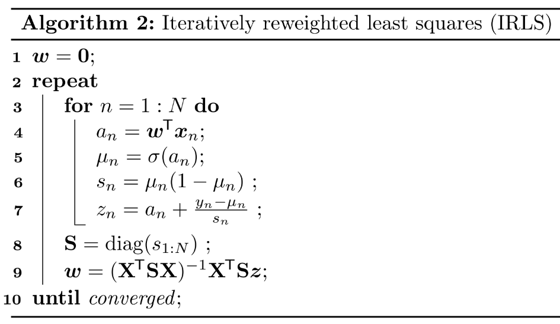
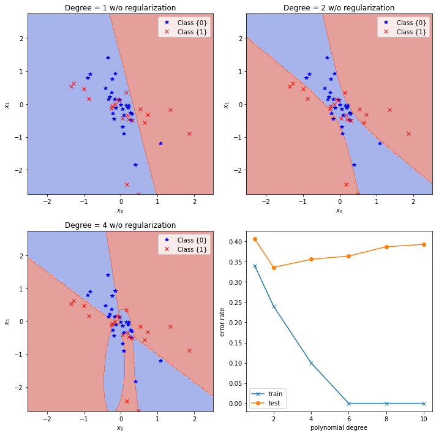
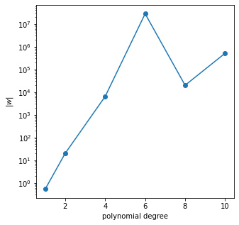
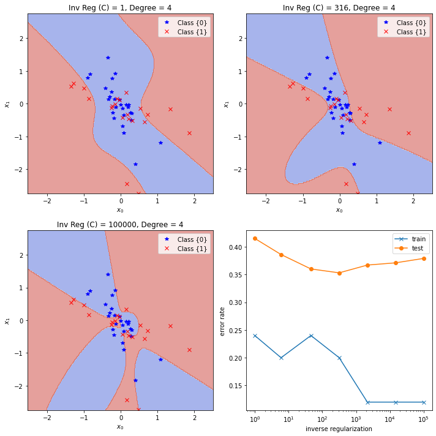

# 10. Logistic Regression

Logistic regression is a **discriminative classification** model $p(y|x;\theta)$.


## 10.2 Binary logistic regression

$$
p(y|x;\theta) = \operatorname{Ber}(y|\sigma(w^Tx+b)) \tag{10.1}
$$
where $\sigma$ is the **sigmoid** or **logistic** function. In other words,
$$
p(y=1|x;\theta) = \sigma(a) \equiv \frac{1}{1+e^{-a}} \tag{10.2}
$$
where $a=w^Tx+b=\log(\frac{p}{1-p})$ is the **log-odds** (see, eq. 2.83), or called the **logit** or the **pre-activation**.

If we choose the labels $\tilde y\in\{\pm1\}$ instead of $y\in\{0,1\}$, we can compute
$$
p(\tilde y|x;\theta) = \sigma(\tilde ya) \tag{10.3}
$$
since $\sigma(-a)=1-\sigma(a)$.


### 10.2.1 Linear classifiers

Since $p(y=0|x;\theta)=1-\sigma(a)=\sigma(-a)$ and $\dfrac{\sigma(a)}{\sigma(-a)}=e^a$, we have
$$
\mathbb{I}\bigl[p(y=1|x) > p(y=0|x)\bigr] = \mathbb{I}\Bigl[\frac{\sigma(a)}{1-\sigma(a)}>1\Bigr] = \mathbb{I}\Bigl[\log\frac{\sigma(a)}{\sigma(-a)}>0\Bigr] = \mathbb{I}(a>0) \tag{10.4}
$$
Thus the <u>prediction (or decision) function</u>
$$
f(x;\theta) = a = w^Tx + b \tag{10.5}
$$
defines a hyperplane (**decision boundary**) with normal vector $w\in\mathbb{R}^D$ and an offset $b\in\mathbb{R}$ from the origin. 

If we can perfectly separate the training examples by such a linear boundary, we say the data is **linearly separable**. (The data in Figure 10.1 below is not linearly separable. Here, $w=(5.75, 10.44)^T$ and $b=-45.27$.)


The vector $w$ defines the <u>orientation</u> of the decision boundary, and its magnitude $\|w\|$ controls the <u>steepness</u> of the sigmoid, and hence the <u>confidence of the predictions</u>.


### 10.2.2 Nonlinear classifiers

Let $\phi(x_1,x_2)=(1,x_1^2,x_2^2)$ be a transformed version of the input feature vector $(x_1,x_2)$, and let $w=(-R^2,1,1)$. Then $w^T\phi(x_1,x_2)=x_1^2+x_2^2-R^2$, so the decision boundary defines a circle with radius $R$.


We can gain even more power by <u>learning the parameters of the feature extractor</u> $\phi$ in addition to linear weights $w$. (See Part III. Deep Neural Networks.)


### 10.2.3 Maximum likelihood estimation

We discuss <u>how to estimate $w$ using MLE</u>. We assume that the bias term $b$ is absorbed into the weight vector $w$, i.e., we prepend each $x$ with $x_0=1$ and add $b=w_0$ to the first coordinate of $w$.


#### 10.2.3.1 Objective function (negative log likelihood)

$$
\begin{align*}
\operatorname{NLL}(w) &\equiv -\frac{1}{N}\log p(\mathcal{D}|w) = -\frac{1}{N}\log\prod_n\operatorname{Ber}(y_n|\sigma(a_n)) \tag{10.6} \\
&= -\frac{1}{N} \sum_n\bigl[y_n\log\sigma(a_n)+(1-y_n)\log(1-\sigma(a_n))\bigr] \tag{10.8} \\
&= \frac{1}{N} \sum_n\mathbb{H}(y_n,\sigma(a_n)) \tag{10.9}
\end{align*}
$$

where $a_n=w^Tx_n$ is the **logit**, and $\mathbb{H}(p,q)\equiv -[p\log q+(1-p)\log(1-q)]$ is the **binary cross entropy**.

If we use $\tilde y_n=\{\pm1\}$ instead of $y_n\in\{0,1\}$, then
$$
\begin{align*}
\operatorname{NLL}(w) &= -\frac{1}{N}\sum_n\Bigl[ \mathbb{I}(\tilde y_n=1)\log\sigma(a_n) + \mathbb{I}(\tilde y_n=-1)\log\sigma(-a_n) \Bigr] \tag{10.11} \\
&= -\frac{1}{N}\sum_n \log\sigma(\tilde y_na_n) = \frac{1}{N}\sum_n\log(1+e^{-\tilde y_na_n}) \tag{10.13}
\end{align*}
$$
> This is called the **log loss** in `scikit-learn`.


#### 10.2.3.2 Optimizing the objective

We can use any <u>gradient-based optimization</u> algorithm to find the MLE, i.e., to solve $\nabla_w\operatorname{NLL}(w)=0$.


#### 10.2.3.3. Deriving the gradient

Since $\nabla_w\log\sigma(a_n)=(1-\sigma(a_n))x_n$ and $\nabla_w\log(1-\sigma(a_n))=-\sigma(a_n)x_n$, we have
$$
\begin{align*}
\nabla_w\operatorname{NLL}(w) &= -\frac{1}{N} \sum_n\bigl[y_n(1-\sigma(a_n))x_n-(1-y_n)\sigma(a_n)x_n\bigr] \tag{10.19} \\
&= \frac{1}{N} \sum_n (\sigma(a_n)-y_n)x_n \tag{10.21} \\
&= \frac{1}{N} X^T\operatorname{diag}[\sigma(a_n)-y_n]1_N = \frac{1}{N}X^T(\sigma(a)-y) \tag{10.22}
\end{align*}
$$
where $X$ is the design matrix of shape $(N,D)$, i.e., the rows of $X$ are $x_n^T$.


#### 10.2.3.4 Deriving the Hessian

We will prove that the <u>Hessian is positive definite</u> so that the <u>NLL is strictly convex</u>. Since $\nabla_w\sigma(a_n)=\sigma(a_n)(1-\sigma(a_n))x_n$, we have
$$
\begin{align*}
H(w) &\equiv \nabla^2\operatorname{NLL}(w) = \nabla_w\nabla_w^T\operatorname{NLL}(w) \\
&= \frac{1}{N} \sum_n \sigma(a_n)(1-\sigma(a_n))x_nx_n^T = \frac{1}{N}X^TSX \tag{10.23}
\end{align*}
$$
where $S\equiv\operatorname{diag}[\sigma(a_n)(1-\sigma(a_n))]$. Thus, if $X$ is a <u>full rank</u> matrix, for any nonzero vector $v$,
$$
v^T(X^TSX)v = (v^TX^TS^\frac{1}{2})(S^\frac{1}{2}Xv) = \|S^\frac{1}{2}Xv\|_2^2 > 0 \tag{10.25}
$$


### 10.2.4 Stochastic gradient descent

Our goal is to solve the optimization problem
$$
\hat w\equiv\arg\min_w \mathcal{L}(w)
$$
where $\mathcal{L}(w)=\operatorname{NLL}(w)$. If we use a minibatch of size 1, the update equation for SGD becomes

$$
w_{t+1} = w_t - \eta_t\nabla_w\operatorname{NLL}(w_t) = w_t-\eta_t(\sigma(a_n)-y_n)x_n \tag{10.28}
$$


### 10.2.5 Perceptron algorithm

A **perceptron** is a deterministic binary classifier
$$
f(x_n;\theta)=\mathbb{I}(w^Tx_n+b>0)=\mathbb{I}(a>0) \in \{0,1\}
$$
using the Heaviside step function so that
$$
p(y_n=1|x_n;\theta) = \mathbb{I}(a>0) \quad\text{(instead of $\sigma(a)$)}
$$
Since the Heaviside step function is <u>not differentiable</u>, we cannot use SGD. However, Rosenblatt [Ros58] proposed the **perceptron learning algorithm** instead
$$
w_{t+1} = w_t - \eta_t\big[\mathbb{I}(a>0)-y_n\bigr] x_n \tag{10.30}
$$

> If the bias term $b$ is absorbed into the weight vector $w$, we can set the learning rate $\eta_t=1$, since the magnitude of $w_t$ <u>does not</u> affect the classifier $f(x_n;\theta)=\mathbb{I}(w^Tx_n>0)$.

If the prediction is correct, no change is made, otherwise we move the weights in a direction so as to make the correct answer more likely.


> [PRML, p.195] Figure 4.7: Illustration of the convergence of the perceptron learning algorithm.
>
> (a) The **top left plot** shows the initial parameter vector $w$ shown as a black arrow together with the corresponding decision boundary (black line), in which the arrow points towards the decision region which classified as belonging to the red class. The data point circled in green is misclassified and so its feature vector is added to the current weight vector, giving the new decision boundary shown in the **top right plot**.
>
> (b) The **bottom left plot** shows the next misclassified point to be considered, indicated by the green circle, and its feature vector is again added to the weight vector giving the decision boundary shown in the **bottom right plot** for which all data points are correctly classified.


**Perceptron convergence thereom:** If the training data set is <u>linearly separable</u>, then the perceptron learning algorithm is guaranteed to find an exact solution in a finite number of steps.

- The **advantage** of the perceptron method: We don't need to compute probabilities, which is <u>suitable for large scale learning</u>.
- The **disadvantage** of the perceptron method: It will <u>only converge when the data is linearly separable</u>, whereas SGD for minimizing the NLL for logistic regression will always converge to the globally optimal MLE, even if the data is not linearly separable.


### 10.2.6 Iteratively reweighted least squares

>  **Newton-Raphson** method is a root-finding algorithm. It can be used to <u>find a minimum or maximum</u> of $f(x)$. Since $f'(x)=0$ at a minimum or maximum, local minima and maxdima can be found by applying Newton-Raphson method to the derivative $f'(x)$:
> $$
> x_{n+1} = x_n - \frac{f'(x_n)}{f''(x_n)}
> $$

We focus on the full batch setting (so we assume $N$ is small), since it is harder to make second order methods work in the stochastic setting. Newton-Raphson method consists of updates of the form
$$
w_{t+1} = w_t - H_t^{-1}g_t \tag{10.31}
$$
where $g_t\equiv\nabla_w\mathcal{L}(w_t)$ and the Hessian $H_t\equiv\nabla_w^2\mathcal{L}(w_t)$ is assumed to be postive-definite.

We now apply this method to logistic regression, $\mathcal{L}(w)=\operatorname{NLL}(w)$. Then by (eq. 10.22 & 10.23)
$$
\begin{align*}
w_{t+1} &= w_t - H_t^{-1}g_t = w_t - \Bigl(\frac{1}{N}X^TS_tX\Bigr)^{-1} \Bigl(\frac{1}{N} X^T(\sigma(a_t)-y)\Bigr) \\
&= w_t + (X^TS_tX)^{-1}X^T(y-\sigma(a_t)) = (X^TS_tX)^{-1}X^T\Bigl[ S_tXw_t+y-\sigma(a_t)\Bigr] \\
&= (X^TS_tX)^{-1}X^TS_tz_t \tag{10.40}
\end{align*}
$$
where $z_t\equiv Xw_t+S_t^{-1}(y-\sigma(a_t))$ called the **working response** and $S_t=\operatorname{diag}\bigl[\sigma(a_t)(1-\sigma(a_t))\bigr]$.
$$
z_{t,n} = a_{t,n} + \frac{y_n-\sigma(a_{t,n})}{\sigma(a_{t,n})(1-\sigma(a_{t,n}))} = a_{t,n} - \frac{da_{t,n}}{d\sigma(a_{t,n})}\Bigg|_{w_t}(\sigma(a_{t,n})-y_n) \tag{10.42}
$$
which can be interpreted as an effective target value in the space obtained by making a <u>local linear approximation</u> to the sigmoid function around the current point $w_t$.

Equation (10.40) is the normal equation for a <u>weighted least squares</u> problem
$$
z = Xw+\epsilon, \quad \mathbb{E}[\epsilon|X]=0, \quad \operatorname{Cov[\epsilon|X]}=S^{-1}
$$
 which is a minimizer of the squared Mahalanobis length of the residual $z-Xw$:
$$
\arg\min_w \|S^\frac{1}{2}(z-Xw)\|^2 = \arg\min_w(z-Xw)^TS(z-Xw) = \arg\min_w\sum_n S_n(z_n-w^Tx_n)^2
$$
Because the weighting matrix $S$ is not constant but depends on $w$, we must apply the normal equation (10.40) iteratively, each time using the new weight vector $w_t$ to compute a revised weighing matrix $S_t$. For this reason, the algorithm is known as the **iterative reweighted least squares (IRLS)**.




The **Fisher information matrix (FIM)** is defined by the covariance of the gradient of the log likelihood (also called the **score function**):
$$
\begin{align*}
F &\equiv \mathbb{E}_{x\sim p(x|\theta)} \bigl[\nabla\log p(x|\theta)\nabla\log p(x|\theta)^T \bigr] \tag{4.220} \\
F_{ij} &= \mathbb{E}_{x\sim p(x|\theta)} \Bigl[ \Bigl(\frac{\partial}{\partial\theta_i}\log p(x|\theta)\Bigr)\Bigl(\frac{\partial}{\partial\theta_j}\log p(x|\theta)\Bigr) \Bigr] \tag{4.221}
\end{align*}
$$
**Theorem 4.7.2.** If $\log p(x|\theta)$ is twice differentiable, and under certain regularity conditions, the FIM is equal to the expected Hessian of the NLL, i.e.,
$$
F_{ij} = -\mathbb{E}_{x\sim p(x|\theta)} \Bigl[ \frac{\partial^2}{\partial\theta_i\partial\theta_j}\log p(x|\theta) \Bigr] \tag{4.222}
$$
Thus <u>we can interpret the FIM as the Hessian of the NLL</u>.

Note that **Fisher scoring** is the same as IRLS except we replace the Hessian with the FIM:
$$
w_{t+1} = w_t + \eta_tF^{-1}\nabla_w\operatorname{NLL}(w_t)
$$
Since the FIM is independent of the data, this can be faster for problems with many parameters.


### 10.2.7 MAP estimation

- degree 1: $\phi(x_0,x_1) = (x_0,x_1)\in\mathbb{R}^2$
- degree 2: $\phi(x_0,x_1) = (x_0,x_1, x_0^2,x_0x_1,x_1^2)\in\mathbb{R}^5$
- degree 4: $\phi(x_0,x_1) = (x_0,x_1, \dotsc,x_0x_1^3,x_1^4)\in\mathbb{R}^{14}$



One way to reduce such overfitting is to prevent the weights from becoming so large.

- degree 1: $\hat w = (0.513, 0.119)$
- degree 2: $\hat w =(2.293,  0.065, 11.916, 15.504,  2.530)$
- degree 4: $\hat w=(-661330.445, 165024.837, \dotsc, 5691135.286,5091313.309)$



We can do this by using a zero-mean Gaussian prior, $p(w)=\mathcal{N}(w|0,\lambda^{-1}I)$, and then using MAP estimation (see $\S$4.5.3).
$$
\operatorname{PNLL}(w) = \operatorname{NLL}(w) + \lambda\|w\|_2^2
$$
This is called $\ell_2$ **regularization** or **weight decay**. The larger the value of $\lambda$, the more the parameters are penalized for being "large", and thus the less flexible the model.



> The **bottom right plot** uses the inverse regularization, $C=\lambda^{-1}=1, 6, 46, 316,  2154, 14677, 100000$

We can compute the MAP estimate by slightly modifying the input to the above gradient based optimization algorithms. The gradient and Hessian of the penalized negative log likelihood have the following forms:
$$
\begin{align*}
\nabla_w\operatorname{PNLL}(w) &= g(w)+2\lambda w \\
\nabla_w^2\operatorname{PNLL}(w) &= H(w)+2\lambda I
\end{align*}
$$
where $g(w)$ is the gradient and $H(w)$ is the Hessian of the unpenalized NLL.


### 10.2.8 Standardization

In $\S$10.2.7, we use an isotropic prior $\mathcal{N}(w|0,\lambda^{-1}I)$ to prevent overfitting. This implicitly encodes the assumption that <u>we expect all weights to be similar in magnitude</u>, which in turn encodes the assumption <u>we expect all input features to be similar in magnitude</u>.

However, in many datasets, input features are on different scales. In such cases, it is common to **standardize** the data, to ensure <u>each feature has mean 0 and variance 1</u>.
$$
\operatorname{standarize}(x_{nd}) = \frac{x_{nd}-\hat\mu_d}{\hat\sigma_d}
$$

```python
from sklearn.preprocessing import StandardScaler
scaler = StandardScaler()
scaler.fit(X) # compute the mean and (biased) std to be used for later scaling
X_tran = scaler.transform(X) # perform standardization by centering and scaling
X_orig = scaler.inverse_transform(X_tran) # scale back the data to the original
```

An alternative is to use **min-max scaling**, in which we rescale the inputs so they lie in the interval $[0,1]$.
$$
\operatorname{min-max\_scaling}(x_{nd}) = \frac{x_{nd}-\min_{n'}\{x_{n'd}\}}{\max_{n'}\{x_{n'd}\}-\min_{n'}\{x_{n'd}\}}
$$

```python
from sklearn.preprocessing import MinMaxScaler
scaler = MinMaxScaler() # default feature_range=(0,1)
scaler.fit(X) # compute the min and max to be used for later scaling
X_tran = scaler.transform(X) # scale features of X according to feature_range
X_orig = scaler.inverse_transform(X_tran) # undo the scaling of X
```


## Implementation of logistic regression in scikit-learn

Our goal is to solve the optimization problem
$$
\hat w\equiv\arg\min_w \bigl[\mathcal{L}(w) + \alpha \mathcal{R}(w)\bigr]
$$
where $\mathcal{L}(w)$ is the loss function that measures model (mis)fit and $\mathcal{R}$ is a regularization term (or `penalty`) that penalizes model complexity, where $\alpha>0$ is a hyperparameter that controls the regularization strength.


```python
from sklearn.linear_model import SGDClassifier
clf = SGDClassifier(loss='log_loss', penalty='none')
    # e.g., learning_rate='constant', eta0=0.1 for constant learning rate
clf.fit(X, y)
clf.decision_function(X) # logit a: X @ clf.coef_.T + clf.intercept_
clf.predict(X) # argmax of decision_function(X)
clf.predict_proba(X) # softmax of decision_function(X)
    # For the binary classification: (1-p, p), where p=sigmoid(decision_function(X))
    # In this case, decision_function(X) is of shape (1,)
clf.predict_log_proba(X) # log of predict_proba(X)
```

- `clf.coef_`: Weights assigned to the features, of shape $(C,D)$ or $(1,D)$ if binary
- `clf.intercept_`: Constants in decision function, of shape $(C,)$ or $(1,)$ if binary


We can improve the convergence speed using variance reduction techniques such as **SAGA** (see $\S$8.4.5).

> SAGA – Defazio, A., Bach F. & Lacoste-Julien S. (2014). https://arxiv.org/abs/1407.0202

In particular, `LogisticRegression` in `scikit-learn` solves the optimization problem
$$
\arg\min_w \Bigl[ C \sum_n \log\bigl[1+\exp(-\tilde y_n(w^Tx_n+b))\bigr] + \mathcal{R}(w) \Bigr]
$$
where $C$  (default 1.0) gives the inverse of regularization strength.

```python
from sklearn.linear_model import LogisticRegression
clf = LogisticRegression(solver='saga', penalty='none')
    # Supported penalties by 'saga': 'elasticnet', 'l1', 'l2', 'none'
clf.fit(X, y)
clf.decision_function(X) # logit a: X @ clf.coef_.T + clf.intercept_
clf.predict(X) # argmax of decision_function(X)
clf.predict_proba(X) # softmax of decision_function(X)
    # For the binary classification: (1-p, p), where p=sigmoid(decision_function(X))
    # In this case, decision_function(X) is of shape (1,)
clf.predict_log_proba(X) # log of predict_proba(X)
```

- `clf.coef_`: Coefficient of the features in the decision function, of shape $(C,D)$ or $(1,D)$ if binary
- `clf.intercept_`: Intercept (bias) added to the decision function, of shape $(C,)$ or $(1,)$ if binary


Notice that `sklearn.linear_model.Perceptron()` is equivalent to

````python
SGDClassifier(loss='perceptron', penalty='none', learning_rate='constant', eta0=1.0)
````

The `perceptron` loss is defined by
$$
\mathcal{L}(w) = \frac{1}{N}\sum_n\max\{0,-\tilde y_na_n\}
$$


```python
from sklearn.linear_model import Perceptron
clf = Perceptron(penalty='none') # Supported penalties: 'elasticnet', 'l1', 'l2'
clf.fit(X, y)
clf.decision_function(X) # logit a: X @ clf.coef_.T + clf.intercept_
clf.predict(X) # argmax of decision_function(X)
```

- `clf.coef_`: Coefficient of the features in the decision function, of shape $(C,D)$ or $(1,D)$ if binary
- `clf.intercept_`: Intercept (bias) added to the decision function, of shape $(C,)$ or $(1,)$ if binary

