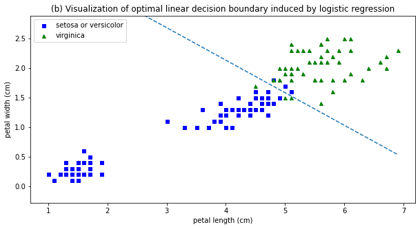
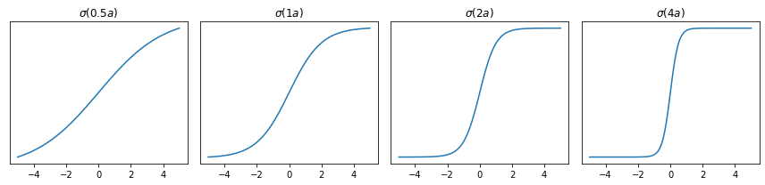

# 10. Logistic Regression

Logistic regression is a **discriminative classification** model.


## 10.2 Binary logistic regression

$$
p(y|x;\theta) = \operatorname{Ber}(y|\sigma(w^Tx+b)) \tag{10.1}
$$
where $\sigma$ is the **sigmoid** or **logistic** function. In other words,
$$
p(y=1|x;\theta) = \sigma(a) \equiv \frac{1}{1+e^{-a}} \tag{10.2}
$$
where $a=w^Tx+b=\log(\frac{p}{1-p})$ is the **log-odds** (see, eq. 2.83), or called the **logit** or the **pre-activation**.


### 10.2.1 Linear classifiers

Since $p(y=0|x;\theta)=1-\sigma(a)=\sigma(-a)$ and $\dfrac{\sigma(a)}{\sigma(-a)}=e^a$, we have
$$
\mathbb{I}\bigl[p(y=1|x) > p(y=0|x)\bigr] = \mathbb{I}\Bigl[\log\Bigl(\frac{\sigma(a)}{\sigma(-a)}\Bigr)>0\Bigr] = \mathbb{I}(a>0) \tag{10.4}
$$
Thus we have the <u>prediction (or decision) function</u>
$$
f(x;\theta) = a = w^Tx + b \tag{10.5}
$$
which defines a hyperplane (**decision boundary**) with normal vector $w\in\mathbb{R}^D$ and an offset $b\in\mathbb{R}$ from the origin. If we can perfectly separate the training examples by such a linear boundary, we say the data is **linearly separable**. (The data in the figure below is not linearly separable.)



The vector $w$ defines the <u>orientation</u> of the decision boundary, and its magnitude controls the <u>steepness</u> of the sigmoid, and hence the confidence of the predictions.




### 10.2.2 Nonlinear classifiers

Let $\phi(x_1,x_2)=(1,x_1^2,x_2^2)$ be a transformed version of the input feature vector $(x_1,x_2)$, and let $w=(-R^2,1,1)$. Then $w^T\phi(x_1,x_2)=x_1^2+x_2^2-R^2$, so the decision boundary defines a circle with radius $R$.


We can gain even more power by <u>learning the parameters of the feature extractor</u> $\phi$ in addition to linear weights $w$. (See Part III. Deep Neural Networks.)


### 10.2.3 Maximum likelihood estimation

We assume that the bias term $b$ is absorbed into the weight vector $w$.

#### 10.2.3.1 Objective function (negative log likelihood)

$$
\begin{align*}
\operatorname{NLL}(w) & -\frac{1}{N}\log p(\mathcal{D}|w) = -\frac{1}{N}\log\prod_n\operatorname{Ber}(y_n|\sigma(a_n)) \tag{10.6} \\
&= -\frac{1}{N} \sum_n\bigl[y_n\log\sigma(a_n)+(1-y_n)\log(1-\sigma(a_n))\bigr] \tag{10.8} \\
&= \frac{1}{N} \sum_n\mathbb{H}(y_n,\sigma(a_n)) \tag{10.9}
\end{align*}
$$

where $a_n=w^Tx_n$ is the **logit**, and $\mathbb{H}(p,q)\equiv -[p\log q+(1-p)\log(1-q)]$ is the **binary cross entropy**.


#### 10.2.3.2 Optimizing the objective

To find the MLE, we can use any gradient-based optimization algorithm to solve $\nabla_w\operatorname{NLL}(w)=0$.


#### 10.2.3.3. Deriving the gradient

Since $\nabla_w\log\sigma(a_n)=(1-\sigma(a_n))x_n$ and $\nabla_w\log(1-\sigma(a_n))=-\sigma(a_n)x_n$, the gradient vector of the NLL is given by
$$
\begin{align*}
\nabla_w\operatorname{NLL}(w) &= -\frac{1}{N} \sum_n\bigl[y_n(1-\sigma(a_n))x_n-(1-y_n)\sigma(a_n)x_n\bigr] \tag{10.19} \\
&= \frac{1}{N} \sum_n (\sigma(a_n)-y_n)x_n \tag{10.21} \\
&= \frac{1}{N} X\operatorname{diag}[\sigma(a_n)-y_n]1_N \tag{10.22}
\end{align*}
$$
where $X$ is the matrix with columns $x_n$.


#### 10.2.3.4 Deriving the Hessian

To be sure the stationary point is the global optimum, we will prove that the <u>Hessian is positive definite</u> so that the <u>NLL is strictly convex</u>. Since $\nabla_w\sigma(a_n)=\sigma(a_n)(1-\sigma(a_n))x_n$, we have
$$
\begin{align*}
H(w) &\equiv \nabla^2\operatorname{NLL}(w) = \nabla_w\nabla_w^T\operatorname{NLL}(w) \\
&= \frac{1}{N} \sum_n \sigma(a_n)(1-\sigma(a_n))x_nx_n^T = \frac{1}{N}XSX^T \tag{10.23}
\end{align*}
$$
where $S\equiv\operatorname{diag}[\sigma(a_n)(1-\sigma(a_n))]$. Thus, for any nonzero vector $v$,
$$
v^TXSX^Tv = (v^TXS^\frac{1}{2})(S^\frac{1}{2}X^Tv) = \|S^\frac{1}{2}X^Tv\|_2^2 > 0 \tag{10.25}
$$


### 10.2.4 Stochastic gradient descent

Our goal is to solve the optimization problem
$$
\hat w\equiv\arg\min_w \bigl[\mathcal{L}(w) + \alpha \mathcal{R}(w)\bigr]
$$
where $\mathcal{L}(w)$ is the loss function that measures model (mis)fit and $\mathcal{R}$ is a regularization term (or `penalty`) that penalizes model complexity, where $\alpha>0$ is a hyperparameter that controls the regularization strength.

Let $\mathcal{L}(w)=\operatorname{NLL}(w)$ and $\mathcal{R}(w)=0$. If we use a minibatch of size 1, then the update equation for SGD becomes
$$
w_{t+1} = w_t - \eta_t\nabla_w\operatorname{NLL}(w_t) = w_t-\eta_t(\sigma(a_n)-y_n)x_n \tag{10.28}
$$
If we use $\tilde y_n\in\{\pm1\}$ instead of $y_n\in\{0,1\}$, then we can rewrite
$$
\begin{align*}
\operatorname{NLL}(w) &= -\frac{1}{N}\sum_n \bigl[ \mathbb{I}(\tilde y_n=1)\log(\sigma(a_n)) + \mathbb{I}(\tilde y_n=-1)\log(1-\sigma(a_n)) \bigr] \tag{10.11} \\
&= -\frac{1}{N}\sum_n\log(\sigma(\tilde y_na_n)) \tag{10.12} \\
&= \frac{1}{N} \sum_n \log\bigl[1+\exp(-\tilde y_na_n)\bigr] \tag{10.13}
\end{align*}
$$
since $\sigma(-a_n)=1-\sigma(a_n)$. It is called the **log loss** in `scikit-learn`.


```python
from sklearn.linear_model import SGDClassifier
clf = SGDClassifier(loss='log_loss', penalty='none')
    # e.g., learning_rate='constant', eta0=0.1 for constant learning rate
clf.fit(X, y)
clf.decision_function(X) # logit a: X @ clf.coef_.T + clf.intercept_
clf.predict(X) # argmax of decision_function(X)
clf.predict_proba(X) # softmax of decision_function(X)
    # For the binary classification: (1-p, p), where p=sigmoid(decision_function(X))
    # In this case, decision_function(X) is of shape (1,)
clf.predict_log_proba(X) # log of predict_proba(X)
```

- `clf.coef_`: Weights assigned to the features, of shape $(C,D)$ or $(1,D)$ if binary
- `clf.intercept_`: Constants in decision function, of shape $(C,)$ or $(1,)$ if binary


We can improve the convergence speed using variance reduction techniques such as **SAGA** (see $\S$8.4.5).

> SAGA – Defazio, A., Bach F. & Lacoste-Julien S. (2014). https://arxiv.org/abs/1407.0202

In particular, `LogisticRegression` in `scikit-learn` solves the optimization problem
$$
\arg\min_w \Bigl[ C \sum_n \log\bigl[1+\exp(-\tilde y_n(w^Tx_n+b))\bigr] + \mathcal{R}(w) \Bigr]
$$
where $C$  (default 1.0) gives the inverse of regularization strength.

```python
from sklearn.linear_model import LogisticRegression
clf = LogisticRegression(solver='saga', penalty='none')
    # Supported penalties by 'saga': 'elasticnet', 'l1', 'l2', 'none'
clf.fit(X, y)
clf.decision_function(X) # logit a: X @ clf.coef_.T + clf.intercept_
clf.predict(X) # argmax of decision_function(X)
clf.predict_proba(X) # softmax of decision_function(X)
    # For the binary classification: (1-p, p), where p=sigmoid(decision_function(X))
    # In this case, decision_function(X) is of shape (1,)
clf.predict_log_proba(X) # log of predict_proba(X)
```

- `clf.coef_`: Coefficient of the features in the decision function, of shape $(C,D)$ or $(1,D)$ if binary
- `clf.intercept_`: Intercept (bias) added to the decision function, of shape $(C,)$ or $(1,)$ if binary


### 10.2.5 Perceptron algorithm

A **perceptron** is a deterministic binary classifier $\hat y_n=f(x_n;\theta)=\mathbb{I}(w^Tx_n+b>0)=\mathbb{I}(a>0)$ using the Heaviside step function so that
$$
p(y_n=1|x_n;\theta) = \mathbb{I}(a>0) \in \{0,1\} \quad\text{instead of $\sigma(a)$}
$$
The advantage of the perceptron method is that we don't need to compute probabilities, which is <u>suitable for large scale learning</u>. The disadvantage is that the method will only converge when the data is linearly separable, whereas SGD for minimizing the NLL for logistic regression will always converge to the globally optimal MLE, even if the data is not linearly separable.

Since the Heaviside step function is not differentiable, we cannot use SGD. However, Rosenblatt [Ros58] proposed the **perceptron learning algorithm** instead.
$$
w_{t+1} = w_t - (\hat y_n-y_n) x_n \tag{10.30}
$$
If the prediction is correct, no change is made, otherwise we move the weights in a direction so as to make the correct answer more likely.

Notice that `sklearn.linear_model.Perceptron()` is equivalent to

````python
SGDClassifier(loss='perceptron', penalty='none', learning_rate='constant', eta0=1.0)
````

The `perceptron` loss is defined by
$$
\mathcal{L}(w) = \frac{1}{N}\sum_n\max\{0,-\tilde y_na_n\}
$$


```python
from sklearn.linear_model import Perceptron
clf = Perceptron(penalty='none') # Supported penalties: 'elasticnet', 'l1', 'l2'
clf.fit(X, y)
clf.decision_function(X) # logit a: X @ clf.coef_.T + clf.intercept_
clf.predict(X) # argmax of decision_function(X)
```

- `clf.coef_`: Coefficient of the features in the decision function, of shape $(C,D)$ or $(1,D)$ if binary
- `clf.intercept_`: Intercept (bias) added to the decision function, of shape $(C,)$ or $(1,)$ if binary


### 10.2.6 Iteratively reweighted least squares


### 10.2.7 MAP estimation


### 10.2.8 Standardization

