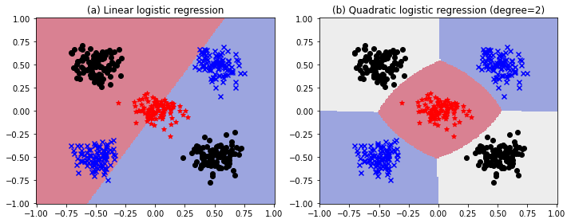

# 10. Logistic Regression

Logistic regression is a **discriminative classification** model $p(y|x;\theta)$, where $x\in\mathbb{R}^D$ is a input vector, $y\in\{1,\dotsc,C\}$ is the class label, and $\theta$ are the parameters.


## 10.2 Binary logistic regression

$$
p(y|x;\theta) = \operatorname{Ber}(y|\sigma(w^Tx+b)) \tag{10.1}
$$
where $\sigma$ is the **sigmoid** or **logistic** function and $\theta=(w,b)$. In other words,
$$
p(y=1|x;\theta) = \sigma(a) \equiv \frac{1}{1+e^{-a}} \tag{10.2}
$$
where $a=w^Tx+b=\log(\frac{p}{1-p})$ is the **log-odds** (see, eq. 2.83), or called the **logit** or the **pre-activation**.

If we choose the labels $\tilde y\in\{\pm1\}$ instead of $y\in\{0,1\}$, we can compute
$$
p(\tilde y|x;\theta) = \sigma(\tilde ya) \tag{10.3}
$$
since $\sigma(-a)=1-\sigma(a)$.


### 10.2.1 Linear classifiers

Since $p(y=0|x;\theta)=1-\sigma(a)=\sigma(-a)$ and $\dfrac{\sigma(a)}{\sigma(-a)}=e^a$, we have
$$
\mathbb{I}\bigl[p(y=1|x) > p(y=0|x)\bigr] = \mathbb{I}\Bigl[\frac{\sigma(a)}{1-\sigma(a)}>1\Bigr] = \mathbb{I}\Bigl[\log\frac{\sigma(a)}{\sigma(-a)}>0\Bigr] = \mathbb{I}(a>0) \tag{10.4}
$$
Thus the <u>prediction (or decision) function</u>
$$
f(x;\theta) = a = w^Tx + b \tag{10.5}
$$
defines a hyperplane (**decision boundary**) with normal vector $w\in\mathbb{R}^D$ and an offset $b\in\mathbb{R}$ from the origin. 

If we can perfectly separate the training examples by such a linear boundary, we say the data is **linearly separable**. (The data in Figure 10.1 below is not linearly separable. Here, $w=(5.75, 10.44)^T$ and $b=-45.27$.)


The vector $w$ defines the <u>orientation</u> of the decision boundary, and its magnitude $\|w\|$ controls the <u>steepness</u> of the sigmoid, and hence the <u>confidence of the predictions</u>.


### 10.2.2 Nonlinear classifiers

We can often make a problem linearly separable by <u>preprocessing the inputs</u> in a suitable way.

For example, let $\phi(x_1,x_2)=(1,x_1^2,x_2^2)$ be a transformed version of the input feature vector $(x_1,x_2)$. If $w=(-R^2,1,1)$, then $w^T\phi(x_1,x_2)=x_1^2+x_2^2-R^2$, so the decision boundary is a circle with radius $R$.


We can gain even more power by <u>learning the parameters of the feature extractor</u> $\phi$ in addition to linear weights $w$. (See Part III. Deep Neural Networks.)


### 10.2.3 Maximum likelihood estimation

We discuss <u>how to estimate $w$ using MLE</u>. We assume that the bias term $b$ is absorbed into the weight vector $w$, i.e., we prepend each $x$ with $x_0=1$ and add $b=w_0$ to the first coordinate of $w$.


#### 10.2.3.1 Objective function (negative log likelihood)

$$
\begin{align*}
\operatorname{NLL}(w) &\equiv -\frac{1}{N}\log p(\mathcal{D}|w) = -\frac{1}{N}\log\prod_n\operatorname{Ber}(y_n|\sigma(a_n)) \tag{10.6} \\
&= -\frac{1}{N} \sum_n\bigl[y_n\log\sigma(a_n)+(1-y_n)\log(1-\sigma(a_n))\bigr] \tag{10.8} \\
&= \frac{1}{N} \sum_n\mathbb{H}(y_n,\sigma(a_n)) \tag{10.9}
\end{align*}
$$

where $a_n=w^Tx_n$ is the **logit** and $\mathbb{H}(p,q)\equiv -[p\log q+(1-p)\log(1-q)]$ is the **binary cross-entropy**.

If we use $\tilde y_n=\{\pm1\}$ instead of $y_n\in\{0,1\}$, then
$$
\begin{align*}
\operatorname{NLL}(w) &= -\frac{1}{N}\sum_n\Bigl[ \mathbb{I}(\tilde y_n=1)\log\sigma(a_n) + \mathbb{I}(\tilde y_n=-1)\log\sigma(-a_n) \Bigr] \tag{10.11} \\
&= -\frac{1}{N}\sum_n \log\sigma(\tilde y_na_n) = \frac{1}{N}\sum_n\log(1+e^{-\tilde y_na_n}) \tag{10.13}
\end{align*}
$$
> This is called the **log loss** in `scikit-learn`.


#### 10.2.3.2 Optimizing the objective

We can use any <u>gradient-based optimization</u> algorithm to find the MLE, i.e., to solve
$$
\nabla_w\operatorname{NLL}(w)\equiv g(w)=0 \tag{10.14}
$$


#### 10.2.3.3. Deriving the gradient

Note that $\dfrac{d\sigma}{da}(a)=\sigma(a)(1-\sigma(a))$. Hence by the chain rule we have
$$
\nabla_w\log\sigma(a_n)=(1-\sigma(a_n))x_n \quad\text{and}\quad
\nabla_w\log(1-\sigma(a_n))=-\sigma(a_n)x_n
$$
Thus the gradient vector of the NLL (as a column vector) is given by
$$
\begin{align*}
\nabla_w\operatorname{NLL}(w) &= -\frac{1}{N} \sum_n\bigl[y_n(1-\sigma(a_n))x_n-(1-y_n)\sigma(a_n)x_n\bigr] \tag{10.19} \\
&= \frac{1}{N} \sum_n (\sigma(a_n)-y_n)x_n \tag{10.21} \\
&= \frac{1}{N} X^T\operatorname{diag}[\sigma(a_n)-y_n]1_N \tag{10.22}
\end{align*}
$$
where $X$ is the design matrix of shape $(N,D)$, i.e., the rows of $X$ are $x_n^T$.

If we interpret $e_n\equiv\sigma(a_n)-y_n$ as an <u>error signal</u>, we can see that the gradient weights each input $x_n$ by its error, and then averages the result.


#### 10.2.3.4 Deriving the Hessian

We will prove that the Hessian $H(w)_{ij}\equiv\dfrac{\partial^2\operatorname{NLL}}{\partial w_iw_j}(w)$ is <u>positive definite</u> so that the NLL is <u>strictly convex</u>.
$$
H(w) = \nabla_w\nabla_w^T\operatorname{NLL}(w) = \frac{1}{N} \sum_n \sigma(a_n)(1-\sigma(a_n))x_nx_n^T = \frac{1}{N}X^TSX \tag{10.23}
$$
where $S\equiv\operatorname{diag}[\sigma(a_n)(1-\sigma(a_n))]$. Thus, if $X$ is a <u>full rank</u> matrix, for any nonzero vector $v$, we have
$$
v^T(X^TSX)v = (v^TX^TS^\frac{1}{2})(S^\frac{1}{2}Xv) = \|S^\frac{1}{2}Xv\|_2^2 > 0 \tag{10.25}
$$

However, in practice, $\sigma(a_n)$ which are <u>close to 0 or 1</u> might cause the Hessian to be <u>close to singular</u>. We can avoid this by using $\ell_2$ regularization.


### 10.2.4 Stochastic gradient descent

Our goal is to solve the optimization problem
$$
\hat w\equiv\arg\min_w \mathcal{L}(w) \tag{10.26}
$$
where $\mathcal{L}(w)=\operatorname{NLL}(w)$ is the loss function. If we use a minibatch of size 1, the update equation for SGD becomes

$$
w_{t+1} = w_t - \eta_t\nabla_w\operatorname{NLL}(w_t) = w_t-\eta_t(\sigma(a_n)-y_n)x_n \tag{10.28}
$$

Since the objective $\operatorname{NLL}(w)$ is convex, this procedure will converge to the global optimum, provided we decay the learning rate $\eta_t$ at the appropriate rate.


### 10.2.5 Perceptron algorithm

A **perceptron** [Ros58] is a deterministic binary classifier with the decision function
$$
f(x;\theta)=\mathbb{I}(a>0)=\mathbb{I}(w^Tx+b>0) \tag{10.29}
$$
using the Heaviside step function instead of the sigmoid $\sigma(a)$ (compare with eq. 10.5).

Since the Heaviside step function is <u>not differentiable</u>, we <u>cannot</u> use SGD. However, Rosenblatt proposed the **perceptron learning algorithm** instead
$$
w_{t+1} = w_t - \eta_t\big[\mathbb{I}(a>0)-y_n\bigr] x_n \tag{10.30}
$$

> If the bias term $b$ is absorbed into the weight vector $w$, we can set the learning rate $\eta_t=1$, since the magnitude of $w$ <u>does not</u> affect the decision function $f(x;\theta)=\mathbb{I}(w^Tx>0)$.

If the prediction is correct, no change is made, otherwise we move the weights in a direction so as to make the correct answer more likely.


> [PRML, p.195] Figure 4.7: Illustration of the convergence of the perceptron learning algorithm.
>
> 1. The **top left plot** shows the initial parameter vector $w$ shown as a black arrow together with the corresponding decision boundary (black line), in which the arrow points towards the decision region which classified as belonging to the red class. The data point circled in green is misclassified and so its feature vector is added to the current weight vector, giving the new decision boundary shown in the **top right plot**.
>
> 2. The **bottom left plot** shows the next misclassified point to be considered, indicated by the green circle, and its feature vector is again added to the weight vector giving the decision boundary shown in the **bottom right plot** for which all data points are correctly classified.


#### Perceptron convergence theorem

If the training data set is <u>linearly separable</u>, then the perceptron learning algorithm is guaranteed to find an exact solution in a finite number of steps.


#### Comparison with SGD

- **Advantage**: We don't need to compute probabilities, which is <u>suitable for large scale learning</u>.
- **Disadvantage**: It will <u>only converge when the data is linearly separable</u>, whereas SGD for minimizing the NLL for logistic regression will always converge to the globally optimal MLE.


### 10.2.6 Iteratively reweighted least squares

#### Newton's method or the Newton-Raphson method

> The Newton-Raphson method is a <u>root-finding</u> algorithm:
> $$
> x_{n+1} = x_n - \frac{f(x_n)}{f'(x_n)}
> $$
> It can be used to <u>find a minimum or maximum</u> of $f(x)$. Since $f'(x)=0$ at a minimum or maximum, local minima and maxima can be found by applying Newton-Raphson method to the derivative $f'(x)$:
> $$
> x_{n+1} = x_n - \frac{f'(x_n)}{f''(x_n)}
> $$

We focus on the <u>full batch</u> setting (so we assume $N$ is small), since it is harder to make second order methods work in the stochastic setting. The Newton-Raphson method consists of updates of the form
$$
w_{t+1} = w_t - H_t^{-1}g_t \tag{10.31}
$$
where $g_t\equiv\nabla_w\mathcal{L}(w_t)$ and the Hessian $H_t\equiv\nabla_w^2\mathcal{L}(w_t)$ is assumed to be postive-definite.


#### As a weighted least squares problem

We apply the Newton-Raphson method to logistic regression, $\mathcal{L}(w)=\operatorname{NLL}(w)$. From (eq. 10.22 & 10.23),
$$
\begin{align*}
w_{t+1} &= w_t - H_t^{-1}g_t = w_t - \Bigl(\frac{1}{N}X^TS_tX\Bigr)^{-1} \Bigl(\frac{1}{N} X^T(\sigma(a_t)-y)\Bigr) \\
&= w_t + (X^TS_tX)^{-1}X^T(y-\sigma(a_t)) = (X^TS_tX)^{-1}X^T\Bigl[ S_tXw_t+y-\sigma(a_t)\Bigr] \\
&= (X^TS_tX)^{-1}X^TS_tz_t \tag{10.40}
\end{align*}
$$
where $z_t\equiv Xw_t+S_t^{-1}(y-\sigma(a_t))$ called the **working response** and $S_t=\operatorname{diag}\bigl[\sigma(a_t)(1-\sigma(a_t))\bigr]$.
$$
z_{t,n} = w_t^Tx_n + \frac{y_n-\sigma(a_{t,n})}{\sigma(a_{t,n})(1-\sigma(a_{t,n}))} \tag{10.42}
$$
Equation (10.40) is the normal equation for a <u>weighted least squares</u> problem
$$
z = Xw+\epsilon, \quad \mathbb{E}[\epsilon|X]=0, \quad \operatorname{Cov[\epsilon|X]}=S^{-1}
$$
 which is a <u>minimizer of the squared Mahalanobis length</u> of the residual $z-Xw$:
$$
\arg\min_w \|S^\frac{1}{2}(z-Xw)\|^2 = \arg\min_w(z-Xw)^TS(z-Xw) = \arg\min_w\sum_n S_n(z_n-w^Tx_n)^2 \tag{10.43}
$$


#### IRLS algorithm

Because the weighting matrix $S$ is not constant but depends on $w$, we must apply the normal equation (10.40) iteratively, each time using the new weight vector $w_t$ to compute a revised weighing matrix $S_t$. For this reason, the algorithm is known as the **iterative reweighted least squares (IRLS)**.


#### FIM and Fisher scoring

> The partial derivative of the log likelihood, $\dfrac{\partial}{\partial\theta}\log p(x|\theta)$ is called the the **score**, and the expected value of the score is zero.
> $$
> \mathbb{E}_{x\sim p(x|\theta)}\Bigl[\frac{\partial}{\partial\theta}\log p(x|\theta)\Bigr] = \int \frac{\frac{\partial}{\partial\theta}p(x|\theta)}{p(x|\theta)}p(x|\theta)\,dx = \frac{\partial}{\partial\theta}\int p(x|\theta)\,dx = 0
> $$

The **Fisher information matrix (FIM)** is defined by the <u>covariance of the score</u> function:

$$
F \equiv \mathbb{E}_{x\sim p(x|\theta)} \bigl[\nabla_\theta\log p(x|\theta)\nabla_\theta\log p(x|\theta)^T \bigr] \tag{4.220}
$$
and has the entry
$$
F_{ij} = \mathbb{E}_{x\sim p(x|\theta)} \Bigl[ \Bigl(\frac{\partial}{\partial\theta_i}\log p(x|\theta)\Bigr)\Bigl(\frac{\partial}{\partial\theta_j}\log p(x|\theta)\Bigr) \Bigr] \tag{4.221}
$$
**Theorem 4.7.2.** If $\log p(x|\theta)$ is twice differentiable, and under certain regularity conditions, the FIM is equal to the <u>expected Hessian</u> of the NLL, i.e.,
$$
F_{ij} = -\mathbb{E}_{x\sim p(x|\theta)} \Bigl[ \frac{\partial^2}{\partial\theta_i\partial\theta_j}\log p(x|\theta) \Bigr] \tag{4.222}
$$
Note that **Fisher scoring** is the same as IRLS except we replace the Hessian with the FIM:
$$
w_{t+1} = w_t + \eta_tF^{-1}\nabla_w\operatorname{NLL}(w_t)
$$
Since the FIM is independent of the data, this can be faster for problems with many parameters.


### 10.2.7 MAP estimation

- **Degree 1**: $\phi(x_0,x_1) = (x_0,x_1)\in\mathbb{R}^2$ and $\hat w = (0.513, 0.119)$
- **Degree 2**: $\phi(x_0,x_1) = (x_0,x_1, x_0^2,x_0x_1,x_1^2)\in\mathbb{R}^5$ and $\hat w =(2.293,  0.065, 11.916, 15.504,  2.530)$ 
- **Degree 4**: $\phi(x_0,x_1) = (x_0,x_1, \dotsc,x_0x_1^3,x_1^4)\in\mathbb{R}^{14}$ and $\hat w=(-661330.445, 165024.837, \dotsc, 5691135.286,5091313.309)$


One way to reduce such overfitting is to <u>prevent the weights from becoming so large</u>. We can do this by using a zero-mean Gaussian prior, $p(w)=\mathcal{N}(w|0,\lambda^{-1}I)$, and then using MAP estimation (see $\S$4.5.3).

$$
\operatorname{PNLL}(w) = \operatorname{NLL}(w) + \lambda\|w\|_2^2 \tag{10.48}
$$
This is called $\ell_2$ **regularization** or **weight decay**. The larger the value of $\lambda$, the more the parameters are penalized for being *large* (deviating from the zero-mean prior), and thus the less flexible the model.


> The **bottom right plot** uses the inverse regularization, $C=\lambda^{-1}$ from `numpy.logspace(0, 5, 7, dtype='int64')`, that is, (**1**, 6, 46, **316**,  2154, 14677, **100000**).

We can compute the MAP estimate by slightly modifying the input to the above gradient based optimization algorithms. The gradient and Hessian of the penalized negative log likelihood have the following forms:
$$
\begin{align*}
\nabla_w\operatorname{PNLL}(w) &= g(w)+2\lambda w \tag{10.49} \\
\nabla_w^2\operatorname{PNLL}(w) &= H(w)+2\lambda I \tag{10.50}
\end{align*}
$$


### 10.2.8 Standardization

The isotropic prior $\mathcal{N}(w|0,\lambda^{-1}I)$ used to prevent overfitting implicitly encodes the assumptions:

- We expect all weights to be similar in magnitude.
- We expect all input features to be similar in magnitude.

However, in many datasets, input features are on different scales. In such cases, it is common to **standardize** the data, to ensure <u>each feature has mean 0 and variance 1</u>.
$$
\operatorname{standarize}(x_{nd}) = \frac{x_{nd}-\hat\mu_d}{\hat\sigma_d} \tag{10.51}
$$

```python
from sklearn.preprocessing import StandardScaler
scaler = StandardScaler()
scaler.fit(X) # compute the mean and (biased) std to be used for later scaling
X_tran = scaler.transform(X) # perform standardization by centering and scaling
X_orig = scaler.inverse_transform(X_tran) # scale back the data to the original
```

An alternative is to use **min-max scaling**, in which we rescale the inputs so they lie in the interval $[0,1]$.
$$
\operatorname{min-max\_scaling}(x_{nd}) = \frac{x_{nd}-\min_{n'}\{x_{n'd}\}}{\max_{n'}\{x_{n'd}\}-\min_{n'}\{x_{n'd}\}}
$$

```python
from sklearn.preprocessing import MinMaxScaler
scaler = MinMaxScaler() # default feature_range=(0,1)
scaler.fit(X) # compute the min and max to be used for later scaling
X_tran = scaler.transform(X) # scale features of X according to feature_range
X_orig = scaler.inverse_transform(X_tran) # undo the scaling of X
```


## 10.3 Multinomial logistic regression

$$
p(y|x;\theta) = \operatorname{Cat}(y|S(Wx+b)) \tag{10.54}
$$

where $S$ is the softmax function, $W$ is a $C\times D$ weight matrix, and $b$ is a bias vector. We will ignore the bias term $b$; we prepend each $x$ with 1, and add $b$ to the first column of $W$. Thus $\theta=W$.
$$
p(y=c|x;\theta) = \frac{e^{a_c}}{\sum_{c'} e^{a_{c'}}} \tag{10.55}
$$
where $a=Wx$ is the $C$-dim. vector of **logits**.

**Multi-label classification**: For some applications (e.g., image tagging), we want to predict one or more labels for an input; in this case, the output space is the subsets of $\{1,\dotsc,C\}$. This can be viewed as a bit vector, $\mathcal{Y}=\{0,1\}^C$. We can use a modified version of binary logistic regression with multiple outputs:
$$
p(y|x;\theta) = \prod_c \operatorname{Ber}(y_c|\sigma(w_cx))
$$


### 10.3.1 Linear and nonlinear classifiers



Logistic regression computes (a) linear decision boundaries. However, we can always transform $x$ in some way to create (b) nonlinear boundaries, e.g., $\phi(x_0,x_1)=(x_0,x_1,x_0^2,x_1^2,x_0x_1)\in\mathbb{R}^5$.


### 10.3.2 Maximum likelihood estimation

#### 10.3.2.1 Objective

$$
\operatorname{NLL}(W) = -\frac{1}{N}\log\prod_n\prod_c \mu_{nc}^{y_{nc}} = -\frac{1}{N}\sum_n\sum_c y_{nc}\log\mu_{nc} = \frac{1}{N}\sum_n\mathbb{H}(y_n,\mu_n) \tag{10.58}
$$

where $\mu_{nc}\equiv p(y_{nc}=1|x_n;\theta)=S(Wx_n)_c$ and $y_n$ is the one-hot encoding of the label (so $y_{nc}=\mathbb{I}(y_n=c)$ and $\sum_c y_{nc}=1$), and $\mathbb{H}(p,q)\equiv -\sum_c p_c\log q_c$ is the **cross entropy**. 


#### 10.3.2.2 Optimizing the objective

To find the optimum, we need to solve $\nabla_W\operatorname{NLL}(W)=0$.


#### 10.3.2.3 Deriving the gradient

Since $\mu_c=S(Wx)_c=S(a)_c=\dfrac{e^{a_c}}{\sum_je^{a_j}}$, we have $\dfrac{\partial\mu_c}{\partial a_j}=\mu_c(\delta_{cj}-\mu_j)$, where $\delta_{cj}=\mathbb{I}(c=j)$. In matrix form,
$$
\frac{\partial\mu}{\partial a} = (\mu 1^T)\odot(I-1\mu^T) \tag{10.62}
$$
where $\odot$ is elementwise product, $\mu1^T$ copies $\mu$ across each column, and $1\mu^T$ copies $\mu$ across each row.

For the (row) vector $w_j$ of $W$ associated with class $j$, we have $a_j=w_jx$ so that the gradient of the NLL for a single example, indexed by $n$, is given by
$$
\begin{align*}
\nabla_{w_j}\operatorname{NLL}(W)_n &= \sum_c\frac{\partial\operatorname{NLL}(W)_n}{\partial\mu_{nc}}\frac{\partial\mu_{nc}}{\partial a_{nj}}\frac{\partial a_{nj}}{\partial w_j} \\
&= -\sum_c\frac{y_{nc}}{\mu_{nc}}\mu_{nc}(\delta_{cj}-\mu_{nj})x_n = \sum_c y_{nc}(\mu_{nj}-\delta_{cj})x_n \\
&= \bigl(\sum_c y_{nc}\bigr)\mu_{nj}x_n - y_{nj}x_n = (\mu_{nj}-y_{nj})x_n \tag{10.67}
\end{align*}
$$
The gradient of the overall NLL is obtained by summing ever examples, to give the $D\times C$ matrix
$$
g(W) = \frac{1}{N}\sum_n\nabla_{W}\operatorname{NLL}(W)_n = \frac{1}{N}\sum_n x_n(\mu_n-y_n)^T = \frac{1}{N}\sum_n x_n\otimes(\mu_n-y_n) \tag{10.68}
$$


#### 10.3.2.4 Deriving the Hessian

The Hessian of the NLL for multinomial logistic regression is given by
$$
H(W) = \frac{1}{N} \sum_n \bigl(\operatorname{diag}(\mu_n)-\mu_n\mu_n^T\bigr)\otimes\bigl(x_nx_n^T\bigr) \tag{10.69}
$$
where $A\otimes B$ is the Kronecker product (see $\S$7.2.5), and it is positive definite, so the objective is convex.


### 10.3.3 Gradient-based optimization

- It is straightforward to use the gradient to derive the SGD algorithms.
- We can use the Hessian to derive a second-order optimization method.
- However, computing Hessian can be expensive, so it is common to approximate it using quasi-Newton methods (see $\S$8.3.2).

The gradient of the log likelihood requires computing normalized probabilities, which can be computed from the logits $a=Wx$ using
$$
\mu_c=p(y=c|x;\theta)=S(a)_c=\exp\bigl[a_c-\operatorname{lse}(a)\bigr] \tag{10.73}
$$
where $\operatorname{lse}(a)\equiv\log\sum_c\exp(a_c)=m+\log\sum_c\exp(a_c-m)$. It is common to use $m=\max_c a_c$ (see $\S$2.5.4).


### 10.3.4 Bound optimization

We consider an approach for fitting logistic regression using a class of algorithms known as **bound optimization** or **MM algorithm** (see $\S$8.7).

>  We assume our goal is to <u>maximize</u> $\operatorname{LL}(\theta)$. The basic approach in MM algorithms is to construct a **surrogate function** $Q(\theta,\theta^t)$ which is a tight lower bound to $\operatorname{LL}(\theta)$ such that $Q(\theta,\theta^t)\leq\operatorname{LL}(\theta)$ and $Q(\theta^t,\theta^t)=\operatorname{LL}(\theta^t)$. If these conditions are met, we say that $Q$ <u>minorizes</u> $\operatorname{LL}$. We then perform the update at each step:
>  $$
>  \theta^{t+1} = \arg\max_\theta Q(\theta,\theta^t) \tag{8.144}
>  $$
>  This guarantees us monotonic increases in the original objective:
>  $$
>  \operatorname{LL}(\theta^{t+1})\geq Q(\theta^{t+1},\theta^t)\geq Q(\theta^t,\theta^t)=\operatorname{LL}(\theta^t) \tag{8.145}
>  $$
>  If $Q$ is a quadratic lower bound, the overall method is similar to Newton's method. The difference is that optimizing $Q$ is guaranteed to lead to an improvement in the objective, even if it is not convex, whereas Newton's method may overshoot or lead to a decrease in the objective, since it is a quadratic approximation and not a bound.

We want to find a negative definite matrix $B$ such that $H(\theta)\succ B$. In this case,
$$
\operatorname{LL}(\theta) \geq \operatorname{LL}(\theta^t) + (\theta-\theta^t)^Tg(\theta^t) + \tfrac{1}{2}(\theta-\theta^t)^TB(\theta-\theta^t) \equiv Q(\theta,\theta^t)
$$
where $g(\theta^t)=\nabla\operatorname{LL}(\theta^t)$. Then, the update becomes $\theta^{t+1}=\arg\max_\theta Q(\theta,\theta^t)=\theta^t-B^{-1}g(\theta^t)$.


We want to maximize the log likelihood
$$
\operatorname{LL}(W) = \sum_n\sum_c y_{nc}\log\mu_{nc}=\sum_n\sum_c y_{nc}(a_c-\operatorname{lse}(a))
$$
The gradient and the Hessian are given by
$$
\begin{align*}
g(W) &= \sum_n x_n(y_n-\mu_n)^T=\sum_n x_n\otimes(y_n-\mu_n) \tag{10.77} \\
H(W) &= -\sum_n \bigl(\operatorname{diag}(\mu_n)-\mu_n\mu_n^T\bigr)\otimes\bigl(x_nx_n^T\bigr) \tag{10.78}
\end{align*}
$$
We can construct a lower bound on the Hessian [D. Böhning, *Multinomial logistic regression algorithm*, Ann. Inst. Statist. Math. (1992)]
$$
B \equiv -\frac{1}{2}\bigl[I_C-\tfrac{1}{C}11^T\bigr] \otimes \Bigl(\sum_n x_nx_n^T\Bigr) \prec H(W)
$$
We can use this lower bound to construct an MM algorithm to find the MLE. The update becomes
$$
W^{t+1} = W^t - B^{-1}g(W^t)
$$
This iteration can be faster than IRLS since we can precompute $B^{-1}$ in time independent of $N$, rather than having to invert the Hessian at each iteration.


### 10.3.5 MAP estimation


### 10.3.6 Maximum entropy classifiers


### 10.3.7 Hierarchical classification


### 10.3.8 Handling large numbers of classes

#### 10.3.8.1 Hierarchical softmax

#### 10.3.8.2 Class imbalance and the long tail


## Implementation of logistic regression in scikit-learn

Our goal is to solve the optimization problem
$$
\hat w\equiv\arg\min_w \bigl[\mathcal{L}(w) + \alpha \mathcal{R}(w)\bigr]
$$
where $\mathcal{L}(w)$ is the loss function that measures model (mis)fit and $\mathcal{R}$ is a regularization term (or `penalty`) that penalizes model complexity, where $\alpha>0$ is a hyperparameter that controls the regularization strength.


```python
from sklearn.linear_model import SGDClassifier
clf = SGDClassifier(loss='log_loss', penalty='none')
    # e.g., learning_rate='constant', eta0=0.1 for constant learning rate
clf.fit(X, y)
clf.decision_function(X) # logit a: X @ clf.coef_.T + clf.intercept_
clf.predict(X) # argmax of decision_function(X)
clf.predict_proba(X) # softmax of decision_function(X)
    # For the binary classification: (1-p, p), where p=sigmoid(decision_function(X))
    # In this case, decision_function(X) is of shape (1,)
clf.predict_log_proba(X) # log of predict_proba(X)
```

- `clf.coef_`: Weights assigned to the features, of shape $(C,D)$ or $(1,D)$ if binary
- `clf.intercept_`: Constants in decision function, of shape $(C,)$ or $(1,)$ if binary


We can improve the convergence speed using variance reduction techniques such as **SAGA** (see $\S$8.4.5).

> SAGA – Defazio, A., Bach F. & Lacoste-Julien S. (2014). https://arxiv.org/abs/1407.0202

In particular, `LogisticRegression` in `scikit-learn` solves the optimization problem
$$
\arg\min_w \Bigl[ C \sum_n \log\bigl[1+\exp(-\tilde y_n(w^Tx_n+b))\bigr] + \mathcal{R}(w) \Bigr]
$$
where $C$  (default 1.0) gives the inverse of regularization strength.

```python
from sklearn.linear_model import LogisticRegression
clf = LogisticRegression(solver='saga', penalty='none')
    # Supported penalties by 'saga': 'elasticnet', 'l1', 'l2', 'none'
clf.fit(X, y)
clf.decision_function(X) # logit a: X @ clf.coef_.T + clf.intercept_
clf.predict(X) # argmax of decision_function(X)
clf.predict_proba(X) # softmax of decision_function(X)
    # For the binary classification: (1-p, p), where p=sigmoid(decision_function(X))
    # In this case, decision_function(X) is of shape (1,)
clf.predict_log_proba(X) # log of predict_proba(X)
```

- `clf.coef_`: Coefficient of the features in the decision function, of shape $(C,D)$ or $(1,D)$ if binary
- `clf.intercept_`: Intercept (bias) added to the decision function, of shape $(C,)$ or $(1,)$ if binary


Notice that `sklearn.linear_model.Perceptron()` is equivalent to

````python
SGDClassifier(loss='perceptron', penalty='none', learning_rate='constant', eta0=1.0)
````

The `perceptron` loss is defined by
$$
\mathcal{L}(w) = \frac{1}{N}\sum_n\max\{0,-\tilde y_na_n\}
$$


```python
from sklearn.linear_model import Perceptron
clf = Perceptron(penalty='none') # Supported penalties: 'elasticnet', 'l1', 'l2'
clf.fit(X, y)
clf.decision_function(X) # logit a: X @ clf.coef_.T + clf.intercept_
clf.predict(X) # argmax of decision_function(X)
```

- `clf.coef_`: Coefficient of the features in the decision function, of shape $(C,D)$ or $(1,D)$ if binary
- `clf.intercept_`: Intercept (bias) added to the decision function, of shape $(C,)$ or $(1,)$ if binary

