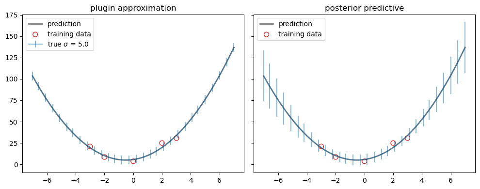

# 11. Linear Regression

We assume that $x$ is written as $(1,x_1,\dotsc,x_D)$, so we can absorb the offset (or bias) term $b=w_0$ into the weight vector $w$.

The key property of the **linear model** is that the <u>expected value of the output</u> $y$ is assumed to be a <u>linear function of the input</u> $x$, i.e,

$$
\mathbb{E}[y|x] = \int y\,p(y|x;\theta)\,dy = w^Tx
$$


## 11.2 Least squares linear regression

We assume that the target $y$ is given by a <u>deterministic function</u> $f(x,w)$ with <u>additive Gaussian noise</u>

$$
y = f(x, w) + \epsilon, \quad \epsilon\sim\mathcal{N}(0,\sigma^2)
$$

The term **linear regression** refers to a model

$$
p(y|x;w,\sigma^2) = \mathcal{N}(y|f(x,w),\sigma^2) \tag{11.1}
$$

We set $f(x,w)=\mathbb{E}[y|x]=w^Tx$. If $x$ is one-dimensional, it is called **simple linear regression**. If $x$ is multi-dimensional, it is called **multiple linear regression**. If the output $y$ is also multi-dimensional, it is called **multivariate linear regression**

$$
p(y|x;w_1,\dotsc,w_J,\sigma_1^2,\dotsc,\sigma_J^2) = \prod_j \mathcal{N}(y_j|w_j^Tx,\sigma_j^2) \tag{11.2}
$$

We can apply a nonlinear transformation $\phi$ to the input $x$ to get 

$$
p(y|x;\theta) = \mathcal{N}(y|w^T\phi(x),\sigma^2) \tag{11.3}
$$


> Figure 11.1: Polynomial regression of degrees 1 and 2 fit to 21 datapoints. $\phi(x)=(1,x,x^2)$ for degree 2.


### 11.2.2 Least squares estimation

The objective function to minimize the negative log likelihood is

$$
\begin{align}
\operatorname{NLL}(w,\sigma^2) &= -\sum_n\log\mathcal{N}(y_n|w^Tx_n,\sigma^2) \\
&= \frac{1}{2\sigma^2}\sum_n(y_n-w^Tx_n)^2 + \frac{N}{2}\log(2\pi\sigma^2) \tag{11.5}
\end{align}
$$

We focus on estimating the weights $w$. In this case, the NLL is equal (up to irrelevant constants) to the **residual sum of squares (RSS)**

$$
\begin{align}
\operatorname{RSS}(w) &\equiv \frac{1}{2}\sum_n (y_n-w^Tx_n)^2 \\
&= \frac{1}{2}\|Xw-y\|_2^2 = \frac{1}{2}(Xw-y)^T(Xw-y) \tag{11.6} \\
\nabla_w\operatorname{RSS}(w) &= X^TXw - X^Ty \tag{11.7}
\end{align}
$$

Thus $\hat w_\text{mle}$ is the point where $\nabla_w\operatorname{NLL}(w,\sigma^2)=\nabla_w\operatorname{RSS}(w)=0$. We can first optimize with respect to $w$, and then solve for the optimal $\sigma$.

> **IMPORTANT**: In the following, we assume that the design matrix $X$ has <u>full rank</u> and $N\geq D$.

- Then $X$ has <u>linearly independent columns</u> so that $X^TX$ is invertible. In this case $X^\dagger=(X^TX)^{-1}X^T$ constitutes a left inverse, since $X^\dagger X=I$.
- In particular, if $N\leq D$ then $X$ has <u>linearly independent rows</u> so that $XX^T$ is invertible. In this case $X^\dagger=X^T(XX^T)^{-1}$ constitutes a right inverse, since $XX^\dagger=I$.

The matrix $X^\dagger$ is called the **Moore–Penrose inverse** (or **pseudoinverse**) of $X$ (see §7.5.3).


#### 11.2.2.1 Ordinary least squares

Setting $\nabla_w\operatorname{RSS}(w)=0$ and solving gives the **normal equations**

$$
X^TXw = X^Ty \tag{11.8}
$$

since, at the optimal solution, $Xw-y$ is normal (orthogonal) to the column space (range) of $X$ (see §7.7.3).

The corresponding solution $\hat w_\text{mle}$  is the **ordinary least squares (OLS)** solution

$$
\hat w_\text{mle} = (X^TX)^{-1}X^Ty = X^\dagger y \tag{11.9}
$$

Moreover, the Hessian $H(w)=\nabla_w^2\operatorname{RSS}(w) = X^TX$ is <u>positive definite</u> so that the least squares objective has a <u>unique global minimum</u> at $\hat w_\text{mle}$.


> Figure 11.2: (a) Contours of the RSS error surface for the example in Figure 11.1. The blue cross represents the MLE $\hat w_\text{mle}$. (b) Corresponding surface plot.


#### 11.2.2.2 Geometric interpretation of least squares

If the case of an **overdetermined system** when $N>D$,

$$
\hat y = X\hat w_\text{mle} = XX^\dagger y = X(X^TX)^{-1}X^T y \tag{11.15}
$$

corresponds to an **orthogonal projection** of $y$ onto the column space of $X$. Here, $\operatorname{Proj}(X)\equiv XX^\dagger$ is called the **projection matrix** or the **hat matrix**.


#### 12.2.2.3 Algorithmic issues

Even if it is theoretically possible to compute the pseudoinverse, we should not do so for numerical reasons, since $X^TX$ may be <u>ill conditioned or singular</u>.

1. A better and more general approach is to use the <u>SVD</u>, $X=USV^T$. Then $X^\dagger=VS^\dagger U^T$, where $S^\dagger$ is formed by replacing every non-zero diagonal entry by its reciprocal and transposing the resulting matrix (see §7.5.3), and

   $$
   \hat y = XX^\dagger y = (USV^T)(VS^\dagger U^T)y = (U_KU_K^T)y
   $$
   
   where $U_K$ contains the first $\operatorname{rank} X$ columns of $U$.

   ```python
   from scipy.linalg import lstsq
   # lstsq.default_lapack_driver = 'gelsd'
   w, residues, rank, singular_values = lstsq(X, y)
   ```

   (See LAPACK: DGELSD, https://netlib.org/lapack/explore-3.1.1-html/dgelsd.f.html)

2. If $N\gg D$, it can be quicker to use <u>QR decomposition</u>, $X=QR$ where $Q$ is an orthogonal matrix and $R=\begin{bmatrix}R_1\\0\end{bmatrix}$ with a $D\times D$ upper triangular matrix $R_1$ (see §7.6.2).

   $$
   y=Xw=(QR)w \implies Q^Ty = Q^T(QR)w = Rw
   $$

   Since $R_1$ is upper triangular, we can solve the last equation using <u>back-substitution</u>, thus <u>avoiding matrix inversion</u>.

   ```python
   scipy.linalg.lstsq(X, y, lapack_driver='gelsy')
   ```

   (See LAPACK: DGELSY, https://netlib.org/lapack/explore-3.1.1-html/dgelsy.f.html)

3. An alternative is to use <u>iterative solvers</u>, such as the **conjugate gradient** method (which assumes $X$ is <u>symmetric positive definite</u>), and the **GMRES** (generalized minimal residual method), that works for a general <u>square</u> matrix $X$.

   These methods are well-suited to problems where $X$ is a <u>dependency structure matrix</u> (DSM; it is an equivalent of an adjacency matrix in graph theory) or a <u>sparse matrix</u>.

   ```python
   from scipy.sparse.linalg import cg, gmres
   w, info = cg(X, y)    # Conjugate Gradient iteration
                         # X must be symmetric positive definite
   w, info = gmres(X, y) # Generalized Minimal RESidual iteration
                         # X must be square
   ```

> **IMPORTANT**: It is usually essential to <u>standardize the input features before fitting the model</u>, to ensure that they are zero mean and unit variance (see §11.7.5).


#### 11.2.2.4 Weighted least squares

In some cases, we want to associate a weight with each sample. For example, in **heteroskedastic regression**, the variance depends on the input, so

$$
p(y|x;\theta) = \mathcal{N}(y|w^Tx,\sigma^2(x)) \tag{11.22}
$$

The **weighted linear regression** has the form

$$
p(y|x;\theta) = \mathcal{N}(y|Xw,\Lambda^{-1}) \tag{11.23}
$$

where $\Lambda=\operatorname{diag}(1/\sigma^2(x_n))$. The MLE is given by the **weighted least squares (WLS)** estimate

$$
\hat w_\text{mle} = (X^T\Lambda X)^{-1}X^T\Lambda y \tag{11.24}
$$

Recall that it is called the **generalized least squares (GLS)** estimate if $\Lambda$ is not diagonal.


### 11.2.3 Other approaches to computing the MLE

#### 11.2.3.1 Solving for offset and slope separately

> **Reference**: [Bis06, p.142]
>
> If we make the bias parameter explicit, then the RSS (eq. 11.6) becomes
>
> $$
> \begin{align}
> \operatorname{RSS}(w_0,w) &= \frac{1}{2}\sum_n(y_n-w_0-w^Tx_n)^2 = \frac{1}{2}\sum_n (y_n-w_0-\sum_{d=1:D} w_dx_{nd})^2 \\
> \frac{\partial}{\partial w_0}\operatorname{RSS}(w_0,w) &= -\sum_n (y_n-w_0-\sum_{d=1:D} w_dx_{nd}) = Nw_0 - \sum_n (y_n-\sum_{d=1:D} w_dx_{nd})
> \end{align}
> $$
> 
> Setting $\frac{\partial}{\partial w_0}\operatorname{RSS}(w_0,w)=0$ and solving for $w_0$ gives
> 
> $$
> \hat w_0=\frac{1}{N}\sum_n(y_n-\sum_{d=1:D} w_dx_{nd}) = \bar y-\sum_{d=1:D} w_d\bar x_d = \bar y-w^T\bar x
> $$
> 
> where $\bar y = \frac{1}{N}\sum_n y_n$ and $\bar x_d=\frac{1}{N}\sum_n x_{nd}$. Thus the bias $w_0$ compensates for the difference between the averages (over the training set) of the target values and the weighted sum of the averages of the input values.

Replacing $w_0$ with $\hat w_0=\bar y-w^T\bar x$, we have

$$
\begin{align}
\operatorname{RSS}(w) &= \frac{1}{2}\sum_n(y_n-\hat w_0-w^Tx_n)^2 = \frac{1}{2}\sum_n\bigl[(y_n-\bar y)-w^T(x_n-\bar x)\bigr]^2 \\
&= \frac{1}{2}(X_cw-y_c)^T(X_cw-y_c)
\end{align}
$$

where $X_c$ is the $N\times D$ <u>centered design matrix</u> containing $(x_n-\bar x)^T$ along its rows, and $y_c=y-\bar y$ is the <u>centered output vector</u>.

Thus we can first compute $\hat w$ on the centered data:

$$
\hat w = (X_c^TX_c)^{-1}X_c^Ty_c = \Bigl[\sum_n(x_n-\bar x)(x_n-\bar x)^T\Bigr]^{-1} \Bigl[\sum_n(y_n-\bar y)(x_n-\bar x)\Bigr] \tag{11.25}
$$

and then finally estimate

$$
\hat w_0=\bar y-\hat w^T\bar x \tag{11.26}
$$


#### 11.2.3.2 Simple linear regression (1d inputs)

In the case of 1d (scalar) inputs, (eq. 11.25 & 11.26) reduce to the familiar form

$$
\begin{align}
\hat w_1 &= \frac{\sum_n(x_n-\bar x)(y_n-\bar y)}{\sum_n(x_n-\bar x)^2} = \frac{C_{xy}}{C_{xx}} \tag{11.27} \\
\hat w_0 &= \bar y-\hat w_1\bar x = \mathbb{E}[y]-\hat w_1\mathbb{E}[x] \tag{11.28} 
\end{align}
$$

where $C_{xy}=\operatorname{Cov}[X,Y]$ and $C_{xx}=\operatorname{Cov}[X,X]=\mathbb{V}[X]$.

> **Reference**: §3.1.1 Covariance and §3.1.2 Correlation
>
> The **covariance** $\operatorname{Cov}[X,Y]\equiv\mathbb{E}[(X-\mathbb{E}[X])(Y-\mathbb{E}[Y])]$ between $X$ and $Y$ measures the <u>degree to which $X$ and $Y$ are (linearly) related</u>. If $X$ and $Y$ are independent, $\operatorname{Cov}[X,Y]=0$, but the converse is not true. Note that $-\infty<\operatorname{Cov}[X,Y]<\infty$.
>
> The (Pearson) **correlation coefficient** gives a normalized measure with a finite lower and upper bound $\pm1$.
> 
> $$
> \operatorname{corr}[X,Y] \equiv \frac{\operatorname{Cov}[X,Y]}{\sqrt{\mathbb{V}[X]\mathbb{V}[Y]}} = \frac{C_{xy}}{\sqrt{C_{xx}C_{yy}}} \tag{3.7}
> $$
> 
> Note that $\operatorname{corr}[X,Y]=1$ if and only if $Y=aX+b$ and $a>0$.
>
> One might expect the correlation coefficient (eq. 3.7) to be related to the slope of the regression line. However, the <u>regression coefficient</u> is in fact given by (eq. 11.27).


#### 11.2.3.3 Partial regression

Consider the case of 2d inputs, so $Y=w_0+w_1X_1+w_2X_2+\epsilon$, where $\mathbb{E}[\epsilon]=0$. Then

$$
\begin{align}
\begin{bmatrix} \hat w_1 \\ \hat w_2 \end{bmatrix} &= \hat w = (X_c^TX_c)^{-1}X_c^Ty_c = \begin{bmatrix} C_{11} & C_{12} \\ C_{12} & C_{22} \end{bmatrix}^{-1} \begin{bmatrix} C_{1y} \\ C_{2y} \end{bmatrix} \\
&= \frac{1}{C_{11}C_{22}-C_{12}^2} \begin{bmatrix} C_{22}C_{1y}-C_{12}C_{2y} \\ -C_{12}C_{1y}+C_{11}C_{2y} \end{bmatrix}
\end{align}
$$

where $C_{ij}=\operatorname{Cov}[X_i,X_j]$ and $C_{iy}=\operatorname{Cov}[X_i,Y]$.

The optimal regression coefficient for $w_1$ is given by

$$
\frac{\partial}{\partial x}\mathbb{E}[Y|X_1=x,X_2] = \hat w_1 = \frac{C_{22}C_{1y}-C_{12}C_{2y}}{C_{11}C_{22}-C_{12}^2}
$$

which is the **partial regression coefficient** of $Y$ on $X_1$, keeping $X_2$ constant. This quantity is invariant to the specific value of $X_2$ we condition on.

Similarly, the **partial regression coefficient** of $Y$ on $X_2$, keeping $X_1$ constant, is given by

$$
\begin{align}
 \\
\frac{\partial}{\partial x}\mathbb{E}[Y|X_1,X_2=x] &= \hat w_2 = \frac{-C_{12}C_{1y}+C_{11}C_{2y}}{C_{11}C_{22}-C_{12}^2}
\end{align}
$$

We can extend this to multiple input variables. In each case, we find the <u>optimal coefficients</u>

$$
\hat w = (X_c^TX_c)^{-1}X_c^Ty_c = \Bigl[\sum_n(x_n-\bar x)(x_n-\bar x)^T\Bigr]^{-1} \Bigl[\sum_n(y_n-\bar y)(x_n-\bar x)\Bigr] \tag{11.25}
$$

<u>are equal to the partial regression coefficients</u>. This means that we can interpret the $d$'th coefficient $\hat w_d$ as the <u>change in output</u> $y$ we expect <u>per unit change in input</u> $x_{nd}$ at $d$'th dimension, keeping all the other dimensions constant. 


#### 11.2.3.4 Recursively computing the MLE

OLS is a <u>batch method</u> for computing the MLE (see eq. 11.27 and 11.28). In some applications, the data arrives in a <u>continual stream</u>, so we want to compute the estimate online, or recursively (see §4.4.2).

Suppose $Y=w_0+w_1X+\epsilon$, simple 1d linear regression. Define

$$
\begin{align}
\bar x^{(n)} &= \frac{1}{n}\sum_{i=1:n} x_i, \quad \bar y^{(n)} = \frac{1}{n}\sum_{i=1:n} y_i \\
C_{xx}^{(n)} &= \frac{1}{n}\sum_{i=1:n} (x_i-\bar x^{(n)})^2, \quad
C_{yy}^{(n)} = \frac{1}{n}\sum_{i=1:n} (y_i-\bar y^{(n)})^2, \\
C_{xy}^{(n)} &= \frac{1}{n}\sum_{i=1:n} (x_i-\bar x^{(n)})(y_i-\bar y^{(n)}) \tag{11.34}
\end{align}
$$

1. We can update the means online using

$$
\bar x^{(n+1)} = \bar x^{(n)} + \frac{1}{n+1}(x_{n+1}-\bar x^{(n)}), \quad
  \bar y^{(n+1)} = \bar y^{(n)} + \frac{1}{n+1}(y_{n+1}-\bar y^{(n)})
$$

2. To update the covariance terms, let us first rewrite $C_{xy}^{(n)}$ as follows:

$$
\begin{align}
C_{xy}^{(n)} &= \frac{1}{n} \Bigl[ \sum_{i=1:n} x_iy_i - n\bar x^{(n)}\bar y^{(n)} \Bigr] \implies
  \sum_{i=1:n} x_iy_i = nC_{xy}^{(n)}+n\bar x^{(n)}\bar y^{(n)} \\
  C_{xy}^{(n+1)} &= \frac{1}{n+1} \Bigl[ x_{n+1}y_{n+1} +   nC_{xy}^{(n)} + n\bar x^{(n)}\bar y^{(n)} - (n+1)\bar x^{(n+1)}\bar y^{(n+1)} \Bigr] \tag{11.40}
\end{align}
$$

3. From (eq. 11.27 and 11.28) we have

$$
w_1^{(n+1)} = \frac{C_{xy}^{(n+1)}}{C_{xx}^{(n+1)}} \quad\text{and}\quad
  w_0^{(n+1)} = \bar y^{(n+1)} - w_1^{(n+1)} \bar x^{(n+1)}
$$


> Figure 11.4: Regression coefficients over time for the 1d model in Figure 11.1.


To extend the above analysis to multi-dimensional inputs, the easiest approach is to use SGD with a minibatch size of 1.

$$
w_{t+1} = w_t - \eta_t(w_t^Tx_n-y_n)x_n \tag{8.60}
$$

where $n=n(t)$ is the index of the sample chosen at iteration $t$. The overall algorithm is called the **least mean squares (LMS)** algorithm (see §8.4.2).


#### 11.2.3.5 Deriving the MLE from a generative perspective

Linear regression is a discriminative model of the form $p(y|x)$. However, we can also use <u>generative model for regression</u>. The goal is to compute the conditional expectation

$$
f(x) = \mathbb{E}[y|x] = \int y\,p(y|x)\,dy = \int y\,\frac{p(x,y)}{p(x)}\,dy = \frac{\int y\,p(x,y)\,dy}{\int p(x,y)\,dy} \tag{11.41}
$$

Suppose we fit $p(x,y)$ using an <u>MVN (multivariate Gaussian)</u>. The MLEs for the parameters of the joint distribution are the <u>empirical mean and covariances</u>,

$$
\begin{align}
\mu_x &= \frac{1}{N}\sum_n x_n = \bar x \quad \mu_y = \frac{1}{N}\sum_n y_n = \bar y \\
\Sigma_{xx} &= \frac{1}{N}\sum_n (x_n-\bar x)(x_n-\bar x)^T = \frac{1}{N}X_c^TX_c \\
\Sigma_{xy} &= \frac{1}{N}\sum_n (x_n-\bar x)(y_n-\bar y)^T = \frac{1}{N}X_c^Ty_c
\end{align}
$$

Hence from (eq. 3.28) we have $\mathbb{E}[y|x] = \mu_y+\Sigma_{xy}^T\Sigma_{xx}^{-1}(x-\mu_x)$. We can rewrite this as $\mathbb{E}[y|x]=w_0+w^Tx$ by defining

$$
\begin{align}
w &= \Sigma_{xx}^{-1}\Sigma_{xy} = (X_c^TX_c)^{-1}X_c^Ty_c \tag{11.48} \\
w_0 &= \mu_y - \Sigma_{xy}^T\Sigma_{xx}^{-1}\mu_x = \mu_y-w^T\mu_x = \bar y-w^T\bar x \tag{11.47}
\end{align}
$$

This matches the MLEs for the discriminative model as (eq. 11.25 and 11.26).

Thus we see that fitting the joint model, and then conditioning it, <u>yields the same result</u> as fitting the conditional model. However, <u>this is only true for Gaussian models</u>.


#### 11.2.3.6 Deriving the MLE for $\sigma^2$

After estimating $\hat w$, we can estimate the noise variance. From (eq 11.5) we have

$$
\hat\sigma^2 = \arg\min_{\sigma^2}\operatorname{NLL}(\hat w,\sigma^2) = \frac{1}{N}\sum_n(y_n-\hat w^Tx_n)^2
$$


### 11.2.4 Measuring goodness of fit

#### 11.2.4.1 Residual plots

For 1d inputs, we can check the reasonableness of the model by plotting the residuals, $r_n=y_n-\hat y_n$ vs. the input $x_n$. The model assumes that the residuals have a $\mathcal{N}(0,\sigma^2)$ distribution, so the **residual plot** should be a cloud of points more or less equally above and below the horizontal line at 0, <u>without any obvious trends</u>.


> Figure 11.5: Residual plot for polynomial regression of degree 1 and 2 for the data in Figure 11.1. (a) We see that there is some curved structure to the residuals, indicating a lack of fit. (b) We see a much better fit.


To extend this approach to multi-dimensional inputs, we can plot $\hat y_n$ vs. the true output $y_n$, rather than plotting vs. $x_n$. A good model will have points that lie on a <u>diagonal line</u>.


> Figure 11.6: Fit vs. actual plots for polynomial regression of degree 1 and 2 for the data in Figure 11.1.


#### 11.2.4.2 Prediction accuracy and $R^2$

- We can assess the fit quantitatively by computing the RSS (residual sum of squares). A model with lower RSS fits the data better.

- Another measure that is used is **root mean squared error (RMSE)**:

$$
\operatorname{RMSE}(w) \equiv \sqrt{\frac{1}{N}\operatorname{RSS}(w)} \tag{11.50}
$$

- A more interpretable measure can be computed using the **coefficient of determination**, denoted by $R^2$:

  $$
  R^2 \equiv 1- \frac{\operatorname{RSS}}{\operatorname{TSS}} = 1 - \frac{\sum_n(\hat y_n-y_n)^2}{\sum_n(\bar y_n-y_n)^2}
  $$
  
  where $\bar y=\frac{1}{N}\sum_n y_n$ is the empirical mean of the response and TSS is the total sum of squares.

  We see that $R^2$ measures the variance in the predictions relative to a simple constant prediction of $\hat y_n=\bar y$. Note that $0\leq R^2\leq 1$, where larger values imply a greater reduction in variance (better fit).


## 11.3 Ridge regression

> **Reference**: [HFT09, p.57]
>
> There are two reasons why we are often not satisfied with the least squares estimates.
>
> - The first is *prediction accuracy*. The least squares estimates often have <u>low bias but large variance</u>. Prediction accuracy can sometimes be <u>improved by shrinking or setting some coefficients to zero</u>. By doing so we sacrifice a little bit of bias to reduce the variance of the predicted values, and hence may improve the overall prediction accuracy. (See §3.4 Shrinkage Methods, [HFT09])
> - The second reason is *interpretation*. With a large number of predictors, we often would like to determine a smaller subset that exhibit the strongest effects. In order to get the big picture, we are willing to sacrifice some of the small details. (See §3.3 Subset Selection, [HFT09])
>
> **Ridge regression** shrinks the regression coefficients by imposing a penalty on their size. The ridge coefficients minimize a penalized residual sum of squares.

MLE can result in overfitting. A simple solution it to use MAP estimation with a zero-mean Gaussian prior, $p(w)=\mathcal{N}(w|0,\tau^2 I)$. This is called **ridge regression**.

$$
\begin{align}
\hat w_\text{map} &= \arg\min_w \frac{1}{2\sigma^2}(y-Xw)^T(y-Xw)+\frac{1}{2\tau^2}w^Tw \\
&= \arg\min_w \operatorname{RSS}(w) + \frac{\lambda}{2} \|w\|_2^2 \tag{11.53}
\end{align}
$$

where $\lambda\equiv\sigma^2/\tau^2$ is proportional to the strength of the prior, and $\|w\|_2^2=\sum_{d=1:D}|w_d|^2$ (without the offset term $w_0$). In general, this technique is called $\ell_2$ **regularization** or **weight decay**.

> Note that we <u>do not penalize</u> $w_0$, since that only affects the global mean of the output, and does not contribute to overfitting.
>
> **Exercise**: Show that the optimizer of
> 
> $$
> J(w,w_0) = (y-Xw-w_01_N)^T(y-Xw-w_01_N) + \lambda (w^Tw+w_0^2)
> $$
> 
> is $\hat w_0=\frac{N}{N+\lambda}(\bar y-w^T\bar x)$ and $\hat w=(X_c^TX_c+\lambda I_D)^{-1}X_c^Ty_c$, where $X_c$ contains $x_n^c=x_n-\frac{N}{N+\lambda}\bar x$ along it rows, and $y_c=y-\frac{N}{N+\lambda}\bar y$.

> **Reference**: [Bis06, p.10] Note that often the coefficient $w_0$ is <u>omitted</u> from the regularizer because its inclusion causes the results to depend on the choice of origin for the target variable (Hastie et al., 2001), or it may be <u>included but with its own regularization coefficient</u> (we shall discuss this topic in more detail in §5.5.1).
>
> [Bis06, p.259] It is therefore common to include <u>separate priors for the biases</u> (which then break shift invariance) having their own hyperparameters.
>
> *Is pytorch SGD optimizer apply weight decay to bias parameters with default settings?* (YES)
>
> https://github.com/pytorch/pytorch/issues/2639
>


### 11.3.1 Computing the MAP estimate

From (eq. 11.53) the MAP estimate corresponds to minimizing

$$
J(w) \equiv (y-Xw)^T(y-Xw) + \lambda\|w\|_2^2 \tag{11.55}
$$

where $\lambda=\sigma^2/\tau^2$ is the strength of the regularizer. The derivative is given by

$$
\nabla_w J(w) = 2 (X^TXw-X^Ty+\lambda w) \tag{11.56}
$$

and hence

$$
\hat w_\text{map} = (X^TX+\lambda I_D)^{-1}X^Ty = \bigl(\sum_n x_nx_n^T + \lambda I_D\bigr)^{-1}\sum_n y_nx_n \tag{11.57}
$$


#### 11.3.1.1 Solving using QR

Naively computing the primal estimate $\hat w_\text{map}$ using matrix inversion is a bad idea, since it can be slow and numerically unstable.

We assume the prior is $p(w)=\mathcal{N}(0,\Lambda^{-1})$, where $\Lambda$ is the precision matrix. In the case of ridge regression, $\Lambda=\tau^{-2}I$.

Let $\tilde X=\begin{pmatrix}X/\sigma \\ \sqrt{\Lambda}\end{pmatrix}$ and $\tilde y=\begin{pmatrix}y/\sigma \\ 0_D\end{pmatrix}$ where $\Lambda=\sqrt{\Lambda}\sqrt{\Lambda}^T$ is a <u>Cholesky decomposition</u> of $\Lambda$. Then the RSS on this expanded data is equivalent to <u>penalized</u> RSS on the original data:

$$
\begin{align}
f(w) &= (\tilde y-\tilde Xw)^T(\tilde y-\tilde Xw)
= \begin{pmatrix}\frac{1}{\sigma}(y-Xw)\\-\sqrt{\Lambda}w\end{pmatrix}^T \begin{pmatrix}\frac{1}{\sigma}(y-Xw)\\-\sqrt{\Lambda}w\end{pmatrix} \\
&= \frac{1}{\sigma^2}(y-Xw)^T(y-Xw)+w^T\Lambda w \tag{11.63}
\end{align}
$$

In the case of ridge regression, $f(w)=\frac{1}{\sigma^2}J(w)$. Hence the MAP estimate can be given by

$$
\hat w_\text{map}=(\tilde X^T\tilde X)^{-1}\tilde X^T\tilde y \tag{11.64}
$$

which is solved using standard OLS methods.

In particular, we can compute the QR decomposition of the $(N+D)\times D$ matrix $\tilde X$, and then proceed as in §11.2.2.3. This takes $O((N+D)D^2)$ time. (https://math.stackexchange.com/questions/501018/what-is-the-operation-count-for-qr-factorization-using-householder-transformatio)


#### 11.3.1.2 Solving using SVD

> **Reference**: [HFT09, p.64-66]
>
> The **singular value decomposition (SVD)** of the (centered) design matrix $X$ gives  us some additional insight into the nature of ridge regression.
> 
> $$
> X = USV^T
> $$
> 
> Here $U$ and $V$ are $N\times D$ and $D\times D$ orthogonal matrices, with the columns of $U$ spanning the column space of $X$, and the columns of $V$ spanning the row space. $S$ is a $D\times D$ diagonal matrix, with diagonal entries $\sigma_1\geq \sigma_2\geq\dotsb \sigma_D\geq 0$ called the singular values of $X$. If one or more values $s_d=0$, $X$ is singular.
>
> Suppose $X$ has a full rank. Using the SVD we can write the least squares fitted vector as
> 
> $$
> \begin{split}
> X\hat w_\text{mle} &= X(X^TX)^{-1}X^Ty = (USV^T)(VS^{-2}V^T)(VSU^T)y \\
> &= UU^Ty = \sum_d u_du_d^Ty
> \end{split} \tag{11.70}
> $$
> 
> where the $u_d$ are the columns of $U$.
>
> Now the ridge solutions are
> 
> $$
> \begin{split}
> X\hat w_\text{map} &= X(X^TX+\lambda I)^{-1}X^Ty = (USV^T)(VS^2V^T+\lambda I)^{-1}(VSU^T)y \\
> &= (USV^T)(V(S^2+\lambda I)^{-1}V^T)(VSU^T)y \\
> &= US(S^2+\lambda I)^{-1}SU^Ty = \sum_d u_d\Bigl(\frac{\sigma_d^2}{\sigma_d^2+\lambda}\Bigr)u_d^Ty 
> \end{split} \tag{11.69}
> $$
> 
> Note that $U^Ty$ are the coordinates of $y$ with respect to the orthonormal basis $U$.


In the case when $D\gg N$ (usual in ridge regression), it is faster to use SVD than QR.

> **Reference**: [HTF09, §18.3.5 Computational ShortCuts When $p\gg N$, p.659]
>
> When $D>N$, the computations can be carried out in an $N$-dimensional space, rather than $D$ via the SVD. Here is the geometric intuition. Just like two points in 3-dimensional
> space always lie on a line, $N$ points in $D$-dimensional space lie in an $(N−1)$-dimensional affine subspace.
>
> Given the $N\times D$ design matrix $X$, let $X=(US)V^T=RV^T$ be the SVD of $X$; that is, $V$ is $D\times N$ with orthonormal columns, $U$ is $N\times N$ orthogonal, and $S$ a diagonal matrix with elements $\sigma_1\geq \sigma_2\dotsb \sigma_N\geq 0$. The matrix $R$ is $N\times N$, with rows $r_n^T$.
>
> Replacing $X$ by $RV^T$ we can show that
> 
> $$
> \begin{align}
> \hat w_\text{map} &= (X^TX+\lambda I_D)^{-1}X^Ty = (VR^TRV^T+\lambda I_D)^{-1}VR^Ty \\
> &= V(R^TR+\lambda I_N)^{-1}R^Ty \tag{11.65}
> \end{align}
> $$
> 
> since $(VR^TRV^T+\lambda I_D)V=VR^TR+\lambda V=V(R^TR+\lambda I_N)$.
>
> Thus $\hat w_\text{map}=V\hat\theta_\text{map}$, where $\hat\theta_\text{map}=(R^TR+\lambda I_N)^{-1}R^Ty$ is the ridge regression estimate using the $N$ observations $(r_n,y_n)$. In other words, we can simply reduce the design matrix $X$ to $R$, and work with rows of $R$. This trick reduces the computational cost from $O(D^3)$ to $O(DN^2)$ when $D>N$.


### 11.3.2 Connection between ridge regression and PCA

> **Reference**: [HFT09, p.66-67]
> 
> $$
> X\hat w_\text{map} = X(X^TX+\lambda I)^{-1}X^Ty = \sum_d u_d\Bigl(\frac{\sigma_d^2}{\sigma_d^2+\lambda}\Bigr)u_d^Ty \tag{11.69}
> $$
> 
> where the $u_d$ are the columns of $U$. Note that since $\lambda\geq 0$, we have $0\leq\frac{\sigma_d^2}{\sigma_d^2+\lambda}\leq 1$.
>
> Like linear regression, ridge regression computes the coordinates of $y$ with respect to the orthonormal basis $U$. It then **shrinks** these coordinates by the factors $\frac{\sigma_d^2}{\sigma_d^2+\lambda}$. This means that a greater amount of shrinkage is applied to the coordinates of basis vectors with smaller $\sigma_d^2$.
>
> **What does a small value of $\sigma_d^2$ mean?**
>
> The SVD of the (centered) design matrix $X$ is another way of expressing the <u>principal components</u> of the variables in $X$. The sample covariance matrix is given by
> 
> $$
> \Sigma = \frac{1}{N}X^TX = \frac{1}{N}VS^2V^T
> $$
> 
> which is the eigen decomposition of $X^TX$. The eigenvectors $v_d$ (columns of $V$) are also called the <u>principal components</u> directions of $X$. The first principal component direction $v_1$ has the property that $z_1=Xv_1$ has the largest sample variance amongst all normalized linear combinations of the columns of $X$. This sample variance is
> 
> $$
> \mathbb{V}[z_1] = \mathbb{V}[Xv_1] = \frac{\sigma_1^2}{N}
> $$
> 
> and in fact $z_1=Xv_1=u_1\sigma_1$. The derived variable $z_1$ is called the **first principal component** of $X$, and hence $u_1$ is the normalized first principal component. Subsequent principal components $z_d$ have maximum variance $\frac{\sigma_d^2}{N}$, subject to being orthogonal to the earlier ones. Conversely the last principal component has minimum variance.
>
> Hence the <u>small singular values</u> $\sigma_d$ correspond to directions in the column space $X$ having <u>small variance</u>, and <u>ridge regression **shrinks** these directions the most</u>.


If $\sigma_n^2$ is small compared to $\lambda$, then the direction $u_n$ will not have much effect on the prediction. In view of this, we define the effective number of **degrees of freedom** of the model

$$
\operatorname{dof}(\lambda) = \sum_n \frac{\sigma_n^2}{\sigma_n^2+\lambda} \tag{11.71}
$$

Note that $\operatorname{dof}(0)=N$ and $\operatorname{dof}(\lambda)\to0$ as $\lambda\to\infty$.


**Why is this behavior desirable?**

The squared singular values $\sigma_d^2$ are equal to the eigenvalues of $X^TX$ so that <u>small singular values</u> $\sigma_d$ corresponds to directions with <u>high posterior variance</u>. It is these directions which ridge shrinks the most.

> In §11.7.2, we will show that the posterior covariance of $p(w|\mathcal{D},\sigma^2)$ is $\mathring\Sigma=\sigma^2(X^TX+\lambda I)^{-1}$ in ridge regression.
>
> Thus the directions in which we are most uncertain about $w$ are determined by the eigenvectors of $(X^TX+\lambda I)^{-1}$ with the <u>largest eigenvalues</u>.
>
> These corresponds to the eigenvectors of $X^TX+\lambda I$ with the <u>smallest squared singular values</u> $\sigma_d^2+\lambda$ and ridge regression shrinks these directions the most.


> Figure 3.15 [Bis06, p.170]: Contours of the likelihood function $p(\mathcal{D}|w,\sigma^2)$ (red) and the prior $p(w)$ (geen).
>
> - For $\lambda=0$, the mode of the posterior $p(w|\mathcal{D},\sigma^2)$ is given by the MLE $\hat w_\text{mle}$, whereas for $\lambda>0$, the mode is the MAP $\hat w_\text{map}$ (see §11.7.2).
> - In the direction $w_1$ (ill-determined by $\mathcal{D}$ with high posterior variance) the squared singular value $\sigma_1^2$ is small compared with $\lambda$ and so $\frac{\sigma_1^2}{\sigma_1^2+\lambda}$ is close to 0, and the corresponding $\hat w_\text{map}{}_1$ is also close to 0.
> - By contrast, in the direction $w_2$ (well-determined by $\mathcal{D}$ with low posterior variance) the squared singular value $\sigma_2^2$ is large compared to $\lambda$ and so $\frac{\sigma_1^2}{\sigma_1^2+\lambda}$ is close to 1, and the corresponding $\hat w_\text{map}{}_2$ is close to $\hat w_\text{mle}{}_2$.

In this way, ill-determined parameters are reduced in size towards 0. This is called **shrinkage**.


#### Principal component regression

This technique is a supervised version of PCA (see §20.1).

- First use PCA to reduce the dimensionality to $K$, and then use these low dimensional features as input to regression.

> **Reference**: [HFT09, §3.5.1 Principal Components Regression, p.79]
>
> As with ridge regression (see §11.7.5), principal components depend on the scaling of the inputs, so typically we first standardize them.
>
> If $K=D$, then we would just get back the usual least squares estimates. For $K<D$, we get a reduced regression.
>
> We see that principal components regression is very similar to ridge regression, since both operate via the principal components of the design matrix $X$.
>
> - <u>Ridge regression shrinks</u> the coefficients of the principal components, shrinking more depending on the size of the corresponding eigenvalue.
> - <u>Principal component regression discards</u> the $D-K$ smallest eigenvalue components.
>
> 
>
> > Figure 3.17 [HFT09, p.80]: <u>Ridge regression</u> shrinks the regression coefficients of the principal components, using shrinkage factors $\frac{\sigma_d^2}{\sigma_d^2+\lambda}$. <u>Principal component regression</u> truncates them. Shown are the shrinkage and truncation patterns as a function of the principal component index.


### 11.3.3 Choosing the strength of the regularizer

To find the optimal value of $\lambda$, we can try a finite number of distinct values, and use cross validation to estimate their expected loss.

This approach can be quite expensive if we have many values to choose from. Fortunately, we can often **warm start** the optimization procedure, using the value of $\hat w(\lambda_k)$ as an initializer for $\hat w(\lambda_{k+1})$, where $\lambda_{k+1}<\lambda_k$; in other words, we start with a highly constrained model (strong regularizer), and then gradually relax the constraints (decrease the amount of regularization). The set of parameters $\hat w_k$ that we sweep out in this way is known as the **regularization path**. See Figure 11.10 (a) for an example.

We can also use an empirical Bayes approach to choose $\lambda$. In particular, we choose the hyperparameter by computing $\hat\lambda=\arg\max_\lambda\log p(\mathcal{D}|\lambda)$, where $p(\mathcal{D}|\lambda)$ is the marginal likelihood or evidence. Figure 4.7 (b) shows that this gives essentially the same result as the CV estimate. However, the Bayesian approach has several advantages: Computing $p(\mathcal{D}|\lambda)$ can be done by fitting a single model, whereas CV has to fit the same model $K$ times; and $p(\mathcal{D}|\lambda)$ is a smooth function of $\lambda$, so we can use gradient based optimization instead of discrete search.


## 11.7 Bayesian linear regression *

> **Reference**: [Bis06, §3.3, p.152]
>
> In our discussion of <u>maximum likelihood</u> for setting the parameters of a linear regression model, we have seen that the <u>effective model complexity</u>, governed by the number of basis functions, <u>needs to be controlled according to the size of the data set</u>. Adding a <u>regularization term</u> to the log likelihood function means the effective model complexity can then be controlled by the value of the regularization coefficient, although the choice of the number and form of the basis functions is of course still important in determining the overall behavior of the model.
>
> This leaves the issue of deciding the appropriate model complexity for the particular problem, which <u>cannot be decided simply by maximizing the likelihood function</u>, because this always leads to excessively complex models and overfitting. <u>Independent hold-out (validation) data</u> can be used to determine model complexity, as discussed in Section 1.3, but this can be both computationally expensive and wasteful of valuable data.
>
> We therefore turn to a <u>Bayesian treatment of linear regression</u>, which will avoid the overfitting problem of maximum likelihood, and which will also lead to automatic methods of determining model complexity <u>using the training data alone</u>.

For simplicity, we assume the variance $\sigma^2$ is a known constant, so we just want to compute the posterior

$$
p(w|\mathcal{D},\sigma^2) \propto p(\mathcal{D}|w,\sigma^2)\,p(w)
$$


### 11.7.1 Priors

We will use a <u>Gaussian prior</u>, $p(w)=\mathcal{N}(w|\breve w,\breve\Sigma)$. In ridge regression, $\breve w=0$ and $\breve\Sigma=\tau^2I$.


### 11.7.2 Posteriors

We can rewrite the <u>likelihood</u> in terms of an MVN

$$
p(\mathcal{D}|w,\sigma^2) = \prod_n p(y_n|x_n;w,\sigma^2) = \mathcal{N}(y|Xw,\sigma^2I_N) \tag{11.119}
$$

From the Bayes rule for Gaussian (eq. 3.37) the <u>posterior</u> is

$$
p(w|X,y,\sigma^2) \propto \mathcal{N}(w|\mathring w,\mathring\Sigma) \equiv \mathcal{N}(y|Xw,\sigma^2I_N)\,\mathcal{N}(w|\breve w,\breve\Sigma) \tag{11.120}
$$

where $\mathring w\equiv\mathring\Sigma \bigl( \frac{1}{\sigma^2}X^Ty+\breve\Sigma^{-1}\breve w \bigr)$ is the <u>posterior mean</u> and $\mathring\Sigma^{-1}\equiv\breve\Sigma^{-1}+\frac{1}{\sigma^2}X^TX$ is the <u>posterior covariance</u>.

- Since the posterior is Gaussian, its mode coincides with its mean $\mathring w$. For example, <u>in ridge regression</u> where $\breve w=0$, $\breve\Sigma=\tau^2I$, and $\lambda=\sigma^2/\tau^2$, we have

  $$
  \begin{gather}
  \mathring\Sigma^{-1} = \frac{1}{\tau^2}I + \frac{1}{\sigma^2}X^TX =   \frac{1}{\sigma^2}(X^TX+\lambda I) \\
  \mathring w = \sigma^2(X^TX+\lambda I)^{-1}\Bigl(\frac{1}{\sigma^2}X^Ty+0\Bigr)=(X^TX+\lambda I)^{-1}X^Ty
  \end{gather}
  $$
  
  Thus the ridge regression estimate $\hat w_\text{map}$ (eq. 11.57) can be derived as the mean or mode of a posterior distribution. 


- If we consider an infinitely broad prior $\breve\Sigma=\tau^2I$ with $\tau^2\to\infty$ <u>in ridge regression</u>, the <u>posterior mean</u> reduces to the MLE estimate $\hat w_\text{mle}=(X^TX)^{-1}X^Ty$ (eq. 11.9), and the <u>posterior covariance</u> reduces to $\frac{1}{\sigma^2}(X^TX)^{-1}$.
- If $N=0$, then the posterior reverts to the prior.


### 11.7.3 Example

> **Reference**: [Bis06, §3.3, p.154]
>
> We can illustrate Bayesian learning in a linear model, as well as the <u>sequential update of a posterior distribution</u>, using a simple example involving straight line fitting.
>
> **Linear model** of the form $y=f(x,w)=w_0+w_1x$, where the true parameters are $w_0=-0.3$ and $w_1=0.5$. 
>
> **Synthetic data**: (1) Choose $x_n\sim\mathcal{U}(-1,1)$ from the uniform distribution. (2) Evaluate $y_n=f(x_n,w)+\epsilon_n$, where $\epsilon_n\sim\mathcal{N}(0,\sigma^2)$ is a Gaussian noise with $\sigma=0.2$.
>
> Our goal is to recover the values of $w_0$ and $w_1$ from such data, and we will explore the dependence on the size $N$ of the data set. We assume that the noise variance $\sigma^2=(0.2)^2$ and $\tau^2=1/2$ so that $\lambda=\sigma^2/\tau^2=2(0.2)^2=0.08$.


> Figure 11.20 shows the results of Bayesian learning in this model as the size $N$ of the data set is increased and demonstrates the <u>sequential nature of Bayesian learning</u> in which the current posterior distribution forms the prior when a new data point is observed.
>
> - The <u>first row</u> corresponds to the situation <u>before any data points are observed</u> and shows a plot of the <u>prior</u> in $w=(w_0,w_1)$ space together with 10 samples of the function $y=f(x,w)$ in which the values of $w$ are drawn from the prior.
>
> - In the <u>second row</u>, we see the situation <u>after observing a single data point</u> $(x_1,y_1)$. The location of the data point is shown by a <u>blue (solid) circle</u> in the right-hand column. In the left-hand column is a plot of the likelihood $p(y_1|x_1;w,\sigma^2)$ as a function of $w$.
>
>   Note that the likelihood provides a <u>soft constraint</u> that the line must pass close to the data point, where close is determined by the noise variance $\sigma^2=0.04$. For comparison, the true parameter values $w_0=−0.3$ and $w_1=0.5$ used to generate the data set are shown by a <u>white cross</u> in the plots in the left column. When we multiply this likelihood function by the prior from the top row, and normalize, we obtain the posterior distribution shown in the middle plot on the second row.
>
>   Samples of the regression function $y=f(x,w)$ obtained by drawing samples of $w$ from this
>   posterior are shown in the right-hand plot. Note that these sample lines all pass close to the data point.
>
> - The <u>third row</u> shows the <u>effect of observing a second data point</u> $(x_2,y_2)$, again shown by a <u>blue (solid) circle</u> in the plot in the right-hand column. The corresponding likelihood for this second data point alone is shown in the left plot. When we multiply this likelihood by the posterior from the second row, we obtain the posterior shown in the middle plot of the third row.
>
>   Note that this is exactly the same posterior as would be obtained by combining the original prior with the likelihood function for the two data points. This posterior has now been influenced by two data points, and because two points are sufficient to define a line this already gives a relatively compact posterior.
>
>   Samples from this posterior give rise to the functions shown in red in the third column, and we see that these functions pass close to both of the data points.
>
> - The <u>fourth row</u> shows the <u>effect of observing a total of 100 data points</u>. The left-hand plot shows the likelihood for the 100th data point alone, and the middle plot shows the resulting posterior that has now absorbed information from all 100 observations.
>
>   Note how the posterior is much sharper than in the third row. In the limit of an infinite number of data points, the posterior would become a delta function centered on the true parameter values, shown by the white cross.


### 11.7.4 Computing the posterior predictive

We have discussed how to compute our uncertainty about the parameters of the model, $p(w|\mathcal{D})$. But what about the uncertainty associated with our predictions about future outputs?

From (eq. 3.38) we can show that the <u>posterior predictive distribution</u> at a test point $x$ is also Gaussian.

$$
\begin{align}
p(y|x,\mathcal{D}) &= \int p(y|x;w)p(w|\mathcal{D})\,dw = \int\mathcal{N}(y|w^Tx,\sigma^2)\,\mathcal{N}(w|\mathring w,\mathring\Sigma)\,dw \\
&= \mathcal{N}(y|\mathring w^Tx,\mathring\sigma_N^2(x))
\end{align}
$$

where $\mathring\sigma_N^2(x)\equiv\sigma^2+x^T\mathring\Sigma x$ is the <u>variance of the posterior predictive distribution</u> at the point $x$ after seeing the $N$ training examples $\mathcal{D}$. The predicted variance depends on two terms, the variance of the observation noise $\sigma^2$, and the variance $\mathring\Sigma$. The latter translates into <u>variance about observations in a way which depends on how close $x$ is to the training data</u> $\mathcal{D}$. This is illustrated in Figure 11.21 (b).



> Figure 11.21: (a) Plugin approximation to predictive density (we plugin the MAP estimate $\hat w_\text{map}$) when fitting a second degree polynomial to some 1d data. (b) Posterior predictive density, obtained by integrating out the parameters. Black curve is <u>posterior mean</u>, error bars are <u>2 standard deviations</u> of the posterior predictive density.

In some cases, it is computationally intractable to compute the parameter posterior $p(w|\mathcal{D})$. In such cases, we may choose to use a point estimate $\hat w_\text{map}$, and then to use the plugin approximation.

$$
p(y|x,\mathcal{D}) = \int\mathcal{N}(y|w^Tx,\sigma^2)\,\delta(w-\hat w_\text{map})\,dw = \mathcal{N}(y|\hat w_\text{map}^Tx,\sigma^2) \tag{11.125}
$$

We see that the posterior predictive variance is constant, and independent of the data $\mathcal{D}$, as illustrated in Figure 11.21 (a).


> Figure 11.21: (c) 10 samples from the plugin approximation to posterior predictive distribution. (d) 10 samples from the true posterior predictive distribution.

If we sample $w_s\sim\delta(w-\hat w_\text{map})$, we will always recover a single function $y=\hat w_\text{map}^Tx$, as shown in Figure 11.21 (c). By contrast, if we sample $w_s\sim\mathcal{N}(w|\mathring w,\mathring\Sigma)$, we will get a range of different functions $y=w_s^Tx$, as shown in Figure 11.21 (d), which more accurately reflects our uncertainty.


### 11.7.5 The advantage of centering

Notice that the shape of the 2d posterior in Figure 11.20 is an elongated ellipse (which eventually collapses to a point as $N\to\infty$). This implies that there is <u>a lot of posterior correlation</u> between $w_0$ and $w_1$, which can cause computational difficulties.

- Each data point induces a likelihood function corresponding to a line which goes through the data point.
- When we look at all the data together, we see that predictions with maximum likelihood must correspond to lines that go through the mean of the data $(\bar x, \bar y)$.
- There are many such lines, but if we increase the slope, we must decrease the intercept. Thus we can think of the set of high probability lines as spinning around the data mean, like a wheel of fortune.
- This correlation between $w_0$ and $w_1$ is why the posterior has the form of a diagonal line.

It can be hard to compute such elongated posteriors. One simple solution is to <u>center the input data</u>, i.e., $x'_n=x_n-\bar x$. Now the lines can pivot around the origin, reducing the posterior correlation between $w_0$ and $w_1$.


> Figure 11.22: Posterior samples of $p(w|\mathcal{D})$ for 1d linear regression model $p(y|x,w)=\mathcal{N}(y|w^Tx,\sigma^2)$ with a Gaussian prior $\mathcal{N}(w|0,\Sigma)$. (a) Original data. (b) Centered data.
>
> - 100 data points $\mathcal{D}$ are generated by $y_n=w_0+w_1x_n+\epsilon_n$, where $x_n\sim\mathcal{N}(10,1)$ and $\epsilon_n\sim\mathcal{N}(0,\sigma^2)$ with $\sigma=0.5$. True weight values are $w_0=2.5$ and $w_1=0.9$. The mean $\bar x=10.2$.
> - The prior covariance $\Sigma=\operatorname{diag}(10^2,1)$.
> - Posterior samples are generated by MCMC with `draws=1000` and `chains=2`.

Note that we can convert the posterior derived from fitting to the centered data back to the original coordinates by noting that

$$
y' = w'_0 + w'_1x' = w'_0 + w'_1(x-\bar x) = (w'_0-w'_1\bar x)+w'_1x
$$

Thus the parameters on the uncentered data are $w_0=w'_0-w'_1\bar x$ and $w_1=w'_1$.


### 11.7.6 Dealing with multicollinearity

In many datasets, the input variables can be highly correlated with each other. Including all of them does not generally harm predictive accuracy (provided you use a suitable prior or regularizer to prevent overfitting). However, it can make interpretation of the coefficients more difficult.

Suppose we have a dataset of $N$ people in which we record their heights $h_n$, as well as the length of their left legs $l_n$ and right legs $r_n$.

- $h_n\sim\mathcal{N}(10,2)$, so $\bar h=10$ (in unspecified units).
- $l_n,r_n\sim\mathcal{N}(\rho_nh_n,0.02)$, where $\rho_n\sim \mathcal{U}(0.4,0.5)$.

We want to predict the height of a person given measurement of their leg lengths. Since both left and right legs are noisy measurements of the unknown quantity, it is useful to use both of them.

- Linear regression to fit $p(h|l,r)=\mathcal{N}(h|\alpha+\beta_ll+\beta_rr,\sigma^2)$.
- Vague priors, $\alpha,\beta_l,\beta_r\sim\mathcal{N}(0,10^2)$ and $\sigma\sim\operatorname{Expon}(1)$.


We assume that $\bar\alpha=2$. Since the average leg length is $\bar l=\bar r=\bar\rho\cdot\bar h=0.45\cdot 10=4.5$, we might expect $\beta_l+\beta_r\approx\frac{\bar h-\bar\alpha}{\bar l}=\frac{10-2}{4.5}\approx 1.78$. However, the posterior marginals of $\beta_l$ and $\beta_r$ are quite different as shown in Figure 11.23.


> Figure 11.23: Posterior marginals for the parameters in the multi-leg example.


We can gain more insight by looking at the joint distribution $p(\beta_l,\beta_r|\mathcal{D})$ shown in Figure 11.24 (a). We see that the parameters are very highly correlated, so if $\beta_l$ is large, then $\beta_r$ is small, and vice versa. The marginal distribution for each parameter does not capture this. However, it does show that there is a lot of uncertainty about each parameter, showing that they are non-identifiable.

However, their sum is well-determined, as can be seen from Figure 11.24 (b), where we plot $p(\beta_l+\beta_r|\mathcal{D})$; this is centered on 1.78, as we might expect.


This example goes to show that we must be careful trying to interpret the significance of individual coefficient estimates in a model, since they do not mean much in isolation.


### 11.7.7 Automatic relevancy determination (ARD) *

Consider a linear regression model $\mathcal{N}(y|Xw,\sigma^2I)$ with known observation noise $\sigma^2$ but unknown regression weights $w$. Suppose we use a Gaussian prior for the weights, $w\sim\mathcal{N}(0,\operatorname{diag}(\alpha)^{-1})$.

We can estimate the prior precisions as follows:

$$
\hat\alpha = \arg\max_\alpha p(y|X,\alpha) = \arg\max_\alpha \int \mathcal{N}(y|Xw,\sigma^2I)\,\mathcal{N}(w|0,\operatorname{diag}(\alpha)^{-1})\,dw
$$

This is an example of empirical Bayes, since we are estimating the prior from data. We can view this as a computational shortcut to a fully Bayesian approach.

However, there are additional advantages. In particular, suppose, after estimating $\alpha$, we compute the MAP estimate $\hat w=\arg\max_w \mathcal{N}(w|0,\hat\alpha^{-1})$. This results in a sparse estimate for $\hat w$, which is perhaps surprising given that the Gaussian prior for $w$ is not sparsity promoting.

This technique is known as **sparse Bayesian learning** or **automatic relevancy determination (ARD)**. It was originally developed for neural networks (where sparsity is applied to the first layer weights), but here we apply it to linear models.
