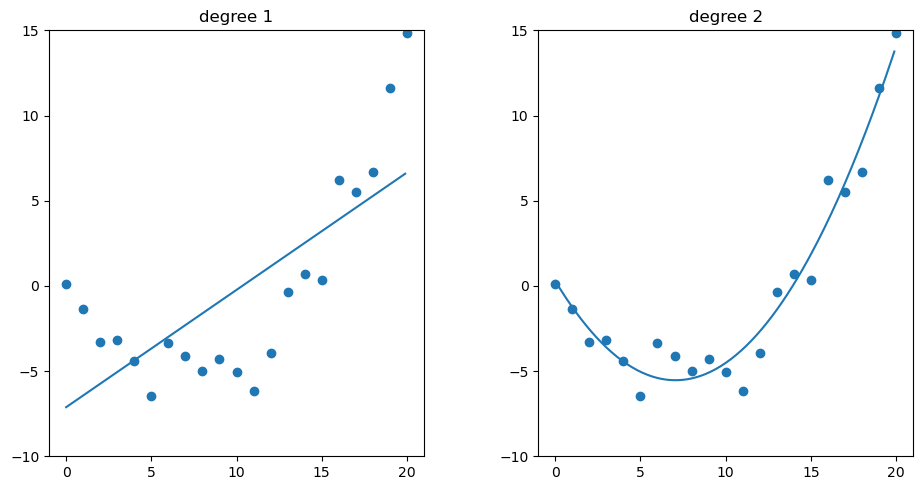
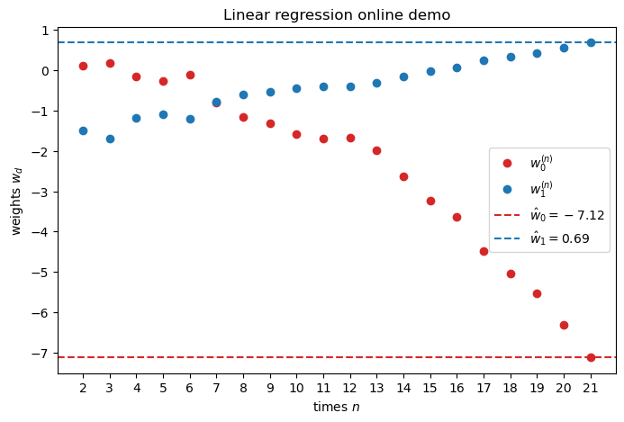
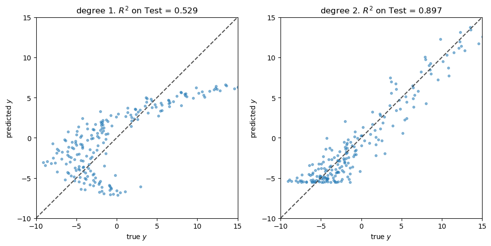

# 11. Linear Regression

We will usually assume that $x$ is written as $(1,x_1,\dotsc,x_D)$, so we can absorb the offset (or bias) term $b=w_0$ into the weight vector $w$.

The <u>key property of the linear model</u> is that the expected value of the output is assumed to be a linear function of the input, i.e,
$$
\mathbb{E}[y|x] = \int y\,p(y|x;\theta)\,dy = w^Tx
$$


## 11.2 Least squares linear regression

We assume that the target variable $y$ is given by a <u>deterministic function</u> $f(x,w)$ with <u>additive Gaussian noise</u> so that $y = f(x,w) + \epsilon$, where $\epsilon$ is a zero mean Gaussian random variable with variance $\sigma^2$. Thus
$$
p(y|x;\theta) = \mathcal{N}(y|f(x,w),\sigma^2) \tag{11.1}
$$
where $\theta=(w,\sigma^2)$. Then $\mathbb{E}[y|x]=f(x,w)$.

Set $f(x,w)=w^Tx$ for <u>linear regression</u>. If $x$ is one-dimensional, it is called **simple linear regression**. If $x$ is multi-dimensional, it is called **multiple linear regression**. If the output $y$ is also multi-dimensional, it is called **multivariate linear regression**,
$$
p(y|x;w_1,\dotsc,w_J,\sigma_1^2,\dotsc,\sigma_J^2) = \prod_j \mathcal{N}(y_j|w_j^Tx,\sigma_j^2) \tag{11.2}
$$
We can always apply a nonlinear transformation to the input features, by replacing $x$ with $\phi(x)$ to get
$$
p(y|x;\theta) = \mathcal{N}(y|w^T\phi(x),\sigma^2) \tag{11.3}
$$


> Figure 11.1: Polynomial of degrees 1 and 2 fit to 21 data points.


### 11.2.2 Least squares estimation

$$
\operatorname{NLL}(w,\sigma^2) = -\sum_n\log\mathcal{N}(y_n|w^Tx_n,\sigma^2) = \frac{1}{2\sigma^2}\sum_n(y_n-\hat y_n)^2 + \frac{N}{2}\log 2\pi\sigma^2 \tag{11.5}
$$

where the predicted response $\hat y_n\equiv w^Tx_n$.

We just <u>focus on</u> estimating the weights $w$. In this case, the NLL is equal (up to irrelevant constants) to the **residual sum of squares**,
$$
\begin{align*}
\operatorname{RSS}(w) &\equiv \frac{1}{2}\sum_n (y_n-\hat y_n)^2 = \frac{1}{2}\|Xw-y\|_2^2 = \frac{1}{2}(Xw-y)^T(Xw-y) \tag{11.6} \\
\nabla_w\operatorname{RSS}(w) &= X^TXw - X^Ty \\
\nabla_w^2\operatorname{RSS}(w) &= X^TX
\end{align*}
$$


#### 11.2.2.1 Ordinary least squares

Setting $\nabla_w\operatorname{RSS}(w)=0$ and solving gives the **normal equations**, $X^TXw=X^Ty$.

Suppose that $X$ has full rank. Then the corresponding solution is the **ordinary least squares (OLS)** solution,
$$
\hat w = (X^TX)^{-1}X^Ty = X^\dagger y \tag{11.9}
$$
Here, $X^\dagger\equiv (X^TX)^{-1}X^T$ is called the **Moore–Penrose inverse** (or **pseudoinverse**) of $X$.

Moreover, the Hessian $H(w)=\nabla_w^2\operatorname{RSS}(w) = X^TX$ is positive definite so that the least squares objective has a unique global minimum at $\hat w$.


> Figure 11.2: (a) Contours of the RSS error surface for the example in Figure 11.1. The blue cross represents the MLE $\hat w$. (b) Corresponding surface plot.


#### 11.2.2.2 Geometric interpretation of least squares

We assume $N>D$. (This is known as an **overdetermined system**.)
$$
\hat y = X\hat w = XX^\dagger y = X(X^TX)^{-1}X^T y \tag{11.15}
$$
corresponds to an **orthogonal projection** of $y$ onto the column space of $X$. Here, $\operatorname{Proj}(X)\equiv XX^\dagger$ is called the **projection matrix**.

In the special case that $X=x$, the orthogonal projection of $y$ onto the line $x$ becomes
$$
\operatorname{Proj}(x)y = x\Bigl(\frac{x^Ty}{x^Tx}\Bigr) \tag{11.17}
$$


#### 12.2.2.3 Algorithmic issues

Even if it is theoretically possible to compute the pseudoinverse, we should not do so for numerical reasons, since $X^TX$ may be ill conditioned or singular.

1. A better (and more general) approach is to compute the pseudoinverse using the <u>SVD</u>.

   ```python
   from scipy.linalg import lstsq
   # lstsq.default_lapack_driver = 'gelsd'
   self.coef_, _, self.rank_, self.singular_ = lstsq(X, y)
   ```

   (See LAPACK: DGELSD, https://netlib.org/lapack/explore-3.1.1-html/dgelsd.f.html)

2. If $N\gg D$, it can be quicker to use <u>QR decomposition</u>, $X=QR$ where $Q^TQ=I$.
   $$
   y=Xw=(QR)w \implies Q^Ty = Q^T(QR)w = Rw \implies w = R^{-1}(Q^Ty)
   $$
   Since $R$ is upper triangular, we can solve the last equation using back-substitution, thus avoiding matrix inversion.

3. An alternative is to use <u>iterative solvers</u>, such as the **conjugate gradient** method (which assumes $X$ is symmetric positive definite), and the **GMRES** (generalized minimal residual method), that works for general $X$. These methods are well-suited to problems where $X$ is a (design or dependency) structure matrix or a sparse matrix.

4. A final important issue is that <u>it is usually essential to standardize the input features before fitting the model</u>, to ensure that they are zero mean and unit variance.


#### 11.2.2.4 Weighted least squares

In some cases, we want to associate a weight with each sample. For example, in **heteroskedastic regression**, the variance depends on the input, so
$$
p(y|x;\theta) = \mathcal{N}(y|w^Tx,\sigma^2(x)) \tag{11.22}
$$
The  **weighted linear regression** has the form
$$
p(y|x;\theta) = \mathcal{N}(y|Xw,\Lambda^{-1}) \tag{11.23}
$$
where $\Lambda=\operatorname{diag}(1/\sigma^2(x_n))$. The MLE is given by the **weighted least squares (WLS) estimate**,
$$
\hat w = (X^T\Lambda X)^{-1}X^T\Lambda y \tag{11.24}
$$
Recall that it is called the **generalized least squares (GLS) estimate** if $\Lambda$ is not diagonal.


### 11.2.3 Other approaches to computing the MLE

#### 11.2.3.1 Solving for offset and slope separately

> **Reference**: [Bis06, p.142]
>
> If we make the bias parameter explicit, then the RSS (eq. 11.6) becomes
> $$
> \begin{align*}
> \operatorname{RSS}(w) &= \frac{1}{2}\sum_n (y_n-w^Tx_n)^2 = \frac{1}{2}\sum_n (y_n-w_0-\sum_{d=1:D} w_dx_{nd})^2 \\
> \frac{\partial}{\partial w_0}\operatorname{RSS}(w) &= -\sum_n (y_n-w_0-\sum_{d=1:D} w_dx_{nd}) = Nw_0 - \sum_n (y_n-\sum_{d=1:D} w_dx_{nd})
> \end{align*}
> $$
> Setting $\frac{\partial}{\partial w_0}\operatorname{RSS}(w)=0$ and solving for $w_0$ gives
> $$
> \hat w_0=\frac{1}{N}\sum_n(y_n-\sum_{d=1:D} w_dx_{nd}) = \bar y -\sum_{d=1:D}w_d\bar x_d
> $$
> where $\bar y = \frac{1}{N}\sum_n y_n$ and $\bar x_d=\frac{1}{N}\sum x_{nd}$. Thus the bias $w_0$ compensates for the difference between the averages (over the training set) of the target values and the weighted sum of the averages of the input values.

Let $X_c$ be the <u>centered design matrix</u> of shape $N\times D$ containing $x_n^c=x_n-\bar x$ along it rows, and $y_c=y-\bar y$ is the <u>centered output vector</u>. Then we can first compute $\hat w$ on centered data:
$$
\hat w = (X_c^TX_c)^{-1}X_c^Ty_c = \Bigl[\sum_n(x_n-\bar x)(x_n-\bar x)^T\Bigr]^{-1} \Bigl[\sum_n(y_n-\bar y)(x_n-\bar x)\Bigr] \tag{11.25}
$$
and then estimate $\hat w_0=\bar y-\hat w^T\bar x$ (eq 11.26).


#### 11.2.3.2 Simple linear regression (1d inputs)

In the case of 1d (scalar) inputs, (eq. 11.25 & 11.26) reduce to the familiar form
$$
\begin{align*}
\hat w_1 &= \frac{\sum_n(x_n-\bar x)(y_n-\bar y)}{\sum_n(x_n-\bar x)^2} = \frac{C_{xy}}{C_{xx}} \tag{11.27} \\
\hat w_0 &= \bar y-\hat w_1\bar x = \mathbb{E}[y]-\frac{C_{xy}}{C_{xx}}\mathbb{E}[x] \tag{11.28} 
\end{align*}
$$
where $C_{xy}=\operatorname{Cov}[X,Y]$ and $C_{xx}=\operatorname{Cov}[X,X]=\mathbb{V}[X]$.

> The **covariance** $\operatorname{Cov}[X,Y]\equiv\mathbb{E}[(X-\mathbb{E}[X])(Y-\mathbb{E}[Y])]$ between $X$ and $Y$ measures the <u>degree to which $X$ and $Y$ are (linearly) related</u>. If $X$ and $Y$ are independant, $\operatorname{Cov}[X,Y]=0$, but the converse is not true. Note that $-\infty<\operatorname{Cov}[X,Y]<\infty$.
>
> The (Pearson) **correlation coefficient** gives a normalized measure with a finite lower and upper bound $\pm1$.
> $$
> \operatorname{corr}[X,Y] \equiv \frac{\operatorname{Cov}[X,Y]}{\sqrt{\mathbb{V}[X]\mathbb{V}[Y]}} = \frac{C_{xy}}{\sqrt{C_{xx}C_{yy}}} \tag{3.7}
> $$
> Note that $\operatorname{corr}[X,Y]=1$ if and only if $Y=aX+b$ and $a>0$.

One might expect the correlation coefficient (eq. 3.7) to be related to the slope of the regression line. However, the regression coefficient is in fact given by (eq. 11.27) (see $\S$3.1.2).


#### 11.2.3.3 Partial regression

From (eq. 11.27), we can compute the **regression coefficient** of $Y=w_0+w_1X+\epsilon$ on $X$:
$$
R_{YX} \equiv \frac{\partial}{\partial x}\mathbb{E}[Y|X=x] = \mathbb{E}[\tfrac{\partial Y}{\partial x}|X=x] = w_1 = \frac{C_{xy}}{C_{xx}} \tag{11.29}
$$
This is the slope of the linear prediction for $Y$ given $X$.

Consider the case of 2d inputs, so $Y=w_0+w_1X_1+w_2X_2+\epsilon$, where $\mathbb{E}[\epsilon]=0$. Then the optimal regression coefficient for $w_1$ is given by
$$
R_{YX_1\cdot X_2} = \frac{\partial}{\partial x}\mathbb{E}[Y|X_1=x,X_2] = w_1 \tag{11.30}
$$
which is the **partial regression coefficient** of $Y$ on $X_1$, keeping $X_2$ constant. This quantity is invariant to the specific value of $X_2$ we condition on.

We can extend this to multiple input variables. In each case, we find that the optimal coefficients are equal to the partial regression coefficients. This means that we can interpret the $j$'th coefficient $\hat w_j$ as the change in output $y$ we expect per unit change in input $x_j$, keeping all the other inputs constant. 


#### 11.2.3.4 Recursively computing the MLE

OLS is a <u>batch method</u> for computing the MLE (see eq. 11.27 and 11.28). In some applications, the data arrives in a continual stream, so we want to compute the estimate online, or recursively (see $\S$4.4.2).

Suppose $Y=w_0+w_1X+\epsilon$, simple 1d linear regression. Define
$$
\begin{align*}
\bar x^{(n)} &= \frac{1}{n}\sum_{i=1:n} x_i, \quad \bar y^{(n)} = \frac{1}{n}\sum_{i=1:n} y_i \\
C_{xx}^{(n)} &= \frac{1}{n}\sum_{i=1:n} (x_i-\bar x^{(n)})^2, \quad
C_{yy}^{(n)} = \frac{1}{n}\sum_{i=1:n} (y_i-\bar y^{(n)})^2, \\
C_{xy}^{(n)} &= \frac{1}{n}\sum_{i=1:n} (x_i-\bar x^{(n)})(y_i-\bar y^{(n)}) \tag{11.34}
\end{align*}
$$

1. We can update the means online using
$$
  \bar x^{(n+1)} = \bar x^{(n)} + \frac{1}{n+1}(x_{n+1}-\bar x^{(n)}), \quad
  \bar y^{(n+1)} = \bar y^{(n)} + \frac{1}{n+1}(y_{n+1}-\bar y^{(n)})
$$

2. To update the covariance terms, let us first rewrite $C_{xy}^{(n)}$ as follows:
$$
\begin{align*}
C_{xy}^{(n)} &= \frac{1}{n} \Bigl[ \sum_{i=1:n} x_iy_i - n\bar x^{(n)}\bar y^{(n)} \Bigr] \implies
  \sum_{i=1:n} x_iy_i = nC_{xy}^{(n)}+n\bar x^{(n)}\bar y^{(n)} \\
  C_{xy}^{(n+1)} &= \frac{1}{n+1} \Bigl[ x_{n+1}y_{n+1} +   nC_{xy}^{(n)} + n\bar x^{(n)}\bar y^{(n)} - (n+1)\bar x^{(n+1)}\bar y^{(n+1)} \Bigr] \tag{11.40}
\end{align*}
$$
3. From (eq. 11.27 and 11.28) we have

$$
w_1^{(n+1)} = \frac{C_{xy}^{(n+1)}}{C_{xx}^{(n+1)}} \quad\text{and}\quad
  w_0^{(n+1)} = \bar y^{(n+1)} - w_1^{(n+1)} \bar x^{(n+1)}
$$




> Figure 11.4: Regression coefficients over time for the 1d model in Figure 11.1.


To extend the above analysis to multi-dimensional inputs, the easiest approach is to use SGD. The resulting algorithm is called the **least mean squares (LMS)** algorithm (see $\S$8.4.2).


#### 11.2.3.5 Deriving the MLE from a generative perspective

Linear regression is a discriminative model of the form $p(y|x)$. However, we can also use generative model for regression. The goal is to compute the conditional expectation
$$
f(x) = \mathbb{E}[y|x] = \int y\,p(y|x)\,dy = \frac{\int y\,p(x,y)\,dy}{\int p(x,y)\,dy} \tag{11.41}
$$
Suppose we fit $p(x,y)$ using an MVN. The MLEs for the parameters of the joint distribution are the empirical mean and covariances.
$$
\begin{align*}
\mu_x &= \frac{1}{N}\sum_n x_n = \bar x \quad \mu_y = \frac{1}{N}\sum_n y_n = \bar y \\
\Sigma_{xx} &= \frac{1}{N}\sum_n (x_n-\bar x)(x_n-\bar x)^T = \frac{1}{N}X_c^TX_c \\
\Sigma_{xy} &= \frac{1}{N}\sum_n (x_n-\bar x)(y_n-\bar y)^T = \frac{1}{N}X_c^Ty_c
\end{align*}
$$
Hence from (eq. 3.28) we have $\mathbb{E}[y|x] = \mu_y+\Sigma_{xy}^T\Sigma_{xx}^{-1}(x-\mu_x)$. We can rewrite this as $\mathbb{E}[y|x]=w_0+w^Tx$ by defining
$$
\begin{align*}
w &= \Sigma_{xx}^{-1}\Sigma_{xy} = (X_c^TX_c)^{-1}X_c^Ty_c \tag{11.48} \\
w_0 &= \mu_y - \Sigma_{xy}^T\Sigma_{xx}^{-1}\mu_x = \mu_y-w^T\mu_x = \bar y-w^T\bar x \tag{11.47}
\end{align*}
$$
This matches the MLEs for the discriminative model as (eq. 11.25). Thus we see that fitting the joint model, and then conditioning it, <u>yields the same result</u> as fitting the conditional model. However, <u>this is only true for Gaussian models</u>.


#### 11.2.3.6 Deriving the MLE for $\sigma^2$

After estimating $\hat w_\text{mle}$, we can estimate the noise variance. From (eq 11.5) we have
$$
\hat\sigma_\text{mle}^2 = \arg\min_{\sigma^2}\operatorname{NLL}(\hat w_\text{mle},\sigma^2) = \frac{1}{N}\sum_n(y_n-\hat w_\text{mle}^Tx_n)^2
$$


### 11.2.4 Measuring goodness of fit

#### 11.2.4.1 Residual plots

For 1d inputs, we can check the reasonableness of the model by plotting the residuals, $r_n=y_n-\hat y_n$ vs. the input $x_n$. The model assumes that the residuals have a $\mathcal{N}(0,\sigma^2)$ distribution, so the **residual plot** should be a cloud of points more or less equally above and below the horizontal line at 0, <u>without any obvious trends</u>.


> Figure 11.5: Residual plot for polynomial regression of degree 1 and 2 for the data in Figure 11.1. (a) We see that there is some curved structure to the residuals, indicating a lack of fit. (b) We see a much better fit.


To extend this approach to multi-dimensional inputs, we can plot $\hat y_n$ vs. the true output $y_n$, rather than plotting vs. $x_n$. A good model will have points that lie on a <u>diagonal line</u>.



> Figure 11.6: Fit vs. actual plots for polynomial regression of degree 1 and 2 for the data in Figure 11.1.


#### 11.2.4.2 Prediction accuracy and $R^2$

- We can assess the fit quantitatively by computing the RSS (residual sum of squares). A model with lower RSS fits the data better.

- Another measure that is used is **root mean squared error (RMSE)**:

$$
\operatorname{RMSE}(w) \equiv \sqrt{\frac{1}{N}\operatorname{RSS}(w)} \tag{11.50}
$$

- A more interpretable measure can be computed using the **coefficient of determination**, denoted by $R^2$:
  $$
  R^2 \equiv 1- \frac{\operatorname{RSS}}{\operatorname{TSS}} = 1 - \frac{\sum_n(\hat y_n-y_n)^2}{\sum_n(\bar y_n-y_n)^2}
  $$
  where $\bar y=\frac{1}{N}\sum_n y_n$ is the empirical mean of the response and TSS is the total sum of squares.

  We see that $R^2$ measures the variance in the predictions relative to a simple constant prediction of $\hat y_n=\bar y$. Note that $0\leq R^2\leq 1$, where larger values imply a greater reduction in variance (better fit).
